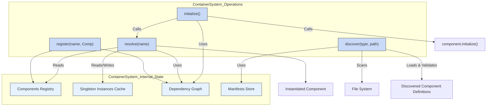
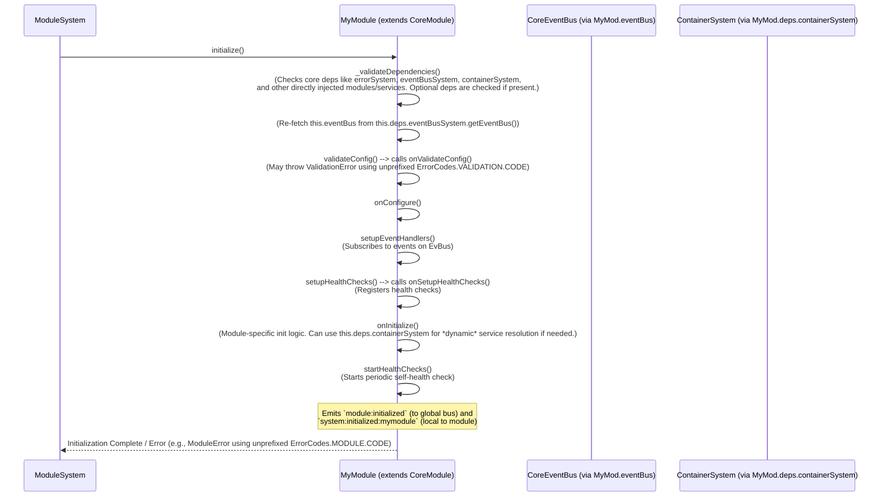
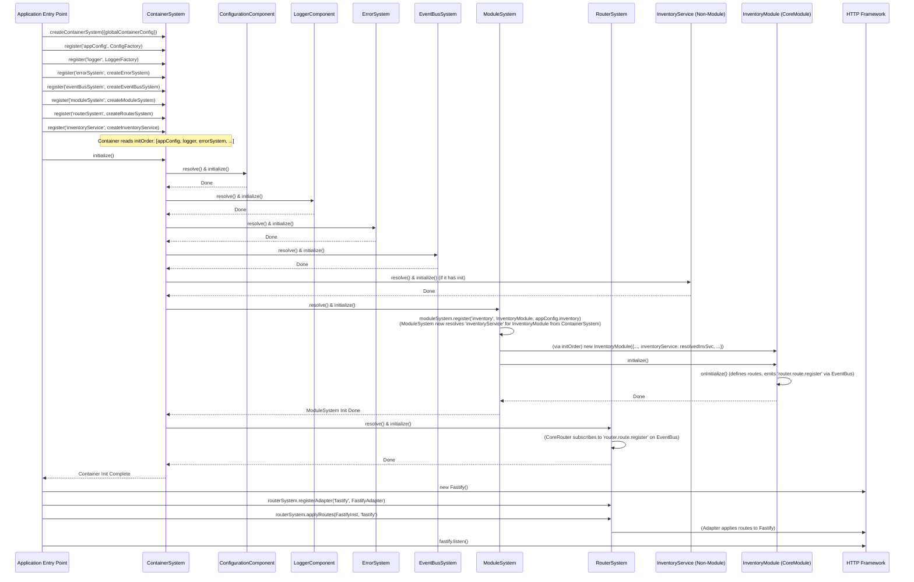
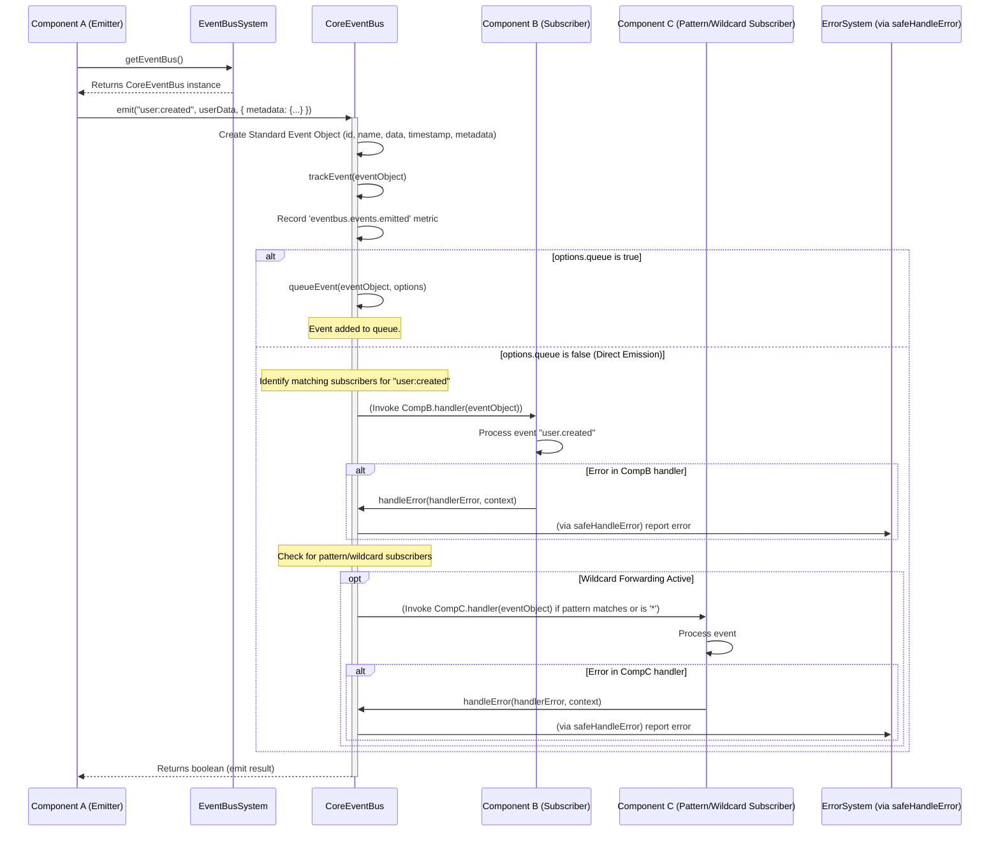
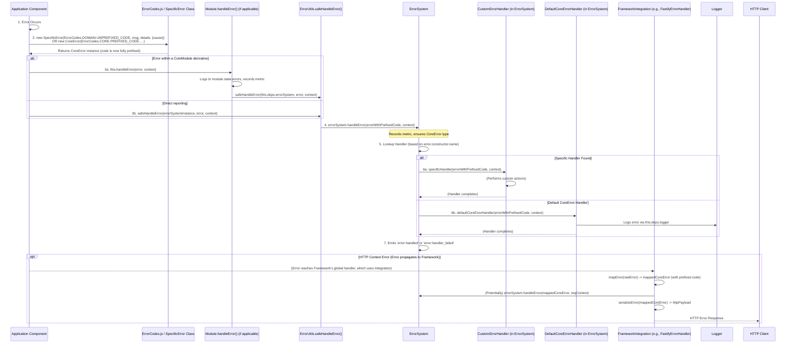

# TSMIS Core Architecture Guide
Version: 2.1.0 (Refactored Core)

## Table of Contents

1.  [Introduction to the TSMIS Core Architecture](#1-introduction-to-the-tsmis-core-architecture)
    * [1.1. Purpose of this Guide](#11-purpose-of-this-guide)
    * [1.2. What is TSMIS? (System Overview)](#12-what-is-tsmis-system-overview)
    * [1.3. Goals of the Core Architecture](#13-goals-of-the-core-architecture)
    * [1.4. Key Architectural Principles Driving TSMIS](#14-key-architectural-principles-driving-tsmis)
2.  [Naming Conventions](#2-naming-conventions)
    * [2.1. File Naming](#21-file-naming)
    * [2.2. Class & Constructor Naming](#22-class--constructor-naming)
    * [2.3. Method & Function Naming](#23-method--function-naming)
    * [2.4. Variable Naming](#24-variable-naming)
    * [2.5. Constant Naming](#25-constant-naming)
    * [2.6. Event Naming](#26-event-naming)
    * [2.7. Error Code Naming](#27-error-code-naming)
    * [2.8. Metric Naming](#28-metric-naming)
    * [2.9. Configuration Key Naming](#29-configuration-key-naming)
3.  [Core Foundational Pillars](#3-core-foundational-pillars)
    * [3.1. Standard `this.state` Object](#31-standard-thisstate-object)
    * [3.2. Standardized Error Handling Framework](#32-standardized-error-handling-framework)
    * [3.3. Standardized Lifecycle Management](#33-standardized-lifecycle-management)
    * [3.4. Standardized Health Monitoring](#34-standardized-health-monitoring)
    * [3.5. Standardized Metrics Tracking](#35-standardized-metrics-tracking)
    * [3.6. Standardized Factory Functions](#36-standardized-factory-functions)
    * [3.7. Shared Utilities Overview](#37-shared-utilities-overview)
4.  [Overview of Core Systems](#4-overview-of-core-systems)
    * [4.1. The Core Systems Landscape](#41-the-core-systems-landscape)
    * [4.2. Holistic System Interaction Diagram](#42-holistic-system-interaction-diagram)
5.  [Deep Dive into Core Systems (Summaries)](#5-deep-dive-into-core-systems-summaries)
    * [5.1. `ContainerSystem`](#51-containersystem)
        * [5.1.1. Primary Responsibility](#511-primary-responsibility)
        * [5.1.2. Key Functionalities & API Summary](#512-key-functionalities--api-summary)
        * [5.1.3. Adherence to Standardization Pillars](#513-adherence-to-standardization-pillars)
        * [5.1.4. Key Integrations](#514-key-integrations)
    * [5.2. `ErrorSystem` & `CoreError`](#52-errorsystem--coreerror)
        * [5.2.1. Primary Responsibility](#521-primary-responsibility)
        * [5.2.2. Key Functionalities & API Summary](#522-key-functionalities--api-summary)
        * [5.2.3. Adherence to Standardization Pillars](#523-adherence-to-standardization-pillars)
        * [5.2.4. Key Integrations](#524-key-integrations)
    * [5.3. `EventBusSystem` & `CoreEventBus`](#53-eventbussystem--coreeventbus)
        * [5.3.1. Primary Responsibility](#531-primary-responsibility)
        * [5.3.2. Key Functionalities & API Summary](#532-key-functionalities--api-summary)
        * [5.3.3. Adherence to Standardization Pillars](#533-adherence-to-standardization-pillars)
        * [5.3.4. Key Integrations](#534-key-integrations)
    * [5.4. `ModuleSystem` & `CoreModule`](#54-modulesystem--coremodule)
        * [5.4.1. Primary Responsibility](#541-primary-responsibility)
        * [5.4.2. Key Functionalities & API Summary](#542-key-functionalities--api-summary)
        * [5.4.3. Adherence to Standardization Pillars](#543-adherence-to-standardization-pillars)
        * [5.4.4. Key Integrations](#544-key-integrations)
    * [5.5. `RouterSystem` & `CoreRouter` & `RoutableModule`](#55-routersystem--corerouter--routablemodule)
        * [5.5.1. Primary Responsibility](#551-primary-responsibility)
        * [5.5.2. Key Functionalities & API Summary](#552-key-functionalities--api-summary)
        * [5.5.3. Adherence to Standardization Pillars](#553-adherence-to-standardization-pillars)
        * [5.5.4. Key Integrations](#554-key-integrations)
6.  [Key System Workflows (with Visuals)](#6-key-system-workflows-with-visuals)
    * [6.1. Application Startup & Initialization Sequence](#61-application-startup--initialization-sequence)
    * [6.2. Typical HTTP API Request Flow](#62-typical-http-api-request-flow)
    * [6.3. Event Propagation within the System](#63-event-propagation-within-the-system)
    * [6.4. Centralized Error Reporting in Action](#64-centralized-error-reporting-in-action)
    * [6.5. Conceptual Health & Metrics Aggregation Flow](#65-conceptual-health--metrics-aggregation-flow)
7.  [Developing Business Modules: A Practical Guide](#7-developing-business-modules-a-practical-guide)
    * [7.1. Guiding Principles for Module Design](#71-guiding-principles-for-module-design)
    * [7.2. Extending `CoreModule` or `RoutableModule`](#72-extending-coremodule-or-routablemodule)
    * [7.3. Example Module: `InventoryModule`](#73-example-module-inventorymodule)
        * [7.3.1. Recommended Directory Structure](#731-recommended-directory-structure)
        * [7.3.2. Defining Routes and Handlers (within the RoutableModule)](#732-defining-routes-and-handlers-within-the-routablemodule)
        * [7.3.3. Defining Module-Specific Errors (`inventory.errors.js`)](#733-defining-module-specific-errors-inventoryerrorsjs)
        * [7.3.4. Defining Module-Specific Events (`inventory.events.js`)](#734-defining-module-specific-events-inventoryeventsjs)
        * [7.3.5. Implementing the Business Logic Service (`InventoryService.js`)](#735-implementing-the-business-logic-service-inventoryservicejs)
        * [7.3.6. Defining API Schemas (`schemas/addItem.schema.js`)](#736-defining-api-schemas-schemasadditemschemajs)
        * [7.3.7. Implementing the Main Module Class (`InventoryModule.js`)](#737-implementing-the-main-module-class-inventorymodulejs)
    * [7.4. Registering the Module & Its Services with the Core](#74-registering-the-module--its-services-with-the-core)
    * [7.5. Module-specific Configuration Details](#75-module-specific-configuration-details)
    * [7.6. Unit Testing Modules (Using Jest)](#76-unit-testing-modules-using-jest)
8.  [Shared Utilities Reference](#8-shared-utilities-reference)
    * [8.1. `SystemConstants.js`](#81-systemconstantsjs)
        * [8.1.1. Purpose & Key Definitions](#811-purpose--key-definitions)
        * [8.1.2. Usage Example](#812-usage-example)
    * [8.2. `ErrorUtils.js`](#82-errorutilsjs)
        * [8.2.1. Purpose & Key Functions](#821-purpose--key-functions)
        * [8.2.2. Usage Examples](#822-usage-examples)
9.  [Conclusion & Future Directions](#9-conclusion--future-directions)
    * [9.1. Summary of Achievements](#91-summary-of-achievements)
    * [9.2. Reinforcing the Standardization Pillars](#92-reinforcing-the-standardization-pillars)
    * [9.3. Future Directions & Potential Enhancements](#93-future-directions--potential-enhancements)

---

## 1. Introduction to the TSMIS Core Architecture

### 1.1. Purpose of this Guide
This document serves as the definitive technical guide and "source of truth" for the refactored core architecture of the Toro_SM Information System (TSMIS). It outlines the design, functionalities, naming conventions, and interaction patterns of the core foundational systems. Its goal is to ensure consistency in development, improve maintainability, and provide a clear understanding of how the system is built and operates, especially for junior to mid-level programmers. This guide synthesizes the principles applied during the core refactoring process and should be used by all developers working on or integrating with the TSMIS core systems and business modules. While more exhaustive, standalone documentation files may exist for each individual core system class, this document focuses on providing clear summaries, the overarching architecture, cross-component standards, and their interplay.

### 1.2. What is TSMIS? (System Overview)
The Toro_SM Information System (TSMIS) is an enterprise-level application built on Node.js, designed to be modular, scalable, and maintainable. It supports a variety of business functionalities through a collection of:
* **Core Infrastructure Systems**: These provide fundamental services like dependency management, error handling, event communication, module orchestration, and request routing.
* **Specialized Business Modules**: These encapsulate specific business domain logic and functionalities, building upon the services provided by the core systems.
The architecture is built with a strong emphasis on clear separation of concerns. This allows different parts of the system to be developed, tested, and potentially deployed with a degree of independence, fostering agility and reducing the complexity of managing a large application.

### 1.3. Goals of the Core Architecture
The refactored core architecture of TSMIS was undertaken with several key goals in mind:
* **Uniformity & Consistency**: Establish consistent patterns across core components and for module development.
* **Enhanced Observability**: Build in comprehensive monitoring for health, metrics, and status.
* **Improved Maintainability**: Make the codebase clearer, better organized, and easier to understand, debug, and extend.
* **Increased Testability**: Design components for effective unit and integration testing.
* **Greater Robustness**: Implement comprehensive and consistent error handling.
* **Effective Decoupling**: Promote loose coupling via Dependency Injection (DI) and an Event-Driven Architecture (EDA).
* **Better Developer Experience**: Provide clear guidelines, reusable base classes, and a predictable framework.
* **Dynamic Development**: Support capabilities like dynamic route updates to improve the development workflow by minimizing restarts.

### 1.4. Key Architectural Principles Driving TSMIS
The TSMIS core architecture is guided by several fundamental software engineering principles:
* **Modularity & Separation of Concerns (SoC)**.
* **Dependency Injection (DI)**.
* **Event-Driven Architecture (EDA)**.
* **Standardization Pillars** (state, errors, lifecycle, health, metrics).
* **Centralized Configuration**.
* **Layered Design**.
* **Clear Naming Conventions**.
* **Observability by Design**.

---
## 2. Naming Conventions
To ensure consistency, readability, and maintainability across the TSMIS codebase, the following naming conventions should be adhered to.

### 2.1. File Naming
* **JavaScript Class Files**: `PascalCase.js` (e.g., `ContainerSystem.js`).
* **JavaScript Utility/Helper Files**: `camelCase.js` or `PascalCase.js` (if primarily exporting a class).
* **JavaScript Configuration Files**: `camelCase.config.js` or `kebab-case.config.js`.
* **Interface Definitions (JS Classes used as Interfaces)**: `IPascalCase.js` (e.g., `IRouterAdapter.js`).
* **Test Files**: `PascalCase.test.js` or `camelCase.test.js`.
* **Markdown Documentation Files**: `kebab-case.md` or `snake_case.md` (e.g., `container-system.md`). *Note: `utilities_and_definitions.md` should be renamed to `utilities-and-definitions.md` for consistency.*
* **Directory Names**: `camelCase` or `kebab-case`.

### 2.2. Class & Constructor Naming
* **Classes**: `PascalCase` (e.g., `CoreModule`).
* **Interfaces (JS Classes used as Interfaces)**: `IPascalCase` (e.g., `IRouterAdapter`).
* **Abstract Classes (Conceptual)**: `PascalCase` (e.g., `CoreModule`).

### 2.3. Method & Function Naming
* **Public Methods/Functions**: `camelCase` (e.g., `initialize`).
* **Private/Internal Methods/Functions (by convention)**: `_camelCase` (e.g., `_handleInternalError`).
* **Factory Functions**: `createPascalCaseEntity` or `createCamelCaseUtility` (e.g., `createContainerSystem`).

### 2.4. Variable Naming
* **Local Variables & Parameters**: `camelCase`.
* **Instance Properties**: `camelCase`.
* **Private/Internal Instance Properties (by convention)**: `_camelCase`.
* **Boolean Variables/Properties**: Often prefixed with `is`, `has`, `should`, `can`.

### 2.5. Constant Naming
* **General Constants**: `UPPER_SNAKE_CASE` (e.g., `MAX_RETRIES`).
* **Exported Constant Objects/Namespaces**: `PascalCase` for the main object, `UPPER_SNAKE_CASE` for keys.
    * Example: `SystemConstants.SYSTEM_STATUS.RUNNING`.
    * Example: `ErrorCodes.CORE.UNKNOWN_ERROR` or `ErrorCodes.VALIDATION.INVALID_INPUT`.

### 2.6. Event Naming
* **Format**: `domain.entity.action` (business events), `system:scope:action` (core system events).
* **Tense**: Past tense for facts (e.g., `user.created`).

### 2.7. Error Code Naming
* **Format in `ErrorCodes.js`**: Keys are `UPPER_SNAKE_CASE`.
    * For the generic `CORE` domain, string values are typically fully prefixed (e.g., `ErrorCodes.CORE.INTERNAL_ERROR` has value `'CORE_INTERNAL_ERROR'`).
    * For other specific domains (e.g., `VALIDATION`, `MODULE`), string values are the **unprefixed specific part** of the code (e.g., `ErrorCodes.VALIDATION.INVALID_INPUT` now has value `'INVALID_INPUT'`).
* **Structure in `ErrorCodes.js`**: Grouped by domain (e.g., `ErrorCodes.CORE`, `ErrorCodes.VALIDATION`).
* **`error.code` Property**: On an instantiated `CoreError` subclass (e.g., `ValidationError`), the `code` property will be a fully prefixed string (e.g., `VALIDATION_INVALID_INPUT`). The subclass constructor is responsible for prepending its domain prefix to the unprefixed specific code it receives from `ErrorCodes.js`.

### 2.8. Metric Naming
* **Format**: `domain_or_component.object_or_feature.specific_action_or_state` (lowercase, dot-separated).
* **Tags**: `camelCase` for tag keys.

### 2.9. Configuration Key Naming
* **Format**: `camelCase` for keys in JavaScript config objects. External sources should be normalized to `camelCase`.

Adherence to these conventions is crucial for code consistency and maintainability.

---
## 3. Core Foundational Pillars
The TSMIS core architecture is built upon several standardization pillars.

### 3.1. Standard `this.state` Object
Core systems (`ContainerSystem`, `ErrorSystem`, etc.) and base classes (`CoreModule`) maintain a standardized internal `state` object.
{{CODE_BLOCK_CORE_SYSTEM_STANDARD_STATE_STRUCTURE_UPDATED}}
```javascript

```
* **Key Properties**: `status` (from `SystemConstants.SYSTEM_STATUS`), `startTime`, `errors` (array of internal operational errors), `metrics` (Map), `healthChecks` (Map).

### 3.2. Standardized Error Handling Framework
A unified approach to error handling:
* **`CoreError` Hierarchy**: All application errors extend `CoreError` or its subclasses.
* **`ErrorCodes.js`**: Central registry of error codes. Domain-specific codes are stored as unprefixed specific parts (e.g., `ErrorCodes.VALIDATION.INVALID_INPUT` is `'INVALID_INPUT'`); `CoreError` subclasses (e.g., `ValidationError`) prepend their domain prefix. `CORE` domain codes are typically stored fully prefixed.
* **`ErrorSystem`**: Central service for processing reported errors.
* **`safeHandleError` Utility**: Shared utility for reliable error reporting to `ErrorSystem`.
* **Error Handling Methods**: Core components use methods like `_handleInternalError` or `handleError`.

### 3.3. Standardized Lifecycle Management
Core systems and modules share a consistent lifecycle:
* **Core Methods**: `async initialize(deps)`, `async shutdown()`.
* **State Transitions**: `this.state.status` uses `SystemConstants.SYSTEM_STATUS`.
* **Lifecycle Events**: Standardized events from `SystemConstants.LIFECYCLE_EVENTS` (e.g., `system:initializing`) are emitted.
* **Idempotency**: `initialize()` and `shutdown()` are generally idempotent.

### 3.4. Standardized Health Monitoring
Components are designed for health observability:
* **`registerHealthCheck(name, checkFn)`**: Method to add health check functions.
* **`async checkHealth()`**: Executes checks, returns aggregated standard health report.
* **`createStandardHealthCheckResult(status, detail, errors)`**: Shared utility for formatting individual check outputs.
* **Default Health Checks**: Each component provides a default check for its own `state.status`.

### 3.5. Standardized Metrics Tracking
For performance and operational insights:
* **`recordMetric(name, value, tags)`**: Method to record metrics to `this.state.metrics`.
* **`getMetrics()`**: Retrieves all metrics.
* **Standard Metrics**: Core components record key metrics automatically.

### 3.6. Standardized Factory Functions
Each primary core system and base module class has an exported factory: `create[ComponentName](deps = {})`.

### 3.7. Shared Utilities Overview
Key utilities in `src/core/common/`:
* **`SystemConstants.js`**: `SYSTEM_STATUS`, `LIFECYCLE_EVENTS`, `DEFAULT_CONFIG`.
* **`ErrorUtils.js`**: `safeHandleError()`, `createStandardHealthCheckResult()`.

These pillars ensure consistent, robust, and observable core systems.

---
## 4. Overview of Core Systems
TSMIS architecture has specialized core systems for foundational services.

### 4.1. The Core Systems Landscape
* **`ContainerSystem`**: DI/IoC container for component registration, dependency resolution, lifecycle orchestration.
* **`ErrorSystem`**: Centralizes error handling, processing, custom handlers, framework integration. Uses `CoreError` and `ErrorCodes.js`.
* **`EventBusSystem`**: Manages `CoreEventBus` for asynchronous, event-driven communication.
* **`ModuleSystem`**: Orchestrates business logic modules (`CoreModule` extensions), managing their lifecycle, dependencies, and aggregated health.
* **`RouterSystem`**: Manages `CoreRouter` for HTTP route definition, web framework integration via adapters, middleware, and dynamic route updates.
These systems work together, often managed by `ContainerSystem`.

### 4.2. Holistic System Interaction Diagram
This diagram illustrates primary relationships and dependencies between core systems and their interaction with business modules and the external environment.
**Holistic Core System Interactions**
```mermaid
graph TD
    A[Web Framework (e.g., Fastify)] <--> RS[RouterSystem]
    RS -- Manages --> CR[CoreRouter]
    CR -- Listens for route events via --> EBS[EventBusSystem]
    
    subgraph ApplicationCore [Core Infrastructure & Orchestration]
        CS[ContainerSystem - DI & Lifecycle]
        ES[ErrorSystem - Error Handling]
        EBS[EventBusSystem - Eventing Engine]
        MS[ModuleSystem - Module Orchestration]
        RS[RouterSystem - Request Routing]
    end

    subgraph BusinessLogic [Business Logic & Services]
        BMs["Business Modules (CoreModule/RoutableModule)"]
        AppServices[Application Services (Non-Module)]
    end

    CS -- "Initializes & Injects Dependencies into" --> ES
    CS -- "Initializes & Injects Dependencies into" --> EBS
    CS -- "Initializes & Injects Dependencies into" --> MS
    CS -- "Initializes & Injects Dependencies into" --> RS
    CS -- "Initializes & Injects Dependencies into" --> AppServices

    MS -- "Registers & Manages Lifecycle of" --> BMs
    MS -- "Injects (ErrorSys, EventBusSys, Config, ContainerSys, Resolved Services/Modules) into" --> BMs

    BMs -- "Define routes, emit to" --> EBS
    BMs -- "Emit/Subscribe to business events via" --> EBS
    BMs -- "Report errors to" --> ES
    BMs -- "Use (injected)" --> AppServices
    BMs -- "Can use (injected) ContainerSystem for dynamic service resolution" --> CS

    AppServices -- "Report errors to" --> ES
    AppServices -- "May use" --> EBS

    ES -- "Used by All" --> ApplicationCore
    ES -- "Used by All" --> BusinessLogic
    
    RS -- "Applies routes (from CoreRouter) to" --> A
    CR -- "Stores routes defined by Events from" --> BMs

    EBS -- Manages --> CEB[CoreEventBus]

    classDef core fill:#D6EAF8,stroke:#5DADE2,stroke-width:2px;
    classDef app fill:#E8F8F5,stroke:#76D7C4,stroke-width:2px;
    class CS, ES, EBS, MS, RS, CR, CEB core;
    class BMs, AppServices app;
```

**Key Interaction Paths**:
* **Bootstrap**: `ContainerSystem` inits core systems; `ModuleSystem` inits modules. `RouterSystem` applies routes.
* **HTTP Request**: Web Framework -> `RouterSystem` -> `RoutableModule` Handler -> Services -> Response. Errors through `ErrorSystem`.
* **Event Communication**: Module A -> `EventBusSystem` -> Module B.
* **Error Reporting**: Any Component -> `ErrorSystem`.
* **Dependency Provision**: `ContainerSystem` -> All other Systems/Modules/Services.

---
## 5. Deep Dive into Core Systems (Summaries)
Summary overviews of each core system. For full details, refer to individual system documentation.

### 5.1. `ContainerSystem`

#### 5.1.1. Primary Responsibility
Application's DI/IoC container. Manages component registration, dependency resolution, and lifecycle orchestration.

#### 5.1.2. Key Functionalities & API Summary
* **Registration**: `register(name, Component, options)`, `registerManifest(type, manifest)`.
* **Resolution**: `async resolve(name)` – provides dependency-injected instances (singletons by default).
* **Discovery**: `async discover(type, basePath)` – loads components from filesystem.
* **Lifecycle**: `async initialize()`, `async shutdown()`.
* **Dependency Logic**: Uses `static dependencies`; `resolveDependencyOrder()` for sequencing and circular dependency detection.

#### 5.1.3. Adherence to Standardization Pillars
* **State**: Standard `this.state`; manages maps for `components`, `instances`, `dependencies`, `manifests`.
* **Errors**: `_handleInternalError` reports to `ErrorSystem`. Throws `ConfigError` or `ServiceError` (using unprefixed specific codes from `ErrorCodes.js`) for operational/setup issues.
* **Lifecycle**: Standard `initialize`/`shutdown`; emits lifecycle and operational events.
* **Health**: Default checks `container.state`, `container.components`.
* **Metrics**: For registrations, resolutions, discovery, lifecycle, errors.
* **Factory**: `createContainerSystem(deps = {})`.

#### 5.1.4. Key Integrations
* **`ErrorSystem`**: Reports its internal errors.
* **Configuration (`deps.config`)**: For its own settings.
* **Application Components**: Instantiates, configures, injects dependencies, manages lifecycle of all other registered core systems, services, and (via `ModuleSystem`) business modules. It is the source for `ModuleSystem` to get instances of non-module services that modules depend on.
* **`EventBusSystem` (Indirectly)**: Emits operational events.

**`ContainerSystem`:** Key Operational Flows Summary


### 5.2. `ErrorSystem` & `CoreError`

#### 5.2.1. Primary Responsibility
Centralizes error handling. Processes reported errors, manages custom handlers, integrates with frameworks for HTTP error responses. Relies on `CoreError` and `ErrorCodes.js`.

#### 5.2.2. Key Functionalities & API Summary
* **`CoreError`**: Base class with `code` (prefixed on instance), `message`, `details`, `timestamp`, `cause`, `toJSON()`, `static fromJSON()`.
* **`ErrorCodes.js`**: Centralized codes. Domain-specific codes are unprefixed values (e.g., `'INVALID_INPUT'` from `ErrorCodes.VALIDATION.INVALID_INPUT`); `CoreError` subclasses add prefixes. `CORE` domain codes are fully prefixed.
* **`ErrorSystem`**:
    * `async handleError(error, context)`: Main entry point.
    * `registerHandler(errorTypeName, handler)`: For custom logic.
    * `async registerIntegration(name, IntegrationClass, frameworkInstance, options)`: For framework error handling.
    * `createError(typeName, code, ...)`: Factory for `CoreError` instances. Expects an *unprefixed specific code* for `code` when `typeName` is a specialized subclass.

#### 5.2.3. Adherence to Standardization Pillars
* **State**: Standard `this.state`; manages `errorTypes`, `customHandlers`, `integrations` maps.
* **Errors**: `_handleInternalError` for its own issues. Its job is processing errors reported *to* it. Throws `CoreError` with codes from `ErrorCodes.CORE`.
* **Lifecycle**: Standard `initialize`/`shutdown`; emits lifecycle and error processing events.
* **Health**: Default checks `errorsystem.state`, `errorsystem.handlers`, `errorsystem.integrations`.
* **Metrics**: For lifecycle, errors received/processed, handlers/integrations registered.
* **Factory**: `createErrorSystem(deps = {})`.

#### 5.2.4. Key Integrations
* **All Components**: Report errors to `ErrorSystem` via `safeHandleError`.
* **Logger & Config**: Injected dependencies.
* **Framework Integrations (e.g., `FastifyErrorHandler`)**: Managed by `ErrorSystem`.

**`ErrorSystem`**: Error Processing Flow Summary
```mermaid
graph TD
    A[Error Reported (CoreError instance with prefixed code + context)] --> ES_HandleError["ErrorSystem.handleError()"];
    
    subgraph ErrorSystem_Processing
        direction TB
        ES_HandleError --> ValidateError["Ensure/Wrap to CoreError"];
        ValidateError --> LookupHandler["Lookup Specific/Default Handler (by error.constructor.name)"];
        LookupHandler --> InvokeHandler["Invoke Handler (Custom or Default)"];
        InvokeHandler --> LogNotify["Handler Actions (Logging, Notifications, etc.)"];
        InvokeHandler --> EmitEvent["Emit 'error:handled' or 'error:handler_failed'"];
    end

    subgraph Framework_Integration (Optional)
        direction TB
        FwError["Framework Catches Error"] --> MapError["Integration.mapError(rawError) -> CoreError (prefixed code)"];
        MapError -- "Calls" --> ES_HandleError; %% Integration calls ErrorSystem.handleError()
        ES_HandleError -- "Potentially modifies error/context, then returns to Integration flow" --> SerializeError["Integration.serializeError(CoreError)"];
        SerializeError --> HttpResponse["Send HTTP Error Response"];
    end

    FwError --> MapError;
    %% If error was processed and needs HTTP response. The exact flow might vary.
    %% The primary path is errors reported to ES_HandleError, which then processes.
    %% Integrations use ES_HandleError for consistent processing before serializing.

    classDef entry fill:#f9e79f,stroke:#333,stroke-width:1px;
    classDef process fill:#d6eaf8,stroke:#333,stroke-width:1px;
    classDef framework fill:#e8f8f5,stroke:#333,stroke-width:1px;
    class A entry;
    class ES_HandleError,ValidateError,LookupHandler,InvokeHandler,LogNotify,EmitEvent process;
    class FwError,MapError,SerializeError,HttpResponse framework;
```

### 5.3. `EventBusSystem` & `CoreEventBus`

#### 5.3.1. Primary Responsibility
`EventBusSystem` manages `CoreEventBus` for asynchronous, event-driven communication, promoting decoupling.

#### 5.3.2. Key Functionalities & API Summary
* **`EventBusSystem`**: `initialize()`, `shutdown()`, `getEventBus()`.
* **`CoreEventBus`**: `async emit(eventName, data, options)` (supports queuing), `subscribe(pattern, handler, options)` (exact, pattern `*`, global `*`), `unsubscribe(subscriptionId)`, queuing methods, history methods, `async handleError(error, context)` (for listeners). Errors thrown use unprefixed codes from `ErrorCodes.EVENT`.

#### 5.3.3. Adherence to Standardization Pillars
Standard state, errors (`EventError` with unprefixed codes), lifecycle, health, metrics, factory (`createEventBusSystem`, `createEventBus`).

#### 5.3.4. Key Integrations
* **`ErrorSystem` & Config**: Dependencies for both.
* **Application Modules & Services**: Primary users via `eventBusSystem.getEventBus()`.
* **Other Core Systems**: Can use for async notifications (e.g., `RouterSystem`).

**`EventBusSystem`**: Event Flow Summary
```mermaid
graph TD
    Publisher["Component/Module (Publisher)"] -- "1. getEventBus().emit('eventName', data, opts)" --> CEBus["CoreEventBus"];
    
    subgraph CoreEventBus_Processing
        direction TB
        CEBus --> CreateEvent["Create Standard Event Obj"];
        CreateEvent --> TrackHistory["Track in History"];
        TrackHistory --> CheckQueue{"options.queue?"};
        CheckQueue -- Yes --> QueueEvent["Queue Event"];
        CheckQueue -- No --> FindSubscribers["Find Subscribers (Exact, Pattern, Wildcard)"];
        QueueEvent -- Later via processQueue() --> FindSubscribers;
        FindSubscribers --> InvokeHandler["Invoke Handler(s)"];
    end
    
    InvokeHandler --> Subscriber["Component/Module (Subscriber)"];
    Subscriber -- "Processes event" --> SubscriberLogic["Subscriber Logic"];
    SubscriberLogic -- Optional: Error --> CEBus_HandleError["CoreEventBus.handleError()"];
    CEBus_HandleError -- Reports to --> ErrorSystemGlobal["ErrorSystem"];

    EventBusSystem["EventBusSystem"] -- Manages/Provides --> CEBus;
    
    classDef component fill:#D6EAF8,stroke:#5DADE2,stroke-width:2px;
    classDef appComp fill:#E8F8F5,stroke:#76D7C4,stroke-width:1px;
    classDef process fill:#FEF9E7,stroke:#F7DC6F,stroke-width:1px;

    class EventBusSystem, CEBus component;
    class Publisher, Subscriber, SubscriberLogic, ErrorSystemGlobal appComp;
    class CreateEvent, TrackHistory, CheckQueue, QueueEvent, FindSubscribers, InvokeHandler, CEBus_HandleError process;
```

### 5.4. `ModuleSystem` & `CoreModule`

#### 5.4.1. Primary Responsibility
`ModuleSystem` orchestrates business logic modules (`CoreModule` extensions). `CoreModule` is a standardized base for modules (lifecycle, DI, config, errors, events, health, metrics).

#### 5.4.2. Key Functionalities & API Summary
* **`ModuleSystem`**:
    * `register(name, ModuleClass, config)`: Instantiates module, injects core dependencies (`errorSystem`, `eventBusSystem`, `containerSystem`, module-specific `config`), and other dependencies (other modules, non-module services from `ContainerSystem`) listed in `ModuleClass.static dependencies`. Handles optional dependencies. Throws `ModuleError` or `ValidationError` using unprefixed codes.
    * `resolve(name)`, `initialize()` (orders module init), `shutdown()` (orders module shutdown), `getSystemModulesHealth()`, `handleModuleError()`.
* **`CoreModule`**:
    * `constructor(deps)` receives injected dependencies.
    * Lifecycle Hooks: `onInitialize`, `onShutdown`, etc.
    * Utilities: `handleError()` (uses `ModuleError` with unprefixed codes), `emit()`, `recordMetric()`, `checkHealth()`, `registerHealthCheck()`.
    * `static dependencies`: Array of strings or objects like `{ name: 'depName', optional: true }` to declare dependencies on other modules or non-module services.
    * `this.config` for module-specific configuration.
    * `this.eventBus` for event communication.

#### 5.4.3. Adherence to Standardization Pillars
Standard state, errors (`ModuleError`, `ValidationError` with unprefixed codes), lifecycle, health, metrics, factory (`createModuleSystem`, `createModule`).

#### 5.4.4. Key Integrations
* **`ContainerSystem`**: `ModuleSystem` is managed by it and *uses it* to resolve non-module service dependencies for `CoreModule`s. `containerSystem` is also passed as a dependency to `CoreModule`s.
* **`EventBusSystem`**: Provides `CoreEventBus` to modules. `ModuleSystem` emits module lifecycle events.
* **`ErrorSystem`**: Both `ModuleSystem` and `CoreModule`s report errors.
* **Business Modules**: Managed by `ModuleSystem`.

**`ModuleSystem`** - Architecture & Module Management Summary 
```mermaid
graph TD
    Container["ContainerSystem"] -- "Injects self & core deps (ErrorSys, EventBusSys, Config)" --> MS["ModuleSystem"];
    
    subgraph ModuleSystem_Operations
        direction TB
        Register["register(name, ModuleClass, config)"]
        Initialize["initialize()"]
        Shutdown["shutdown()"]
        GetHealth["getSystemModulesHealth()"]
    end

    Register -- "Uses ContainerSystem to resolve non-module services" --> Container;
    Register -- "Instantiates CoreModule subclass with ALL resolved dependencies" --> CreateInstance["Instantiate ModuleInstance"];
    CreateInstance --> ModulesMap["Registered Modules Map<name, ModuleInstance>"];
    
    Initialize -- "Resolves Inter-Module Dependency Order" --> ResolveOrder["Resolve Order (Handles Optional Modules)"];
    ResolveOrder --> InitLoop["For each module in order: module.initialize()"];
    InitLoop --> Monitor["Start Periodic Health Monitoring for Module"];
    Monitor -- Periodically Calls --> ModCheckHealth["module.checkHealth()"];
    ModCheckHealth -- Reports Status --> ModuleHealthState["ModuleSystem.state.moduleHealth"];
    
    GetHealth -- Aggregates from --> ModuleHealthState;
    ModulesMap -- "Errors Reported ('module:error' event)" --> HandleModError["ModuleSystem.handleModuleError()"];
    HandleModError -- Uses safeHandleError --> ErrorSystemGlobal["ErrorSystem"];

    classDef system fill:#D6EAF8,stroke:#5DADE2,stroke-width:2px;
    classDef module fill:#E8F8F5,stroke:#76D7C4,stroke-width:1px;
    classDef state fill:#f9f,stroke:#333,stroke-width:1px;
    classDef process fill:#FEF9E7,stroke:#F7DC6F,stroke-width:1px;

    class MS, Container, ErrorSystemGlobal system;
    class ModulesMap, ModuleHealthState state;
    class Register, Initialize, Shutdown, GetHealth, ResolveOrder, InitLoop, Monitor, HandleModError, CreateInstance, ModCheckHealth process;
```

**`CoreModule`**: Internal Initialization Sequence Summary 


### 5.5. `RouterSystem` & `CoreRouter` & `RoutableModule`

#### 5.5.1. Primary Responsibility
Framework-agnostic system for defining, managing, serving HTTP routes, now with dynamic update capabilities.
* **`RouterSystem`**: Manages `CoreRouter`, provides high-level API, orchestrates dynamic refreshes.
* **`CoreRouter`**: Engine for route registry, adapter/middleware management, processing route events, signaling route changes.
* **`RoutableModule`**: `CoreModule` extension for modules to define routes via events.

#### 5.5.2. Key Functionalities & API Summary
* **`RouterSystem`**: `initialize()` (creates/inits `CoreRouter`), `shutdown()`, `getRouter()`. Delegates most operations (e.g., `registerAdapter`, `applyRoutes`) to `CoreRouter`. Listens for `router:routes:changed` from `CoreRouter` to trigger `adapter.refreshRoutes()`. Throws `RouterError` using unprefixed codes.
* **`CoreRouter`**: `initialize()` (subscribes to route events). Internal `registerRoute` (handles conflicts). `registerAdapter` (adapter must implement `refreshRoutes`). `registerMiddleware`. `applyRoutes` (uses adapter). `generateOpenApiDoc`. Emits `router:routes:changed` when its route table is modified post-initial application. Throws `RouterError` using unprefixed codes.
* **`RoutableModule`**: `registerRoute()`, `registerVersionedRoute()`. Emits route definition/unregistration events. Throws `RouterError` using unprefixed codes.

#### 5.5.3. Adherence to Standardization Pillars
Standard state, errors (`RouterError` with unprefixed codes), lifecycle, health, metrics, factory (`createRouterSystem`, `createRoutableModule`).

#### 5.5.4. Key Integrations
* **`EventBusSystem/CoreEventBus`**: `CoreRouter` subscribes to route events from `RoutableModule`s.
* **HTTP Web Frameworks**: `CoreRouter` uses `IRouterAdapter` (e.g., `FastifyAdapter` with `refreshRoutes`).
* **`ErrorSystem`**: All routing components report errors.
* **`ModuleSystem/CoreModule`**: `RoutableModule` is a `CoreModule`.
* **`ContainerSystem`**: Manages `RouterSystem`.

**`RouterSystem`**: Overall Routing Flow Summary 
```mermaid
graph TD
    subgraph ApplicationBootstrap [Application Bootstrap/Setup]
        direction TB
        AppSetup["App Setup Code"]
        HttpFrameworkInst["HTTP Framework Instance (e.g., Fastify)"]
    end

    subgraph RoutableModuleInstance [MyRoutableModule]
        direction TB
        RM_Define["Define Routes (this.registerRoute(...))"]
        RM_OnInit["onInitialize() calls this.registerAllRoutes()"]
        RM_Emit["_emitRouteRegistration()"]
    end

    subgraph EventSystem [EventBusSystem & CoreEventBus]
        direction TB
        EBSys["EventBusSystem"]
        CEBus["CoreEventBus"]
        EBSys -- Provides --> CEBus
    end

    subgraph RouterSystemFacade [RouterSystem Facade]
        direction TB
        RS["RouterSystem"]
        RS_ActiveAdapter[("Active Adapter Ref")]
    end
    
    subgraph CoreRouterEngine [CoreRouter Engine]
        direction TB
        CR["CoreRouter"]
        CR_Routes[("Route Registry")]
        CR_Adapters[("Adapter Registry")]
        CR_AppliedFlag[("_routesAppliedOnce")]
    end

    %% Initialization
    AppSetup -- Creates & Initializes --> RS;
    RS -- Creates & Initializes --> CR;
    CR -- Subscribes to 'router.route.register', etc. --> CEBus;
    RS -- Listens for 'router:routes:changed' from --> CR; %% RouterSystem listens for changes
    
    %% Module Route Definition
    RM_OnInit --> RM_Emit;
    RM_Emit -- "Emits 'router.route.register' event" --> CEBus;
    
    %% CoreRouter Processes Event & Signals Change
    CEBus -- Delivers Event --> CR;
    CR -- "handleRouteRegistration(event)" --> CR_Routes;
    CR -- "If running & applied, emits 'router:routes:changed' " --> CR; %% Internal emit
    
    %% RouterSystem Handles Change (Dynamic Update Path)
    CR -- "Notifies (via event)" --> RS; %% CoreRouter's event reaches RouterSystem
    RS -- "_handleCoreRoutesChanged()" --> RS_ActiveAdapter;
    RS_ActiveAdapter -- "Calls adapter.refreshRoutes(allRoutes)" --> AdapterInst["Specific Adapter (e.g., FastifyAdapter)"];
    AdapterInst -- "Updates its internal router (e.g., find-my-way)" --> AdapterInternalRouter["Adapter's Internal Router"];

    %% Application Applies Routes (Initial Setup)
    AppSetup -- "1. routerSystem.registerAdapter('fwKey', AdapterClass)" --> RS;
    RS -- Delegates --> CR;
    CR -- "Stores adapter" --> CR_Adapters;
    
    AppSetup -- "2. routerSystem.applyRoutes(HttpFrameworkInst, 'fwKey')" --> RS;
    RS -- "Stores active adapter/fw" --> RS_ActiveAdapter;
    RS -- Delegates to --> CR;
    CR -- "applyRoutes(HttpFrameworkInst, 'fwKey')" --> AdapterInst;
    AdapterInst -- "Populates internal router & configures HttpFrameworkInst gateway" --> HttpFrameworkInst;
    CR -- "Sets _routesAppliedOnce = true" --> CR_AppliedFlag;

    classDef system fill:#D6EAF8,stroke:#5DADE2,stroke-width:2px;
    classDef module fill:#E8F8F5,stroke:#76D7C4,stroke-width:2px;
    classDef bus fill:#FEF9E7,stroke:#F7DC6F,stroke-width:2px;
    classDef process fill:#E9D8FD,stroke:#8E44AD,stroke-width:1px;

    class RS, CR, AdapterInst system;
    class RM_OnInit, RM_Define, RM_Emit module;
    class EBSys, CEBus bus;
    class AppSetup, HttpFrameworkInst, AdapterInternalRouter process;
```

---
## 6. Key System Workflows (with Visuals)
How core TSMIS systems interact during key processes.

### 6.1. Application Startup & Initialization Sequence
Describes the typical startup process.
**Application Startup & Initialization Sequence**
*(Ensure diagram notes reflect correct error code instantiation if shown)*


### 6.2. Typical HTTP API Request Flow
Journey of an HTTP request.
**Typical HTTP API Request Flow**
*(Ensure error examples reflect correct error code patterns)*
```mermaid
sequenceDiagram
    participant Client as HTTP Client
    participant Fw as HTTP Web Framework (e.g., Fastify)
    participant Adapter as Router Adapter (e.g., FastifyAdapter's Internal Router)
    participant RM as RoutableModule Instance
    participant Service as Business Service (Optional)
    participant ESysInt as ErrorSystem Framework Integration
    participant ESys as ErrorSystem

    Client->>+Fw: HTTP Request (e.g., GET /api/products/123)
    Fw->>+Adapter: (Gateway Route) Passes request to Adapter's Internal Router
    Adapter->>Adapter: Finds matching TSMIS route
    Adapter->>+RM: Call routeHandler(request, reply)
    RM->>RM: (Optional) Validate request
    alt Request Validation Fails
        RM->>RM: throw new ValidationError(ErrorCodes.VALIDATION.CODE, ...)
        RM-->>-Adapter: Returns/Throws ValidationError
    else Request Validation Succeeds
        RM->>+Service: (Optional) Call service.getProductById(...)
        Service->>Service: Business logic
        Service-->>-RM: Return result or throws ServiceError(ErrorCodes.SERVICE.CODE, ...)
        
        alt Service Operation Fails (Error caught by RM)
            RM->>RM: this.handleError(serviceError, context)
            RM-->>-Adapter: Returns/Throws ServiceError
        else Service Operation Succeeds
            RM->>RM: Prepare success response data
            RM-->>-Adapter: Return response data
        end
    end
    Adapter-->>-Fw: Forwards response/error
    Fw-->>-Client: HTTP Response (Success Data or Error Payload from ESysInt)

    %% Global Error Path for unhandled errors in RM/Adapter or Fw specific errors
    Note over Fw, ESysInt: If any unhandled error bubbles to Fastify
    Fw->>+ESysInt: Framework's Global Error Handler (uses FastifyErrorHandler)
    ESysInt->>ESysInt: mapErrorToCoreError(rawError)
    ESysInt->>ESys: handleError(mappedCoreError, requestContext)
    ESys->>ESys: (Processes error)
    ESysInt->>ESysInt: serializeErrorForHttpResponse(mappedCoreError)
    ESysInt-->>-Fw: Serialized error payload & status code
```

### 6.3. Event Propagation within the System
How events are emitted, processed by `CoreEventBus`, and delivered.

**Event Propagation within the System**


### 6.4. Centralized Error Reporting in Action
How errors are processed through to `ErrorSystem`.
Description updated to emphasize that `CoreError` subclasses are instantiated with unprefixed specific codes from `ErrorCodes.js`, and the subclass constructor prepends the domain prefix.

**Centralized Error Reporting in Action**


### 6.5. Conceptual Health & Metrics Aggregation Flow
How a Monitoring Layer could collect health and metrics.

** Conceptual Health & Metrics Aggregation Flow**
```mermaid
graph TD
    A[Monitoring Layer / Admin Interface] -- Periodically or On-Demand --> Polls;
    
    subgraph Polls
        direction LR
        A --> CS[ContainerSystem.checkHealth() / .getMetrics()];
        A --> ES[ErrorSystem.checkHealth() / .getMetrics()];
        A --> EBSys[EventBusSystem.checkHealth() / .getMetrics()];
        A --> MS[ModuleSystem.checkHealth() / .getMetrics()];
        A --> RS[RouterSystem.checkHealth() / .getMetrics()];
    end

    EBSys -- Internally Calls --> CEB[CoreEventBus.checkHealth() / .getMetrics()];
    MS -- Internally Calls --> Mods["For each Module:<br>module.checkHealth() / .getMetrics()"];
    RS -- Internally Calls --> CR[CoreRouter.checkHealth() / .getMetrics()];
    
    CS --> B[Standardized Health/Metrics Response];
    ES --> B;
    EBSys --> B;
    MS --> B;
    RS --> B;
    
    B --> A;
    A --> Display[Unified Dashboard / Alerting System];

    classDef monitor fill:#E6E6FA,stroke:#9370DB,stroke-width:2px;
    classDef system fill:#D6EAF8,stroke:#5DADE2,stroke-width:2px;
    classDef internal fill:#E8F8F5,stroke:#76D7C4,stroke-width:1px;
    class A,Display monitor;
    class CS,ES,EBSys,MS,RS system;
    class CEB,Mods,CR internal;
```

---
## 7. Developing Business Modules: A Practical Guide
Guide for creating business logic modules extending `CoreModule` or `RoutableModule`.

### 7.1. Guiding Principles for Module Design
Single Responsibility, Loose Coupling, Clear Interfaces, Configuration Driven, Leverage `CoreModule` Features, Service Layer Separation, Testability.

### 7.2. Extending `CoreModule` or `RoutableModule`
Choose based on HTTP endpoint needs.

### 7.3. Example Module: `InventoryModule`
Illustrates creating a `RoutableModule`.

#### 7.3.1. Recommended Directory Structure

**Example Module**: `InventoryModule` - Recommended Directory Structure
```text
src/
└── modules/
    └── inventory/
        ├── InventoryModule.js        # The main module class, extends RoutableModule
        ├── InventoryService.js       # Contains the core business logic/rules for inventory
        ├── inventory.errors.js       # (Optional) Custom ErrorTypes or specific ErrorCodes for ErrorCodes.js INVENTORY domain
        ├── inventory.events.js       # (Optional) Constants for event names specific to inventory
        ├── schemas/                  # (Optional) Validation schemas for API requests/responses
        │   ├── addItem.schema.js
        │   └── updateStock.schema.js
        └── tests/
            ├── InventoryModule.test.js   # Unit tests for the module class
            └── InventoryService.test.js  # Unit tests for the service logic
```

#### 7.3.2. Defining Routes and Handlers (within the RoutableModule)
Routes defined in `onInitialize()` via `this.registerRoute()`. Handlers are module methods.

**`InventoryModule`: Example Route Definitions in `onInitialize`
```javascript
// Inside InventoryModule.js, within onInitialize() method:
// async onInitialize() {
//   await super.onInitialize(); // Important! Calls RoutableModule's onInitialize, which triggers registerAllRoutes

//   // Define API routes
//   // const addItemSchema = require('./schemas/addItem.schema.js'); // Example import
//   this.registerVersionedRoute(1, 'POST', '/items', this.handleAddItem, {
//     schema: addItemSchema, // Reference to an imported schema object
//     summary: "Add a new item to inventory",
//     tags: ['Inventory', 'Items']
//   });
//   this.registerVersionedRoute(1, 'GET', '/items/:sku', this.handleGetItem, {
//     summary: "Get an item by SKU",
//     tags: ['Inventory', 'Items']
//   });
//   // ... other route definitions
// }

// // Handler methods also within InventoryModule.js
// // async handleAddItem(request, reply) { /* ... handler logic ... */ }
// // async handleGetItem(request, reply) { /* ... handler logic ... */ }
```

#### 7.3.3. Defining Module-Specific Errors (`inventory.errors.js`)
Define custom `InventoryError` (e.g., extending `CoreError` or `ModuleError`) and add unprefixed specific codes to an `INVENTORY` domain within `ErrorCodes.js`. The `InventoryError` constructor will prepend `INVENTORY_` (or `MODULE_INVENTORY_` if extending `ModuleError` and `ModuleError` handles the `MODULE_` part based on an inventory-specific code).
*Preferably, `InventoryError` extends `CoreError` and prepends `INVENTORY_` for clarity.*

**`InventoryModule`: Defining Module-Specific Errors
```javascript
// src/modules/inventory/inventory.errors.js
import { CoreError } from '../../core/errors/CoreError.js'; // Prefer extending CoreError directly for domain errors
// import { ModuleError } from '../../core/errors/index.js'; // Or ModuleError if it truly represents a generic module fault within inventory

// If InventoryError represents specific business rule violations for inventory,
// extending CoreError directly gives cleaner, domain-specific error codes like INVENTORY_ITEM_NOT_FOUND.
// If it represents a failure of the inventory *module* itself as a system component, ModuleError might be used.
// For business errors, CoreError is often a better base.

/**
 * Custom error class for inventory-specific operational errors.
 */
export class InventoryError extends CoreError { // Changed base to CoreError for direct prefixing
  /**
   * Creates a new InventoryError instance.
   * The constructor will prepend "INVENTORY_" to the provided specific code.
   * @param {string} specificCode - The specific, **unprefixed** inventory error code from `ErrorCodes.INVENTORY`.
   * @param {string} message - Human-readable error message.
   * @param {object} [details={}] - Additional error details.
   * @param {object} [options={}] - Options, including 'cause'.
   */
  constructor(specificCode, message, details = {}, options = {}) {
    super(\`INVENTORY_${specificCode}\`, message, details, options);
    this.name = 'InventoryError';
    // Assign a default statusCode or make it dependent on the specificCode
    this.statusCode = details.statusCode || 400; // Example: default to 400 or 500 based on error type
    if (details.statusCode) delete details.statusCode; // Consume it from details
  }
}

// It's recommended to define these specific codes within the main
// src/core/errors/ErrorCodes.js file under an 'INVENTORY' domain.
// Example structure for ErrorCodes.js:
//
// export const ErrorCodes = Object.freeze({
//   // ... other domains ...
//   INVENTORY: Object.freeze({
//     ITEM_NOT_FOUND: 'ITEM_NOT_FOUND', // Unprefixed specific code
//     INSUFFICIENT_STOCK: 'INSUFFICIENT_STOCK',
//     INVALID_SKU_FORMAT: 'INVALID_SKU_FORMAT',
//     NEGATIVE_STOCK_UNSUPPORTED: 'NEGATIVE_STOCK_UNSUPPORTED',
//     ITEM_ALREADY_EXISTS: 'ITEM_ALREADY_EXISTS',
//     // Add other inventory-specific error codes here
//   }),
// });

// Usage within InventoryModule or InventoryService:
// import { ErrorCodes } from '../../core/errors/ErrorCodes.js'; // Path to global ErrorCodes
// import { InventoryError } from './inventory.errors.js';
//
// function findItem(sku) {
//   const item = null; // Simulating item not found
//   if (!item) {
//     throw new InventoryError(
//       ErrorCodes.INVENTORY.ITEM_NOT_FOUND, // Uses the unprefixed code 'ITEM_NOT_FOUND'
//       \`Item with SKU ${sku} not found.\`,
//       { sku, attemptedOperation: 'findItem' },
//       { statusCode: 404 } // Optionally pass statusCode in details for constructor
//     );
//     // The resulting error.code will be 'INVENTORY_ITEM_NOT_FOUND'
//     // The resulting error.statusCode will be 404
//   }
//   return item;
// }
```

#### 7.3.4. Defining Module-Specific Events (`inventory.events.js`)
Constants for event names (e.g., `INVENTORY_EVENTS.ITEM_ADDED`).

**`InventoryModule`**: Defining Module-Specific Events
```javascript
// src/modules/inventory/inventory.events.js

/**
 * Defines standardized event names related to the Inventory module.
 */
export const INVENTORY_EVENTS = Object.freeze({
  ITEM_ADDED: 'inventory.item.added',
  ITEM_REMOVED: 'inventory.item.removed',
  ITEM_UPDATED: 'inventory.item.updated',
  STOCK_UPDATED: 'inventory.item.stock_updated',
  STOCK_LOW: 'inventory.item.stock_low',
  STOCK_OUT_OF_STOCK: 'inventory.item.out_of_stock',
  BULK_STOCK_ADJUSTED: 'inventory.bulk_stock_adjusted',

  // Example of events InventoryModule might listen to:
  ORDER_ITEM_ALLOCATED: 'order.item.allocated',
  ORDER_ITEM_RETURNED: 'order.item.returned',
});
```

#### 7.3.5. Implementing the Business Logic Service (`InventoryService.js`)
Encapsulates business rules. Declares `static dependencies` for services it needs (e.g., `['config', 'logger', 'databaseService']`). These will be injected by `ContainerSystem` if `InventoryService` is registered with it.

**`InventoryService.js`**
```javascript
// src/modules/inventory/InventoryService.js
// Assuming InventoryError and global ErrorCodes (with INVENTORY domain) are set up as previously discussed.
// import { InventoryError } from './inventory.errors.js';
// import { ErrorCodes } from '../../core/errors/ErrorCodes.js';

export class InventoryService {
  static dependencies = ['config', 'logger' /*, 'databaseService' */];

  constructor(deps) {
    this.config = deps.config?.inventoryService || deps.config?.inventory?.service || {};
    this.logger = deps.logger || console;
    this._stock = new Map(); // Using an in-memory store for example
    this.logger.info(`[InventoryService] Initialized. Allow Negative Stock: ${!!this.config.allowNegativeStock}`);
  }

  async addItem(itemData) {
    if (!itemData || !itemData.sku || !itemData.name || typeof itemData.quantity !== 'number' || typeof itemData.price !== 'number') {
      throw new InventoryError( // Uses InventoryError, which will prefix with INVENTORY_
        ErrorCodes.INVENTORY.INVALID_SKU_FORMAT, // Pass unprefixed specific code
        'Item data is invalid. SKU, name, quantity, and price are required.',
        { providedSku: itemData?.sku }
      );
    }
    if (this._stock.has(itemData.sku)) {
      throw new InventoryError(
        ErrorCodes.INVENTORY.ITEM_ALREADY_EXISTS, // Pass unprefixed specific code
        `Item with SKU '${itemData.sku}' already exists.`,
        { sku: itemData.sku }
      );
    }
    // ... implementation ...
    const newItem = { ...itemData };
    this._stock.set(itemData.sku, newItem);
    return { ...newItem };
  }

  async updateStock(sku, quantityChange) {
    const item = this._stock.get(sku);
    if (!item) {
      throw new InventoryError(ErrorCodes.INVENTORY.ITEM_NOT_FOUND, `Item with SKU '${sku}' not found.`, { sku }, { statusCode: 404 });
    }
    const newQuantity = item.quantity + quantityChange;
    if (newQuantity < 0 && !(this.config.allowNegativeStock === true)) {
      throw new InventoryError(
        ErrorCodes.INVENTORY.INSUFFICIENT_STOCK, // Pass unprefixed specific code
        `Insufficient stock for SKU '${sku}'. Attempted to change by ${quantityChange}.`,
        { sku, currentQuantity: item.quantity, requestedChange: quantityChange }
      );
    }
    item.quantity = newQuantity;
    this._stock.set(sku, item);
    return { ...item };
  }
  // ... other methods like getItemBySku, listItems, checkHealth ...
}

// export function createInventoryService(deps) {
//   return new InventoryService(deps);
// }
```

#### 7.3.6. Defining API Schemas (`schemas/addItem.schema.js`)
JSON Schema for request/response validation.

**API Schema**: `addItem.schema.js`
```javascript
// src/modules/inventory/schemas/addItem.schema.js
export const addItemSchema = {
  body: {
    type: 'object',
    required: ['sku', 'name', 'quantity', 'price'],
    properties: {
      sku: { type: 'string', minLength: 1 },
      name: { type: 'string', minLength: 1, maxLength: 255 },
      description: { type: 'string', nullable: true },
      quantity: { type: 'integer', minimum: 0 },
      price: { type: 'number', minimum: 0 },
      supplierId: { type: 'string', nullable: true },
      attributes: { type: 'object', nullable: true, additionalProperties: true }
    },
  },
  response: {
    201: {
      description: 'Item created successfully.',
      type: 'object',
      properties: {
        // Define expected response properties, matching what addItem returns
        sku: { type: 'string' },
        name: { type: 'string' },
        // ... other properties from the item
        createdAt: { type: 'string', format: 'date-time' }, // Example server-generated
      },
    },
    // Other responses e.g., 400 for validation error (handled by FastifyErrorHandler)
  },
};
```

#### 7.3.7. Implementing the Main Module Class (`InventoryModule.js`)
Extends `RoutableModule`. Its `constructor(deps)` receives core systems, its config, and now also its declared module and non-module service dependencies directly from `ModuleSystem`. Implements lifecycle hooks, defines route handlers, uses `this.handleError` (which instantiates errors with unprefixed codes), `this.emit`, `this.recordMetric`.

**`InventoryModule.js` Main Class Example** 
```javascript
// src/modules/inventory/InventoryModule.js
import { RoutableModule } from '../../core/router/RoutableModule.js';
import { ErrorCodes } from '../../core/errors/ErrorCodes.js';
import { InventoryError } from './inventory.errors.js'; // Assuming this custom error is defined
import { INVENTORY_EVENTS } from './inventory.events.js';
// import { addItemSchema } from './schemas/addItem.schema.js';
// import { CoreError, ValidationError } from '../../core/errors/index.js';


export class InventoryModule extends RoutableModule {
  // Declare all dependencies: core, other modules, and non-module services
  static dependencies = [
    ...RoutableModule.dependencies, // Inherits errorSystem, eventBusSystem, config, containerSystem
    'inventoryService', // This is a non-module service
    // { name: 'optionalReportingModule', optional: true } // Example optional module
  ];
  static version = '1.0.0';

  constructor(deps) {
    super(deps);
    // Dependencies are now directly available on this.deps if resolved by ModuleSystem
    this.inventoryService = deps.inventoryService;
    // this.optionalReportingModule = deps.optionalReportingModule; 
    
    if (!this.inventoryService) {
        // This check might be redundant if ModuleSystem's registration ensures critical deps are present
        // or throws during its own dependency resolution for the module.
        // However, it's good practice for the module to confirm critical dependencies.
        throw new ModuleError( // Using ModuleError for a module setup/dependency issue
            ErrorCodes.MODULE.MISSING_DEPENDENCIES, // Unprefixed specific code
            `${this.constructor.name}: Critical dependency 'inventoryService' was not injected.`,
            { dependency: 'inventoryService' }
        );
    }
    this.lowStockThreshold = this.config.lowStockThreshold || 10;
    this.subscriptions = [];
    this.deps.logger.info(`[${this.constructor.name}] Constructed. InventoryService available: ${!!this.inventoryService}`);
  }

  async onValidateConfig() {
    await super.onValidateConfig();
    if (this.config.lowStockThreshold !== undefined) {
      if (typeof this.config.lowStockThreshold !== 'number' || this.config.lowStockThreshold < 0) {
        // ErrorCodes.INVENTORY.INVALID_CONFIG_VALUE should be 'INVALID_CONFIG_VALUE'
        throw new InventoryError( 
          ErrorCodes.INVENTORY.INVALID_CONFIG_VALUE,
          "Config 'lowStockThreshold' must be a non-negative number.",
          { field: 'lowStockThreshold', value: this.config.lowStockThreshold }
        );
      }
    }
    return true;
  }

  async onConfigure() {
    await super.onConfigure();
    if (this.config.lowStockThreshold !== undefined) {
      this.lowStockThreshold = this.config.lowStockThreshold;
    }
    this.deps.logger.info(`[${this.constructor.name}] Configured. Low stock threshold: ${this.lowStockThreshold}`);
  }
  
  async setupEventHandlers() {
    await super.setupEventHandlers();
    if (!this.eventBus) {
        this.deps.logger.warn(`[${this.constructor.name}] EventBus not available during setupEventHandlers.`);
        return;
    }
    // Example subscription
    // const subId = this.eventBus.subscribe(
    //   INVENTORY_EVENTS.ORDER_ITEM_ALLOCATED, 
    //   this.handleOrderItemAllocated.bind(this)
    // );
    // this.subscriptions.push(subId);
  }

  async onSetupHealthChecks() {
    await super.onSetupHealthChecks();
    if (this.inventoryService && typeof this.inventoryService.checkHealth === 'function') {
        this.registerHealthCheck('inventorymodule.service.dependency', this.inventoryService.checkHealth.bind(this.inventoryService));
    }
  }

  async onInitialize() {
    this.deps.logger.info(`[${this.constructor.name}] Defining routes...`);
    // const addItemSchema = {}; // Placeholder for actual schema import
    this.registerVersionedRoute(1, 'POST', '/items', this.handleAddItem, { /* schema: addItemSchema */ });
    this.registerVersionedRoute(1, 'GET', '/items/:sku', this.handleGetItem);
    // ... other routes ...
    await super.onInitialize(); // This calls registerAllRoutes from RoutableModule
    this.deps.logger.info(`[${this.constructor.name}] Initialized and routes defined.`);
  }

  async onShutdown() {
    // ... unsubscriptions ...
    await super.onShutdown();
  }

  // --- Route Handlers ---
  async handleAddItem(request, reply) {
    try {
      const newItem = await this.inventoryService.addItem(request.body);
      await this.emit(INVENTORY_EVENTS.ITEM_ADDED, { item: newItem });
      reply.code(201);
      return newItem;
    } catch (error) {
      // Errors from inventoryService (e.g., InventoryError) will already have prefixed codes.
      // If a generic error happens here, handleError will wrap it.
      await this.handleError(error, { operation: 'handleAddItem', endpoint: request.url });
      throw error; // Re-throw for framework error handler to catch and respond
    }
  }

  async handleGetItem(request, reply) {
    const { sku } = request.params;
    try {
      const item = await this.inventoryService.getItemBySku(sku);
      if (!item) {
        // ErrorCodes.INVENTORY.ITEM_NOT_FOUND should be 'ITEM_NOT_FOUND'
        throw new InventoryError(
            ErrorCodes.INVENTORY.ITEM_NOT_FOUND, 
            `Item with SKU ${sku} not found.`, 
            { sku }, 
            { statusCode: 404 }
        );
      }
      return item;
    } catch (error) {
      await this.handleError(error, { operation: 'handleGetItem', sku });
      throw error;
    }
  }
  // ... other handlers like handleUpdateStock, handleListItems ...
  // ... event handlers like handleOrderItemAllocated ...
}

// export function createInventoryModule(deps) {
//   return new InventoryModule(deps);
// }
```

### 7.4. Registering the Module & Its Services with the Core
1.  Register non-module services (like `InventoryService`) with `ContainerSystem`.
2.  Register module class (e.g., `InventoryModule`) with `ModuleSystem`, passing module-specific config. `ModuleSystem` will use the `ContainerSystem` (which must be one of `ModuleSystem`'s dependencies) to resolve and inject services like `InventoryService` into the `InventoryModule` instance, based on `InventoryModule.static dependencies`.

**Module and Service Registration**
```javascript
// In your application bootstrap file (e.g., src/app.js)
// Assume 'container' is your main ContainerSystem instance.
// import { createInventoryService } from './modules/inventory/InventoryService.js';
// import { InventoryModule } from './modules/inventory/InventoryModule.js'; // The class
// import { createModuleSystem } from './core/module/ModuleSystem.js';
// import { ErrorCodes } from './core/errors/ErrorCodes.js';


// async function setupApplication(container) {
//   // --- 1. Register Non-Module Services (like InventoryService) with ContainerSystem ---
//   container.register('inventoryService', createInventoryService);
//   // ... register other application-specific services ...

//   // --- 2. Register ModuleSystem itself with ContainerSystem ---
//   // ModuleSystem needs 'containerSystem' injected to resolve non-module services for modules.
//   // Its 'dependencies' static array should list 'containerSystem'.
//   container.register('moduleSystem', createModuleSystem);


//   // --- 3. Get ModuleSystem instance & Register Business Modules ---
//   let moduleSystem;
//   try {
//     moduleSystem = await container.resolve('moduleSystem');
//   } catch (error) {
//     console.error('Failed to resolve ModuleSystem from container:', error);
//     throw error;
//   }

//   try {
//     // ModuleSystem.register will now use its injected ContainerSystem
//     // to resolve 'inventoryService' (and any other non-module services)
//     // listed in InventoryModule.static_dependencies and inject them directly.
//     const appConfig = await container.resolve('appConfig'); // Assuming appConfig is registered
//     await moduleSystem.register(
//       'inventory',                // Module instance name
//       InventoryModule,            // The module class
//       appConfig.inventory         // Module-specific config for this instance
//     );
//     console.log('InventoryModule registered with ModuleSystem.');
//   } catch (error) {
//     console.error('Failed to register InventoryModule:', error);
//     // Example: error.code might be 'MODULE_DEPENDENCY_RESOLUTION_FAILED' (prefixed)
//     // if (error.code === `MODULE_${ErrorCodes.MODULE.DEPENDENCY_RESOLUTION_FAILED}`) { /* ... */ }
//     throw error;
//   }

//   // ... register other business modules ...

//   // --- 4. Application Initialization ---
//   // await container.initialize(); 
//   // This will initialize ModuleSystem, which in turn initializes InventoryModule.
//   // InventoryModule constructor will receive `inventoryService` directly in its `deps`.
// }

// // Example bootstrap call:
// // async function main() {
// //   const container = createContainerSystem();
// //   container.register('appConfig', () => ({ /* ... app config ... */ inventory: {lowStockThreshold: 5} }));
// //   container.register('logger', () => console);
// //   container.register('errorSystem', createErrorSystem);
// //   container.register('eventBusSystem', createEventBusSystem);
//   // ContainerSystem is available as `container` itself to be passed as a dependency

// //   await setupApplication(container);
// //   await container.initialize();
// //   console.log('Application bootstrapped.');
// // }
// // main().catch(err => { console.error("App Bootstrap Failed:", err); process.exit(1); });
```

### 7.5. Module-specific Configuration Details
Module config passed to `ModuleSystem.register()` is available as `this.config` in the module. Services typically access their config via a global `config` object (if they are registered with `ContainerSystem` which injects it) or via the config passed to them if they are instantiated differently.

**Passing Configuration during `moduleSystem.register()`**
```javascript
// Example:
// Assuming 'moduleSystem' is an instance of ModuleSystem
// and 'InventoryModule' is the class definition.
// moduleSystem.register(
//   'inventory', // Module instance name
//   InventoryModule, // Module class
//   { // This is the module-specific config object for this 'inventory' instance
//     lowStockThreshold: 5,
//     defaultSupplier: 'SUP-001',
//     featureFlags: { enableAdvancedAnalytics: true }
//   }
// );
```

**Accessing `this.config` in `InventoryModule.js`**
```javascript
// Example within InventoryModule.js:
// class InventoryModule extends RoutableModule {
//   constructor(deps) {
//     super(deps);
//     // 'this.config' is automatically set by CoreModule's constructor
//     // to the config object passed during moduleSystem.register().
//     // So, this.config would be:
//     // { lowStockThreshold: 5, defaultSupplier: 'SUP-001', featureFlags: { enableAdvancedAnalytics: true } }

//     this.lowStockThreshold = this.config.lowStockThreshold || 10; // Use default if not provided
//     this.defaultSupplierId = this.config.defaultSupplier;
//     this.analyticsEnabled = this.config.featureFlags?.enableAdvancedAnalytics || false;
//   }

//   async onConfigure() {
//      await super.onConfigure();
//      this.deps.logger.info(`[${this.constructor.name}] Low stock threshold set to: ${this.lowStockThreshold}`);
//   }
// }
```

**`InventoryService` Accessing its Configuration Section from Global Config**
```javascript
// Example within InventoryService.js:
// class InventoryService {
//   static dependencies = ['config', 'logger']; // Expects global 'config' and 'logger'

//   constructor(deps) {
//     // deps.config here is the global application config object, injected by ContainerSystem.
//     // The service looks for its specific section within this global config.
//     this.serviceConfig = deps.config?.inventoryService || {}; // Accessing 'inventoryService' section
//     this.logger = deps.logger || console;
//     this.allowNegativeStock = this.serviceConfig.allowNegativeStock === true;
//     this.dbPoolSize = this.serviceConfig.databasePoolSize || 5;
//     this.logger.info(`[InventoryService] Configured. Allow Negative Stock: ${this.allowNegativeStock}, DB Pool: ${this.dbPoolSize}`);
//   }
// }
```

**Structure of a Global Application Configuration Object**
```javascript
// Example structure for a global application configuration object
// (e.g., loaded from a file, environment variables, and registered as 'config' in ContainerSystem)
// const globalAppConfig = {
//   appName: 'TSMIS App',
//   port: 3000,
//   environment: 'development',

//   logger: {
//     level: 'info',
//     prettyPrint: true,
//   },

//   eventBusSystem: { /* Configurations specific to EventBusSystem */ },
//   coreEventBus: { maxHistorySize: 500, queueBatchSize: 50 },

//   moduleSystem: { defaultHealthCheckIntervalMs: 60000 },

//   // Section specifically for the 'inventory' module instance (passed to ModuleSystem.register)
//   inventory: { 
//     lowStockThreshold: 5,
//     defaultSupplier: 'AcmeCorp',
//     featureFlags: { enableAdvancedAnalytics: true, enableAutoReorder: false, }
//   },

//   // Section specifically for the 'inventoryService' component/service (read by InventoryService itself)
//   inventoryService: { 
//     allowNegativeStock: false,
//     databasePoolSize: 10,
//   },

//   // Configuration for other modules and services...
// };
```

### 7.6. Unit Testing Modules (Using Jest)
Mock dependencies injected by `ModuleSystem` (core systems, other modules, non-module services). Test business logic, lifecycle hooks, event/route handlers, error reporting (ensure errors are created with correct unprefixed specific codes passed to constructors), and metric recording.

**Example**: Unit Testing InventoryModule
```javascript
// src/modules/inventory/tests/InventoryModule.test.js
// import { InventoryModule } from '../InventoryModule.js';
// import { ErrorCodes } from '../../../core/errors/ErrorCodes.js';
// import { InventoryError } from '../inventory.errors.js';
// import { SYSTEM_STATUS } from '../../../core/common/SystemConstants.js';

// describe('InventoryModule', () => {
//   let mockDeps;
//   let inventoryModule;
//   let mockInventoryService;
//   let mockEventBus;
//   let mockContainerSystem;

//   beforeEach(() => {
//     mockInventoryService = {
//       addItem: jest.fn(),
//       getItemBySku: jest.fn(),
//       checkHealth: jest.fn().mockResolvedValue({ status: SYSTEM_STATUS.HEALTHY, detail: {} }),
//     };
//     mockEventBus = { emit: jest.fn().mockResolvedValue(true), subscribe: jest.fn() };
//     mockContainerSystem = { resolve: jest.fn() }; // For dynamic resolution if module uses it

//     mockDeps = {
//       errorSystem: { handleError: jest.fn().mockResolvedValue() },
//       eventBusSystem: { getEventBus: jest.fn().mockReturnValue(mockEventBus) },
//       containerSystem: mockContainerSystem, // ModuleSystem would inject this
//       config: { lowStockThreshold: 5 },
//       logger: { info: jest.fn(), warn: jest.fn(), error: jest.fn(), debug: jest.fn() },
//       inventoryService: mockInventoryService, // This is now directly injected by ModuleSystem
//     };
//     inventoryModule = new InventoryModule(mockDeps);
//   });

//   test('constructor should store injected inventoryService', () => {
//     expect(inventoryModule.inventoryService).toBe(mockInventoryService);
//   });

//   describe('onInitialize', () => {
//     // Test that routes are registered, etc.
//     // Test that if a non-module service was NOT declared in static dependencies
//     // but is resolved in onInitialize, the containerSystem mock is called.
//   });

//   describe('handleAddItem', () => {
//     it('should call inventoryService.addItem and emit event', async () => {
//       const itemData = { sku: 'T1', name: 'Test Item', quantity: 10, price: 100 };
//       const createdItem = { ...itemData, id: 'item1' };
//       mockInventoryService.addItem.mockResolvedValue(createdItem);
//       inventoryModule.eventBus = mockEventBus; // Ensure eventBus is available after initialize

//       const mockRequest = { body: itemData, url: '/items' };
//       const mockReply = { code: jest.fn().mockReturnThis() };

//       const result = await inventoryModule.handleAddItem(mockRequest, mockReply);

//       expect(mockInventoryService.addItem).toHaveBeenCalledWith(itemData);
//       expect(mockEventBus.emit).toHaveBeenCalledWith('inventory.item.added', { item: createdItem });
//       expect(mockReply.code).toHaveBeenCalledWith(201);
//       expect(result).toEqual(createdItem);
//     });

//     it('should handle errors from inventoryService by calling this.handleError', async () => {
//       const itemData = { sku: 'T2' };
//       // ErrorCodes.INVENTORY.INVALID_SKU_FORMAT is 'INVALID_SKU_FORMAT'
//       const serviceError = new InventoryError(ErrorCodes.INVENTORY.INVALID_SKU_FORMAT, "Bad SKU");
//       mockInventoryService.addItem.mockRejectedValue(serviceError);
//       inventoryModule.handleError = jest.fn(); // Spy on the module's own handleError

//       const mockRequest = { body: itemData, url: '/items' };
//       const mockReply = { code: jest.fn() };

//       await expect(inventoryModule.handleAddItem(mockRequest, mockReply)).rejects.toThrow(serviceError);
//       expect(inventoryModule.handleError).toHaveBeenCalledWith(serviceError, expect.any(Object));
//     });
//   });
  
//   // More tests for other handlers, lifecycle methods, error conditions, etc.
// });
```

---
## 8. Shared Utilities Reference
Foundational utilities in `src/core/common/`.

### 8.1. `SystemConstants.js`
#### 8.1.1. Purpose & Key Definitions
Defines `SYSTEM_STATUS`, `LIFECYCLE_EVENTS`, `DEFAULT_CONFIG`.

**`SystemConstants.js`**: Usage Example 
```javascript
// Example usage within a hypothetical core system component:
// import { SYSTEM_STATUS, LIFECYCLE_EVENTS, DEFAULT_CONFIG } from '../common/SystemConstants.js'; // Adjust path as needed

// class MySystem {
//   constructor(deps) {
//     this.deps = deps;
//     this.state = {
//       status: SYSTEM_STATUS.CREATED, // Using a constant for initial status
//       errors: [],
//       // ... other state properties
//     };
//     // Using a constant for a default configuration value
//     this.maxErrors = this.deps.config?.mySystem?.maxErrorHistory || DEFAULT_CONFIG.MAX_ERROR_HISTORY;
//   }

//   async initialize() {
//     if (this.state.status === SYSTEM_STATUS.RUNNING) return; // Comparing with a constant
//     this.state.status = SYSTEM_STATUS.INITIALIZING; // Setting status with a constant
//
//     // Emitting a standardized lifecycle event
//     // if (this.emit) { // Assuming 'this' is an EventEmitter
//     //   this.emit(LIFECYCLE_EVENTS.INITIALIZING, { system: this.constructor.name });
//     // }

//     // ... initialization logic ...

//     this.state.status = SYSTEM_STATUS.RUNNING;
//     // if (this.emit) {
//     //   this.emit(LIFECYCLE_EVENTS.INITIALIZED, { system: this.constructor.name });
//     //   this.emit(LIFECYCLE_EVENTS.RUNNING, { system: this.constructor.name });
//     // }
//   }

//   // ... other methods
// }
```

### 8.2. `ErrorUtils.js`
#### 8.2.1. Purpose & Key Functions
Provides `async safeHandleError()` and `createStandardHealthCheckResult()`.
#### 8.2.2. Usage Examples

**`ErrorUtils.js`**: Usage Examples
```javascript
// Example usage within a hypothetical core system or module:
// import { safeHandleError, createStandardHealthCheckResult } from '../common/ErrorUtils.js'; // Adjust path
// import { SYSTEM_STATUS } from '../common/SystemConstants.js'; // Adjust path
// import { CoreError } from '../errors/CoreError.js'; // Adjust path
// import { ErrorCodes } from '../errors/ErrorCodes.js'; // Adjust path
// import { ServiceError } from '../errors/types/ServiceError.js'; // Adjust path

// class MyComponent {
//   constructor(deps) {
//     this.deps = deps; // Should include errorSystem, logger, etc.
//     // this.state = { errors: [] }; // Standard state
//   }

//   async _handleInternalError(error, context = {}) { // Example internal error handler
//       // Ensure it's a CoreError or subclass. If not, wrap it.
//       // If it's a generic error within a service context, use ServiceError.
//       // ErrorCodes.SERVICE.OPERATION_FAILED is now 'OPERATION_FAILED'
//       const internalError = !(error instanceof CoreError)
//         ? new ServiceError(
//             ErrorCodes.SERVICE.OPERATION_FAILED, 
//             error.message,
//             context,
//             { cause: error }
//           ) 
//         : error; 
//       // internalError.code will be 'SERVICE_OPERATION_FAILED' if wrapped

//       // this.state.errors.push({ error: internalError, timestamp: new Date().toISOString(), context });
//       // ... (error array capping logic) ...
//       // this.recordMetric('mycomponent.errors.internal', 1, { errorName: internalError.name });
//       await safeHandleError(this.deps.errorSystem, internalError, { source: this.constructor.name, ...context });
//   }

//   async checkMySpecificFeature() { // Example health check function
//     let isFeatureHealthy = true;
//     let featureDetails = { status: 'online', version: '1.2.3' };
//     let encounteredErrors = [];

//     try {
//       // if (await this.someDependency.isUnresponsive()) {
//       //   isFeatureHealthy = false;
//       //   featureDetails.status = 'dependency_issue';
//       //   // ErrorCodes.SERVICE.UNAVAILABLE is now 'UNAVAILABLE'
//       //   encounteredErrors.push(new ServiceError(
//       //       ErrorCodes.SERVICE.UNAVAILABLE, 
//       //       'Dependency X is unresponsive.'
//       //   )); // ServiceError constructor will prepend 'SERVICE_'
//       // }
//     } catch (error) {
//       isFeatureHealthy = false;
//       featureDetails.error = error.message;
//       encounteredErrors.push(error);
//     }

//     return createStandardHealthCheckResult(
//       isFeatureHealthy ? SYSTEM_STATUS.HEALTHY : SYSTEM_STATUS.UNHEALTHY,
//       featureDetails,
//       encounteredErrors
//     );
//   }
// }
```

---
## 9. Conclusion & Future Directions

### 9.1. Summary of Achievements
The refactored TSMIS core architecture provides a robust, consistent, observable, and maintainable foundation by standardizing key aspects across core systems, enhancing developer experience and system stability.

### 9.2. Reinforcing the Standardization Pillars
Continued success depends on adherence to: Standard State, Standardized Error Handling (unprefixed codes in `ErrorCodes.js` for domains, subclass prefixing), Standardized Lifecycle, Standardized Health Monitoring, Standardized Metrics Tracking, and Clear Naming Conventions.

### 9.3. Future Directions & Potential Enhancements
* **`ContainerSystem`**: Scoped containers, advanced discovery, lazy initialization.
* **`ErrorSystem`**: Enhanced tracking/analytics, more integrations.
* **`EventBusSystem`**: Advanced routing, schema validation, distributed bus.
* **`ModuleSystem`**: Dynamic management, inter-module contracts, advanced DI options.
* **`RouterSystem`**: Advanced matching, more granular dynamic routing, deeper validation integration. The current dynamic routing capability via adapter refresh is a significant step for development workflows.
This standardized foundation enables structured evolution.