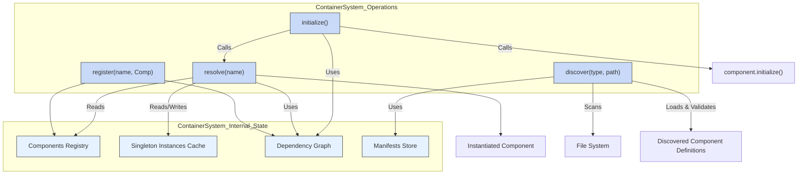
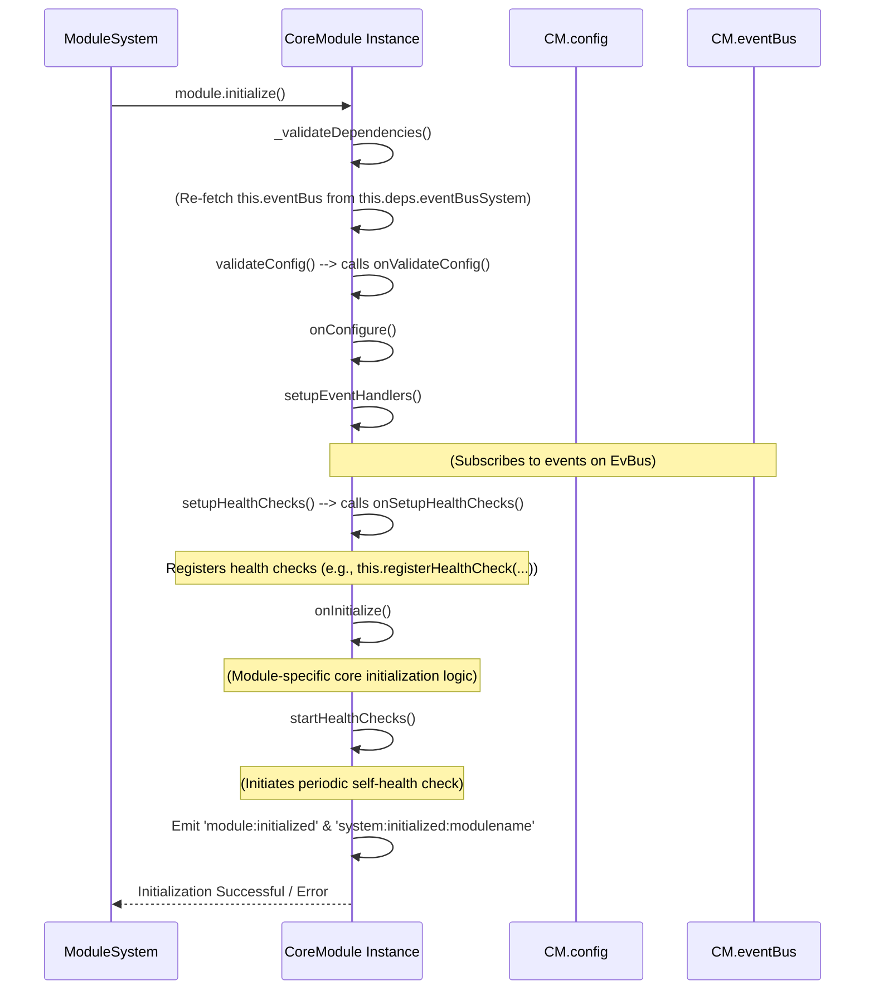
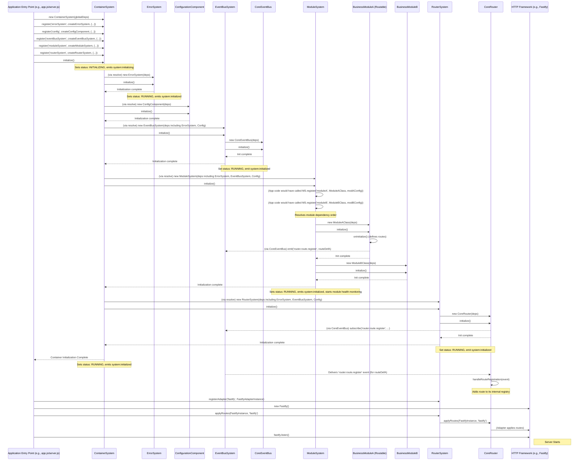
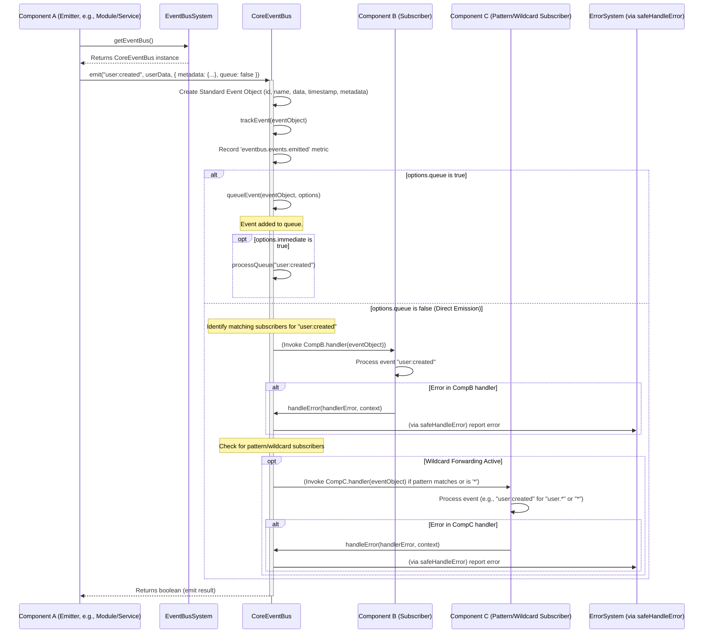
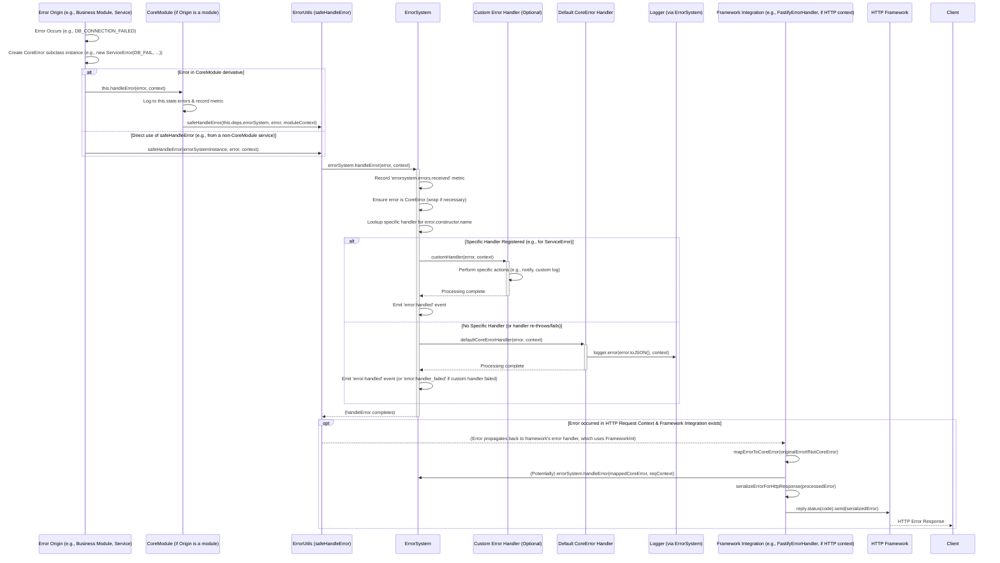

# TSMIS Core Architecture Guide
Version: 2.0.0 (Refactored Core)

## Table of Contents

1.  [Introduction to the TSMIS Core Architecture](#1-introduction-to-the-tsmis-core-architecture)
    * [1.1. Purpose of this Guide](#11-purpose-of-this-guide)
    * [1.2. What is TSMIS? (System Overview)](#12-what-is-tsmis-system-overview)
    * [1.3. Goals of the Core Architecture](#13-goals-of-the-core-architecture)
    * [1.4. Key Architectural Principles Driving TSMIS](#14-key-architectural-principles-driving-tsmis)
2.  [Naming Conventions](#2-naming-conventions)
    * [2.1. File Naming](#21-file-naming)
    * [2.2. Class & Constructor Naming](#22-class--constructor-naming)
    * [2.3. Method & Function Naming](#23-method--function-naming)
    * [2.4. Variable Naming](#24-variable-naming)
    * [2.5. Constant Naming](#25-constant-naming)
    * [2.6. Event Naming](#26-event-naming)
    * [2.7. Error Code Naming](#27-error-code-naming)
    * [2.8. Metric Naming](#28-metric-naming)
    * [2.9. Configuration Key Naming](#29-configuration-key-naming)
3.  [Core Foundational Pillars](#3-core-foundational-pillars)
    * [3.1. Standard `this.state` Object](#31-standard-thisstate-object)
    * [3.2. Standardized Error Handling Framework](#32-standardized-error-handling-framework)
    * [3.3. Standardized Lifecycle Management](#33-standardized-lifecycle-management)
    * [3.4. Standardized Health Monitoring](#34-standardized-health-monitoring)
    * [3.5. Standardized Metrics Tracking](#35-standardized-metrics-tracking)
    * [3.6. Standardized Factory Functions](#36-standardized-factory-functions)
    * [3.7. Shared Utilities Overview](#37-shared-utilities-overview)
4.  [Overview of Core Systems](#4-overview-of-core-systems)
    * [4.1. The Core Systems Landscape](#41-the-core-systems-landscape)
    * [4.2. Holistic System Interaction Diagram](#42-holistic-system-interaction-diagram)
5.  [Deep Dive into Core Systems (Summaries)](#5-deep-dive-into-core-systems-summaries)
    * [5.1. `ContainerSystem`](#51-containersystem)
        * [5.1.1. Primary Responsibility](#511-primary-responsibility)
        * [5.1.2. Key Functionalities & API Summary](#512-key-functionalities--api-summary)
        * [5.1.3. Adherence to Standardization Pillars](#513-adherence-to-standardization-pillars)
        * [5.1.4. Key Integrations](#514-key-integrations)
    * [5.2. `ErrorSystem` & `CoreError`](#52-errorsystem--coreerror)
        * [5.2.1. Primary Responsibility](#521-primary-responsibility)
        * [5.2.2. Key Functionalities & API Summary](#522-key-functionalities--api-summary)
        * [5.2.3. Adherence to Standardization Pillars](#523-adherence-to-standardization-pillars)
        * [5.2.4. Key Integrations](#524-key-integrations)
    * [5.3. `EventBusSystem` & `CoreEventBus`](#53-eventbussystem--coreeventbus)
        * [5.3.1. Primary Responsibility](#531-primary-responsibility)
        * [5.3.2. Key Functionalities & API Summary](#532-key-functionalities--api-summary)
        * [5.3.3. Adherence to Standardization Pillars](#533-adherence-to-standardization-pillars)
        * [5.3.4. Key Integrations](#534-key-integrations)
    * [5.4. `ModuleSystem` & `CoreModule`](#54-modulesystem--coremodule)
        * [5.4.1. Primary Responsibility](#541-primary-responsibility)
        * [5.4.2. Key Functionalities & API Summary](#542-key-functionalities--api-summary)
        * [5.4.3. Adherence to Standardization Pillars](#543-adherence-to-standardization-pillars)
        * [5.4.4. Key Integrations](#544-key-integrations)
    * [5.5. `RouterSystem` & `CoreRouter` & `RoutableModule`](#55-routersystem--corerouter--routablemodule)
        * [5.5.1. Primary Responsibility](#551-primary-responsibility)
        * [5.5.2. Key Functionalities & API Summary](#552-key-functionalities--api-summary)
        * [5.5.3. Adherence to Standardization Pillars](#553-adherence-to-standardization-pillars)
        * [5.5.4. Key Integrations](#554-key-integrations)
6.  [Key System Workflows (with Visuals)](#6-key-system-workflows-with-visuals)
    * [6.1. Application Startup & Initialization Sequence](#61-application-startup--initialization-sequence)
    * [6.2. Typical HTTP API Request Flow](#62-typical-http-api-request-flow)
    * [6.3. Event Propagation within the System](#63-event-propagation-within-the-system)
    * [6.4. Centralized Error Reporting in Action](#64-centralized-error-reporting-in-action)
    * [6.5. Conceptual Health & Metrics Aggregation Flow](#65-conceptual-health--metrics-aggregation-flow)
7.  [Developing Business Modules: A Practical Guide](#7-developing-business-modules-a-practical-guide)
    * [7.1. Guiding Principles for Module Design](#71-guiding-principles-for-module-design)
    * [7.2. Extending `CoreModule` or `RoutableModule`](#72-extending-coremodule-or-routablemodule)
    * [7.3. Example Module: `InventoryModule`](#73-example-module-inventorymodule)
        * [7.3.1. Recommended Directory Structure](#731-recommended-directory-structure)
        * [7.3.2. Defining Routes and Handlers (within the RoutableModule)](#732-defining-routes-and-handlers-within-the-routablemodule)
        * [7.3.3. Defining Module-Specific Errors (`inventory.errors.js`)](#733-defining-module-specific-errors-inventoryerrorsjs)
        * [7.3.4. Defining Module-Specific Events (`inventory.events.js`)](#734-defining-module-specific-events-inventoryeventsjs)
        * [7.3.5. Implementing the Business Logic Service (`InventoryService.js`)](#735-implementing-the-business-logic-service-inventoryservicejs)
        * [7.3.6. Defining API Schemas (`schemas/addItem.schema.js`)](#736-defining-api-schemas-schemasadditemschemajs)
        * [7.3.7. Implementing the Main Module Class (`InventoryModule.js`)](#737-implementing-the-main-module-class-inventorymodulejs)
    * [7.4. Registering the Module & Its Services with the Core](#74-registering-the-module--its-services-with-the-core)
    * [7.5. Module-specific Configuration Details](#75-module-specific-configuration-details)
    * [7.6. Unit Testing Modules (Using Jest)](#76-unit-testing-modules-using-jest)
8.  [Shared Utilities Reference](#8-shared-utilities-reference)
    * [8.1. `SystemConstants.js`](#81-systemconstantsjs)
        * [8.1.1. Purpose & Key Definitions](#811-purpose--key-definitions)
        * [8.1.2. Usage Example](#812-usage-example)
    * [8.2. `ErrorUtils.js`](#82-errorutilsjs)
        * [8.2.1. Purpose & Key Functions](#821-purpose--key-functions)
        * [8.2.2. Usage Examples](#822-usage-examples)
9.  [Conclusion & Future Directions](#9-conclusion--future-directions)
    * [9.1. Summary of Achievements](#91-summary-of-achievements)
    * [9.2. Reinforcing the Standardization Pillars](#92-reinforcing-the-standardization-pillars)
    * [9.3. Future Directions & Potential Enhancements](#93-future-directions--potential-enhancements)

---

## 1. Introduction to the TSMIS Core Architecture

### 1.1. Purpose of this Guide

This document serves as the definitive technical guide and "source of truth" for the refactored core architecture of the Toro_SM Information System (TSMIS). It outlines the design, functionalities, naming conventions, and interaction patterns of the core foundational systems. Its goal is to ensure consistency in development, improve maintainability, and provide a clear understanding of how the system is built and operates, especially for junior to mid-level programmers.

This guide synthesizes the principles applied during the core refactoring process and should be used by all developers working on or integrating with the TSMIS core systems and business modules. While more exhaustive, standalone documentation files may exist for each individual core system class, this document focuses on providing clear summaries, the overarching architecture, cross-component standards, and their interplay.

### 1.2. What is TSMIS? (System Overview)

The Toro_SM Information System (TSMIS) is an enterprise-level application built on Node.js, designed to be modular, scalable, and maintainable. It supports a variety of business functionalities through a collection of:
* **Core Infrastructure Systems**: These provide fundamental services like dependency management, error handling, event communication, module orchestration, and request routing.
* **Specialized Business Modules**: These encapsulate specific business domain logic and functionalities, building upon the services provided by the core systems.

The architecture is built with a strong emphasis on clear separation of concerns. This allows different parts of the system to be developed, tested, and potentially deployed with a degree of independence, fostering agility and reducing the complexity of managing a large application.

### 1.3. Goals of the Core Architecture

The refactored core architecture of TSMIS was undertaken with several key goals in mind, aiming to create a more robust and developer-friendly platform:

* **Uniformity & Consistency**: To establish and enforce consistent patterns across all core components and for the development of new modules. This includes consistent approaches to naming, state management, error handling, component lifecycle, health monitoring, and metrics collection.
* **Enhanced Observability**: To build in capabilities for comprehensive monitoring of the system's health, performance metrics, and operational status from the ground up.
* **Improved Maintainability**: To make the codebase clearer, better organized, and easier to understand, debug, and extend through standardized interfaces and practices.
* **Increased Testability**: To design components with clear responsibilities and decoupled interfaces, facilitating effective unit and integration testing.
* **Greater Robustness**: To implement comprehensive and consistent error handling and reporting mechanisms that improve the system's resilience to failures.
* **Effective Decoupling**: To promote loose coupling between different parts of the system, primarily achieved through Dependency Injection (DI) and an Event-Driven Architecture (EDA).
* **Better Developer Experience**: To provide clear guidelines, reusable base classes (like `CoreModule` and `RoutableModule`), and a predictable framework that streamlines the development of new business logic and features.

### 1.4. Key Architectural Principles Driving TSMIS

The TSMIS core architecture is guided by several fundamental software engineering principles:

* **Modularity & Separation of Concerns (SoC)**: The system is broken down into distinct modules and systems, each with a well-defined responsibility. This limits the impact of changes and makes the system easier to reason about.
* **Dependency Injection (DI)**: Components do not create their own dependencies; instead, dependencies are "injected" into them by the `ContainerSystem`. This promotes loose coupling, making components easier to test in isolation and reuse.
* **Event-Driven Architecture (EDA)**: Asynchronous communication through events (managed by the `EventBusSystem`) is favored for many interactions, especially between different business domains (modules). This further reduces direct coupling and can improve system responsiveness and scalability.
* **Standardization Pillars**: Common cross-cutting concerns like state management, error handling, lifecycle, health checks, and metrics are addressed using a predefined set of patterns and utilities across all core systems. This ensures consistency and predictability.
* **Centralized Configuration**: Systems and modules are designed to be configurable, with configurations managed and supplied in a consistent manner (with the potential for a dedicated `ConfigSystem` in the future).
* **Layered Design**: The architecture promotes a logical layering (e.g., API/Routing Layer, Business Logic/Module Layer, Service Layer, Core Infrastructure Layer) to organize responsibilities.
* **Clear Naming Conventions**: A consistent set of naming standards for files, classes, functions, etc., is applied to improve code readability and maintainability.
* **Observability by Design**: Health monitoring, metrics collection, and structured error reporting are built into the core components, not added as an afterthought.

---
## 2. Naming Conventions

To ensure consistency, readability, and maintainability across the TSMIS codebase, the following naming conventions should be adhered to for all new development and refactoring efforts.

### 2.1. File Naming

* **JavaScript Class Files**: `PascalCase.js` (e.g., `ContainerSystem.js`, `CoreModule.js`, `FastifyAdapter.js`).
* **JavaScript Utility/Helper Files**: `camelCase.js` or `PascalCase.js` if they primarily export a class/constructor (e.g., `ErrorUtils.js`). Use `camelCase.js` if it's a collection of functions (e.g., `inventoryHelpers.js`).
* **JavaScript Configuration Files**: `camelCase.config.js` or `kebab-case.config.js` (e.g., `database.config.js`).
* **Interface Definitions (JS Classes used as Interfaces)**: `IPascalCase.js` (e.g., `IRouterAdapter.js`, `IFrameworkIntegration.js`).
* **Test Files**: `PascalCase.test.js` or `camelCase.test.js` (e.g., `ContainerSystem.test.js`, `errorUtils.test.js`).
* **Markdown Documentation Files**: `kebab-case.md` or `snake_case.md` (e.g., `container-system-docs.md`, `developing-modules.md`).
* **Directory Names**: `camelCase` or `kebab-case`. Prefer `kebab-case` for general directories (e.g., `business-modules`, `error-integrations`) and `camelCase` if the directory name directly corresponds to a primary class/namespace it contains (e.g., `core/errors`, `core/errors/types`).

### 2.2. Class & Constructor Naming

* **Classes**: `PascalCase` (e.g., `CoreModule`, `ErrorSystem`, `InventoryService`).
* **Interfaces (JS Classes used as Interfaces)**: `IPascalCase` (e.g., `IRouterAdapter`).
* **Abstract Classes (Conceptual)**: `PascalCase` with JSDoc indicating it's abstract or intended for extension (e.g., `CoreModule`).

### 2.3. Method & Function Naming

* **Public Methods/Functions**: `camelCase` (e.g., `initialize`, `handleError`, `createInventoryItem`).
* **Private/Internal Methods/Functions (by convention)**: `_camelCase` (e.g., `_handleInternalError`, `_validateDependencies`). The underscore prefix signals internal use.
* **Factory Functions**: `createPascalCaseEntity` or `createCamelCaseUtility` (e.g., `createContainerSystem`, `createInventoryModule`).

### 2.4. Variable Naming

* **Local Variables & Parameters**: `camelCase` (e.g., `let itemCount = 0;`, `function processUserData(userRecord) {}`).
* **Instance Properties**: `camelCase` (e.g., `this.registeredModules = new Map();`).
* **Private/Internal Instance Properties (by convention)**: `_camelCase` (e.g., `this._internalCache = {};`).
* **Boolean Variables/Properties**: Often prefixed with `is`, `has`, `should`, `can` (e.g., `isEnabled`, `hasPendingRequests`).

### 2.5. Constant Naming

* **General Constants**: `UPPER_SNAKE_CASE` (e.g., `MAX_RETRIES`, `DEFAULT_TIMEOUT`).
* **Exported Constant Objects/Namespaces**: `PascalCase` for the main exported object, with `UPPER_SNAKE_CASE` for its keys if it's an enum-like structure.
    * Example: `SystemConstants.SYSTEM_STATUS.RUNNING`, `SystemConstants.LIFECYCLE_EVENTS.INITIALIZED`.
    * Example: `ErrorCodes.CORE.UNKNOWN_ERROR`.

### 2.6. Event Naming

* **Format**: `domain.entity.action` (lowercase, dot-separated) for business events. `system:scope:action` (lowercase, colon-separated) for core system lifecycle or operational events.
    * Business Examples: `user.created`, `order.item.shipped`, `inventory.item.stock_low`.
    * System Lifecycle: `system:initializing`, `system:running` (from `SystemConstants.LIFECYCLE_EVENTS`).
    * Module Lifecycle: `module:initialized`, `module:shutdown` (emitted by `CoreModule`).
    * Scoped System Lifecycle: `system:initialized:containersystem`, `system:initialized:inventorymodule`.
* **Tense**:
    * **Past Tense** for events describing facts (something that has happened): `user.created`, `payment.processed`.
    * **Present Tense** for commands or state changes being announced (less common for pure events, more for command patterns): `inventory.check_stock` (if it were a command event). For general eventing, past tense is preferred.

### 2.7. Error Code Naming

* **Format in `ErrorCodes.js`**: Keys are `UPPER_SNAKE_CASE` representing the specific error (e.g., `ITEM_NOT_FOUND`). String values are also typically `UPPER_SNAKE_CASE` and are the *specific part* of the code.
* **Structure in `ErrorCodes.js`**: Grouped by domain/system under `PascalCase` or `UPPER_SNAKE_CASE` keys (e.g., `ErrorCodes.CORE`, `ErrorCodes.INVENTORY`).
* **`error.code` Property**: On an instantiated `CoreError` subclass, the `code` property will be a fully prefixed string like `DOMAIN_SPECIFIC_CODE` (e.g., `INVENTORY_ITEM_NOT_FOUND`). The subclass constructor prepends its domain.

### 2.8. Metric Naming

* **Format**: `domain_or_component.object_or_feature.specific_action_or_state` (lowercase, dot-separated).
    * Examples: `corerouter.routes.registered`, `inventorymodule.api.items_added`, `system.errors.internal`.
* **Tags**: Use `camelCase` for tag keys (e.g., `eventName`, `moduleId`).

### 2.9. Configuration Key Naming

* **Format**: `camelCase` for keys within JavaScript configuration objects as accessed by `this.config` or `deps.config`.
    * Examples: `maxErrorHistory`, `defaultHealthCheckInterval`, `dbHost`, `dbPort`.
* If loading from external sources (like environment variables `DB_HOST` or JSON/YAML files `db_host`), the loading mechanism should ideally normalize these to `camelCase` when populating the JavaScript `config` object used by the application.

Adherence to these naming conventions is crucial for code consistency, readability, and long-term maintainability of the TSMIS platform.

---
## 3. Core Foundational Pillars

The TSMIS core architecture is built upon several standardization pillars that ensure consistency, reliability, and observability across all core systems and derived business modules. These pillars define common patterns for essential cross-cutting concerns.

### 3.1. Standard `this.state` Object

Every core system component (`ContainerSystem`, `ErrorSystem`, `EventBusSystem`, `ModuleSystem`, `RouterSystem`) and base classes like `CoreModule` and `CoreEventBus` maintain a standardized internal `state` object. This provides a consistent way to inspect the internal condition and operational status of any component.

**Core Systems**: Standard `this.state` Object Structure

```javascript
// Generic example of the 'this.state' object within a Core System component
// import { SystemConstants } from './SystemConstants.js'; // Assuming SystemConstants is available

this.state = {
  status: SystemConstants.SYSTEM_STATUS.CREATED,
  startTime: null,
  errors: [], // Stores { error: CoreError, timestamp: string, context: object }
  metrics: new Map(), // Stores { metricName: { value, timestamp, tags } }
  healthChecks: new Map(), // Stores { healthCheckName: asyncFunction }
  // ... component-specific state properties might be added here
};
```

**Key Properties within `this.state`:**
* **`status: string`**: The current lifecycle status of the component (e.g., `'created'`, `'initializing'`, `'running'`). Values are drawn from `SystemConstants.SYSTEM_STATUS`.
* **`startTime: number | null`**: A timestamp (`Date.now()`) indicating when the component's `initialize()` method began or when it successfully transitioned to the `'running'` state. Cleared or set to `null` on shutdown.
* **`errors: Array<{error: CoreError, timestamp: string, context: object}>`**: A circular buffer (size configurable, e.g., via `DEFAULT_CONFIG.MAX_ERROR_HISTORY`) storing a log of *internal operational errors* encountered by the component itself. This is for component self-diagnostics, not for errors it processes from other parts of the application (which `ErrorSystem` handles).
* **`metrics: Map<string, {value: any, timestamp: number, tags?: object}>`**: A collection of performance and operational metrics recorded by the component.
* **`healthChecks: Map<string, Function>`**: A map of registered asynchronous health check functions specific to this component (name -> `async checkFn()`).

Components may extend this base `state` object with additional properties relevant to their specific domain (e.g., `ModuleSystem.state.moduleHealth`, `CoreRouter.state.routes`).

### 3.2. Standardized Error Handling Framework

A unified approach to error handling enhances robustness and debuggability:
* **`CoreError` Hierarchy**: All application-specific errors MUST extend `CoreError` or one of its domain-specific subclasses (e.g., `ModuleError`). Errors are structured with a `code`, `message`, `details`, `timestamp`, and optional `cause`.
* **`ErrorCodes.js`**: A central enum-like object (`src/core/errors/ErrorCodes.js`) defines all standard error codes, categorized by domain (e.g., `ErrorCodes.CORE.UNKNOWN_ERROR`).
* **`ErrorSystem`**: The central service for processing all reported errors. Components report errors to `ErrorSystem` rather than logging them directly for external concerns.
* **`safeHandleError` Utility**: A shared utility (`src/core/common/ErrorUtils.js`) used by components to reliably report errors to `ErrorSystem`, with a console fallback if `ErrorSystem` is unavailable.
* **Internal Error Methods (e.g., `_handleInternalError`)**: Core systems typically have a private method to manage their own operational errors, which involves logging to their `this.state.errors`, recording a metric, and using `safeHandleError`.
* **Public `handleError` Methods**: Components like `CoreModule` or `CoreEventBus` (for listener errors) provide a public `handleError` method to process errors related to their domain, usually also leveraging `safeHandleError`.

### 3.3. Standardized Lifecycle Management

Core systems and modules share a consistent lifecycle:
* **Core Methods**: Each component implements `async initialize(deps)` for setup and `async shutdown()` for graceful cleanup.
* **State Transitions**: The `this.state.status` property is managed using statuses from `SystemConstants.SYSTEM_STATUS` (e.g., `INITIALIZING`, `RUNNING`, `SHUTDOWN`).
* **Lifecycle Events**: Standardized events (from `SystemConstants.LIFECYCLE_EVENTS`, e.g., `system:initializing`, `system:running`) are emitted by each component for its own lifecycle, typically using `super.emit()`. Name-scoped versions are also used (e.g., `system:initialized:mycomponentname`).
* **Idempotency**: `initialize()` and `shutdown()` are generally designed to be idempotent.

### 3.4. Standardized Health Monitoring

Components are designed to be observable for their health:
* **`registerHealthCheck(name: string, checkFn: Function)`**: Method to add specific health check functions to a component.
* **`async checkHealth(): Promise<object>`**: Executes all registered checks and returns an aggregated, standard health report. The report includes component `name`, `version`, overall `status`, `timestamp`, `uptime`, `errorCount` (from `this.state.errors`), and a `checks` object with individual check results.
* **`createStandardHealthCheckResult(status, detail = {}, errors = [])`**: Shared utility (`src/core/common/ErrorUtils.js`) for formatting the output of individual `checkFn`s consistently: `{ status: string, detail: object, errors: Array<ErrorSummary> }`.
* **Default Health Checks**: Each component provides at least a default check for its own `state.status`.

### 3.5. Standardized Metrics Tracking

For performance and operational insights:
* **`recordMetric(name: string, value: any, tags = {}): void`**: Method to record a metric, stored in `this.state.metrics`. `name` uses dot-notation (e.g., `component.operation.result`).
* **`getMetrics(): object`**: Retrieves all metrics: `{ metricName: { value, timestamp, tags } }`.
* **Standard Metrics**: Core components automatically record key metrics for lifecycle events, internal errors, and critical operations.

### 3.6. Standardized Factory Functions

* Each primary core system class and base module class is accompanied by an exported factory function: `create[ComponentName](deps = {})`.
* These simplify instantiation, especially for DI via `ContainerSystem`, and can provide default dependencies for testing.

### 3.7. Shared Utilities Overview
Key shared utilities in `src/core/common/` underpin these pillars:
* **`SystemConstants.js`**: Defines `SYSTEM_STATUS`, `LIFECYCLE_EVENTS`, `DEFAULT_CONFIG`.
* **`ErrorUtils.js`**: Provides `safeHandleError()` and `createStandardHealthCheckResult()`.

These pillars ensure that TSMIS core systems are developed and operate in a consistent, robust, and observable manner, forming a reliable foundation for business modules.

---
## 4. Overview of Core Systems

The TSMIS architecture is built around a set of specialized core systems that provide foundational services and manage different aspects of the application's operation.

### 4.1. The Core Systems Landscape

* **`ContainerSystem`**: The Dependency Injection (DI) / Inversion of Control (IoC) container. Manages component registration, dependency resolution, and lifecycle orchestration.
* **`ErrorSystem`**: Centralizes error handling, processing reported errors, managing custom error handlers, and integrating with frameworks for error responses. Relies on `CoreError` and `ErrorCodes.js`.
* **`EventBusSystem`**: Manages the `CoreEventBus` to facilitate asynchronous, event-driven communication between decoupled components, especially business modules.
* **`ModuleSystem`**: Orchestrates the lifecycle, registration, and dependencies of all business logic modules (which extend `CoreModule`). It also aggregates module health.
* **`RouterSystem`**: Manages the `CoreRouter` for defining HTTP routes (often defined in `RoutableModule` extensions), integrating with web frameworks via adapters, and handling middleware.

These systems are designed to work together, often with `ContainerSystem` instantiating and providing them as dependencies to each other and to business modules.

### 4.2. Holistic System Interaction Diagram

This diagram illustrates the primary relationships and dependencies between the core TSMIS systems and how they typically interact with business modules and the external environment (e.g., HTTP requests).

**Holistic Core System Interactions**: 

```mermaid
graph TD
    A[Web Framework (e.g., Fastify)] <--> RS[RouterSystem]
    RS -- Manages --> CR[CoreRouter]
    CR -- Listens for route events via --> EBS[EventBusSystem]
    
    subgraph ModulesAndContainer [Application Logic & Orchestration]
        CS[ContainerSystem]
        MS[ModuleSystem]
        BMs["Business Modules<br>(RoutableModule/CoreModule)"]
    end

    CS -- Initializes & Injects Deps --> ES[ErrorSystem]
    CS -- Initializes & Injects Deps --> EBS
    CS -- Initializes & Injects Deps --> MS
    CS -- Initializes & Injects Deps --> RS
    CS -- Initializes & Injects Deps --> BMs
    CS -- Initializes & Injects Deps --> AppServices[Application Services]

    MS -- Manages Lifecycle of --> BMs
    BMs -- Emit route definitions to --> EBS
    BMs -- Emit/Subscribe to business events via --> EBS
    BMs -- Report errors to --> ES
    BMs -- Use --> AppServices
    
    AppServices -- Report errors to --> ES
    AppServices -- Use --> EBS

    ES -- Used by All --> AllSystems["All Core Systems & Modules"]
    
    RS -- Applies routes to --> A
    CR -- Stores routes defined by --> BMs

    EBS -- Manages --> CEB[CoreEventBus]

    classDef core fill:#D6EAF8,stroke:#5DADE2,stroke-width:2px;
    classDef app fill:#E8F8F5,stroke:#76D7C4,stroke-width:2px;
    class CS, ES, EBS, MS, RS, CR, CEB core;
    class BMs, AppServices app;
```

**Key Interaction Paths:**
* **Application Bootstrap**: `ContainerSystem` initializes all other core systems and then `ModuleSystem` initializes business modules. `RouterSystem` applies routes defined by modules to the web framework.
* **HTTP Request**: Web Framework -> `RouterSystem` (Adapter -> `CoreRouter`) -> `RoutableModule` Handler -> Business Services -> Response. Errors are channeled through `ErrorSystem`.
* **Event Communication**: Module A -> `EventBusSystem` (`CoreEventBus`) -> Module B.
* **Error Reporting**: Any Component -> `ErrorSystem`.
* **Dependency Provision**: `ContainerSystem` -> All other Systems/Modules/Services.

---
## 5. Deep Dive into Core Systems (Summaries)

This section provides a summary overview of each core system, highlighting its primary responsibility, key APIs, adherence to standardization pillars, and crucial integrations. For exhaustive details, refer to the individual standalone documentation file for each system.

### 5.1. `ContainerSystem`

#### 5.1.1. Primary Responsibility
The `ContainerSystem` is the application's DI/IoC container. It manages component registration, dependency resolution, and lifecycle orchestration (initialization and shutdown) for all major components.

#### 5.1.2. Key Functionalities & API Summary
* **Registration**: `register(name, Component, options)`, `registerManifest(type, manifest)`.
* **Resolution**: `async resolve(name)` – provides dependency-injected instances (singletons by default).
* **Discovery**: `async discover(type, basePath)` – loads components from filesystem based on manifests.
* **Lifecycle**: `async initialize()` (initializes components in dependency order), `async shutdown()` (shuts down in reverse order).
* **Dependency Logic**: Uses `static dependencies` arrays; `resolveDependencyOrder()` for sequencing and circular dependency detection.

#### 5.1.3. Adherence to Standardization Pillars
* **State**: Standard `this.state`; manages internal maps for `components`, `instances`, `dependencies`, `manifests`.
* **Errors**: Uses `_handleInternalError` (reporting to `ErrorSystem` via `safeHandleError`); throws `ConfigError` or `ServiceError` for operational/setup issues.
* **Lifecycle**: Standard `initialize`/`shutdown`; emits lifecycle and operational events (e.g., `component:registered`, `discovery:completed`).
* **Health**: Default checks `container.state`, `container.components` (counts).
* **Metrics**: For registrations, resolutions, discovery, lifecycle, internal errors.
* **Factory**: `createContainerSystem(deps = {})`.

#### 5.1.4. Key Integrations
* **ErrorSystem**: Reports its internal errors to a configured `ErrorSystem`.
* **Configuration (`deps.config`)**: Can use global config for its own settings (e.g., `initOrder`).
* **Application Components**: Its primary role is to instantiate, configure (by injecting global config if components depend on it), inject dependencies into, and manage the lifecycle of all other registered core systems, services, and business modules.
* **EventBusSystem (Indirectly)**: Emits operational events that can be consumed system-wide.

**Container system**: Key Operational Flows Summary



### 5.2. `ErrorSystem` & `CoreError`

#### 5.2.1. Primary Responsibility
`ErrorSystem` centralizes error handling. It processes errors reported from anywhere in the application, allows custom handling based on error type, and integrates with frameworks (like Fastify) for consistent HTTP error responses. It relies on `CoreError` as the base for all structured application errors and `ErrorCodes.js` for standardized error identification.

#### 5.2.2. Key Functionalities & API Summary
* **`CoreError`**: Base class with `code`, `message`, `details`, `timestamp`, `cause`, `toJSON()`, `static fromJSON()`. Specialized types (e.g., `ValidationError`) extend it.
* **`ErrorCodes.js`**: Centralized, categorized error code strings.
* **`ErrorSystem`**:
    * `async handleError(error, context)`: Main entry point for reported errors.
    * `registerHandler(errorTypeName, handler)`: For custom error processing logic.
    * `async registerIntegration(name, IntegrationClass, frameworkInstance, options)`: For web framework error response handling.
    * `createError(typeName, code, ...)`: Factory for `CoreError` instances.

#### 5.2.3. Adherence to Standardization Pillars
* **State**: Standard `this.state`; `ErrorSystem` also manages `errorTypes`, `customHandlers`, `integrations` maps.
* **Errors**: `ErrorSystem` uses `_handleInternalError` for its own issues. Its main job is to process errors reported *to* it.
* **Lifecycle**: Standard `initialize`/`shutdown`; emits lifecycle and error processing events (e.g., `error:handled`).
* **Health**: Default checks `errorsystem.state`, `errorsystem.handlers` (count), `errorsystem.integrations` (count).
* **Metrics**: For lifecycle, errors received/processed, handlers/integrations registered.
* **Factory**: `createErrorSystem(deps = {})`.

#### 5.2.4. Key Integrations
* **All Components**: Report errors to `ErrorSystem` via `safeHandleError`.
* **Logger & Config**: Injected dependencies for `ErrorSystem`'s operation.
* **Framework Integrations (e.g., `FastifyErrorHandler`)**: Managed by `ErrorSystem` to bridge between framework error capture and centralized processing/response generation.

**Error system**: Error Processing Flow Summary

```mermaid
graph TD
    A[Error Reported (CoreError instance + context)] --> ES_HandleError["ErrorSystem.handleError()"];
    
    subgraph ErrorSystem_Processing
        direction TB
        ES_HandleError --> ValidateError["Ensure/Wrap to CoreError"];
        ValidateError --> LookupHandler["Lookup Specific/Default Handler"];
        LookupHandler --> InvokeHandler["Invoke Handler (Custom or Default)"];
        InvokeHandler --> LogNotify["Handler Actions (Logging, Notifications, etc.)"];
        InvokeHandler --> EmitEvent["Emit 'error:handled' or 'error:handler_failed'"];
    end

    subgraph Framework_Integration (Optional)
        direction TB
        FwError["Framework Catches Error"] --> MapError["Integration.mapError()"];
        MapError --> FwInt_Calls_ESHandle["Calls ErrorSystem.handleError()"];
        ES_HandleError --> SerializeError["Integration.serializeError()"];
        SerializeError --> HttpResponse["Send HTTP Error Response"];
    end

    FwError --> MapError;
    InvokeHandler -.-> SerializeError; %% If error was processed and needs HTTP response

    classDef entry fill:#f9e79f,stroke:#333,stroke-width:1px;
    classDef process fill:#d6eaf8,stroke:#333,stroke-width:1px;
    classDef framework fill:#e8f8f5,stroke:#333,stroke-width:1px;
    class A entry;
    class ES_HandleError,ValidateError,LookupHandler,InvokeHandler,LogNotify,EmitEvent process;
    class FwError,MapError,FwInt_Calls_ESHandle,SerializeError,HttpResponse framework;
```

### 5.3. `EventBusSystem` & `CoreEventBus`

#### 5.3.1. Primary Responsibility
`EventBusSystem` manages the `CoreEventBus`, which provides the application's central mechanism for asynchronous, event-driven communication, promoting decoupling between components.

#### 5.3.2. Key Functionalities & API Summary
* **`EventBusSystem`**: `initialize()`, `shutdown()`, `getEventBus()`.
* **`CoreEventBus`**:
    * `async emit(eventName, data, options)`: Publishes events (standard structure: `id`, `name`, `data`, `timestamp`, `metadata`), supports queuing.
    * `subscribe(pattern, handler, options)`: For exact, pattern (`user.*`), or wildcard (`*`) subscriptions. Handlers always receive the full event object.
    * `unsubscribe(subscriptionId)`.
    * Queuing (`queueEvent`, `processQueue`, `processAllQueues`).
    * History (`trackEvent`, `getHistory`).
    * `async handleError(error, context)`: For listeners to report their errors.

#### 5.3.3. Adherence to Standardization Pillars
* **State**: Standard `this.state` for both. `CoreEventBus` also manages `queues`, `subscriptions`, `history`.
* **Errors**: Both use `_handleInternalError`; `CoreEventBus` has public `handleError` for listeners. Both throw `EventError`.
* **Lifecycle**: `EventBusSystem` manages `CoreEventBus` lifecycle. Both emit standard events.
* **Health**: `EventBusSystem` aggregates `CoreEventBus` health. `CoreEventBus` checks its state, queues, subscriptions.
* **Metrics**: `CoreEventBus` has detailed metrics on events, queues, subs. `EventBusSystem` for its own lifecycle.
* **Factory**: `createEventBusSystem(deps = {})`, `createEventBus(deps = {})`.

#### 5.3.4. Key Integrations
* **ErrorSystem & Config**: Dependencies for both `EventBusSystem` and `CoreEventBus`.
* **Application Modules & Services**: Primary users, obtaining `CoreEventBus` via `eventBusSystem.getEventBus()` for pub/sub.
* **Other Core Systems**: Can use `CoreEventBus` for asynchronous notifications (e.g., `RouterSystem` listens for route registration events).

**EventBus system**: Event Flow Summary

```mermaid
graph TD
    Publisher["Component/Module (Publisher)"] -- "1. getEventBus().emit('eventName', data, opts)" --> CEBus["CoreEventBus"];
    
    subgraph CoreEventBus_Processing
        direction TB
        CEBus --> CreateEvent["Create Standard Event Obj"];
        CreateEvent --> TrackHistory["Track in History"];
        TrackHistory --> CheckQueue{"options.queue?"};
        CheckQueue -- Yes --> QueueEvent["Queue Event"];
        CheckQueue -- No --> FindSubscribers["Find Subscribers (Exact, Pattern, Wildcard)"];
        QueueEvent -- Later via processQueue() --> FindSubscribers;
        FindSubscribers --> InvokeHandler["Invoke Handler(s)"];
    end
    
    InvokeHandler --> Subscriber["Component/Module (Subscriber)"];
    Subscriber -- "Processes event" --> SubscriberLogic["Subscriber Logic"];
    SubscriberLogic -- Optional: Error --> CEBus_HandleError["CoreEventBus.handleError()"];
    CEB_HandleError -- Reports to --> ErrorSystemGlobal["ErrorSystem"];

    EventBusSystem["EventBusSystem"] -- Manages/Provides --> CEBus;
    
    classDef component fill:#D6EAF8,stroke:#5DADE2,stroke-width:2px;
    classDef appComp fill:#E8F8F5,stroke:#76D7C4,stroke-width:1px;
    classDef process fill:#FEF9E7,stroke:#F7DC6F,stroke-width:1px;

    class EventBusSystem, CEBus component;
    class Publisher, Subscriber, SubscriberLogic, ErrorSystemGlobal appComp;
    class CreateEvent, TrackHistory, CheckQueue, QueueEvent, FindSubscribers, InvokeHandler, CEBus_HandleError process;
```

### 5.4. `ModuleSystem` & `CoreModule`

#### 5.4.1. Primary Responsibility
`ModuleSystem` orchestrates business logic modules (`CoreModule` extensions). `CoreModule` provides a standardized base for these modules, handling lifecycle, DI, config, errors, events, health, and metrics.

#### 5.4.2. Key Functionalities & API Summary
* **`ModuleSystem`**: `register(name, ModuleClass, config)`, `resolve(name)`, `initialize()` (orders module init), `shutdown()` (orders module shutdown), `getSystemModulesHealth()`, `handleModuleError()`.
* **`CoreModule`**:
    * Constructor `(deps)` receives injected dependencies.
    * Lifecycle Hooks: `onInitialize`, `onShutdown`, `onValidateConfig`, `onConfigure`, `setupEventHandlers`, `onSetupHealthChecks`.
    * Utilities: `handleError()`, `emit()`, `recordMetric()`, `checkHealth()`, `registerHealthCheck()`.
    * `this.config` for module-specific configuration.
    * `this.eventBus` for event communication.

#### 5.4.3. Adherence to Standardization Pillars
* **State**: Standard `this.state` for both. `ModuleSystem` adds `modules`, `moduleHealth`. `CoreModule` adds `lastHealthCheck`.
* **Errors**: Both use `_handleInternalError`. `CoreModule` has public `handleError`. `ModuleSystem` has `handleModuleError`. Both throw `ModuleError`/`ValidationError`.
* **Lifecycle**: `ModuleSystem` orchestrates `CoreModule` lifecycles based on `static dependencies`. Both emit standard/scoped events.
* **Health**: `ModuleSystem` aggregates health from all managed modules (`getSystemModulesHealth`) and has its own checks. `CoreModule` provides `checkHealth` with a default state check and allows custom checks. `ModuleSystem` manages periodic health polling for modules.
* **Metrics**: Both record relevant metrics.
* **Factory**: `createModuleSystem(deps = {})`, `createModule(deps = {})`.

#### 5.4.4. Key Integrations
* **ContainerSystem**: `ModuleSystem` is usually managed by it. `ModuleSystem` uses `ContainerSystem` (via its injected `deps`) to resolve *additional* dependencies for the `CoreModule` instances it creates.
* **EventBusSystem**: `ModuleSystem` provides `CoreEventBus` (via `EventBusSystem`) to modules for inter-communication. `ModuleSystem` itself emits module lifecycle events.
* **ErrorSystem**: Both `ModuleSystem` and `CoreModule`s report errors to `ErrorSystem`.
* **Business Modules**: `ModuleSystem`'s primary role is to manage these.

**Module system**: Architecture & Module Management Summary

```mermaid
graph TD
    MS["ModuleSystem"] -- Manages Lifecycle & Dependencies --> ModulesMap["Registered Modules Map<name, CoreModuleInstance>"];
    
    subgraph ModuleSystem_Operations
        direction TB
        Register["register(name, Class, config)"]
        Initialize["initialize()"]
        Shutdown["shutdown()"]
        GetHealth["getSystemModulesHealth()"]
    end

    Register --> CreateInstance["Instantiate CoreModule Subclass"];
    CreateInstance -- Injects Deps (ErrorSys, EventBusSys, Config, Custom) --> ModulesMap;
    Initialize --> ResolveOrder["Resolve Dependency Order"];
    ResolveOrder --> InitLoop["For each module in order: module.initialize()"];
    InitLoop --> Monitor["Start Periodic Health Monitoring for Module"];
    
    Monitor -- Periodically Calls --> ModCheckHealth["module.checkHealth()"];
    ModCheckHealth -- Reports Status --> ModuleHealthState["ModuleSystem.state.moduleHealth"];
    
    GetHealth -- Aggregates from --> ModuleHealthState;

    ModulesMap -- Errors Reported/Detected --> HandleModError["ModuleSystem.handleModuleError()"];
    HandleModError -- Uses safeHandleError --> ErrorSystemGlobal["ErrorSystem"];

    classDef system fill:#D6EAF8,stroke:#5DADE2,stroke-width:2px;
    classDef module fill:#E8F8F5,stroke:#76D7C4,stroke-width:1px;
    classDef state fill:#f9f,stroke:#333,stroke-width:1px;
    class MS, Register, Initialize, Shutdown, GetHealth, ResolveOrder, InitLoop, Monitor, HandleModError system;
    class ModulesMap, ModuleHealthState state;
    class CreateInstance, ModCheckHealth, ErrorSystemGlobal module;
```

**CoreModule**: Internal Initialization Sequence Summary (Called by ModuleSystem)



### 5.5. `RouterSystem` & `CoreRouter` & `RoutableModule`

#### 5.5.1. Primary Responsibility
Provide a framework-agnostic system for defining, managing, and serving HTTP routes.
* **`RouterSystem`**: Manages `CoreRouter`, provides high-level API.
* **`CoreRouter`**: Engine for route registry, adapter/middleware management, processing route events.
* **`RoutableModule`**: `CoreModule` extension for modules to define their routes via events.

#### 5.5.2. Key Functionalities & API Summary
* **`RouterSystem`**: `initialize()` (creates/inits `CoreRouter`), `shutdown()`, `getRouter()`, delegates most operations like `registerAdapter`, `applyRoutes`, `generateOpenApiDoc` to `CoreRouter`.
* **`CoreRouter`**: `initialize()` (subscribes to route events), internal `registerRoute` (handles conflicts), `registerAdapter`, `registerMiddleware`, `applyRoutes` (uses adapter and resolved middleware), `generateOpenApiDoc`. Listens for `router.route.register`, `router.module.unregister`, etc.
* **`RoutableModule`**: `registerRoute(method, path, handler, options)`, `registerVersionedRoute(...)`. `onInitialize` emits route definitions; `onShutdown` emits module unregistration.

#### 5.5.3. Adherence to Standardization Pillars
* **State**: Standard `this.state` for all three. `RouterSystem` holds `router` instance. `CoreRouter` holds `routes`, `adapters`, `middleware` maps. `RoutableModule` holds local `routes` definitions.
* **Errors**: All use `_handleInternalError` (or inherited `handleError`). All throw `RouterError`. `RouterSystem` handles errors from `CoreRouter` delegation.
* **Lifecycle**: `RouterSystem` manages `CoreRouter` lifecycle. `CoreRouter` manages event subscriptions. `RoutableModule` hooks into `CoreModule` lifecycle for route event emissions. All emit standard/scoped lifecycle events.
* **Health**: All provide `checkHealth()`. `RouterSystem` aggregates `CoreRouter`'s health. `CoreRouter` checks its registries. `RoutableModule` adds a `modulename.routes` check.
* **Metrics**: All record relevant metrics (lifecycle, routes registered/applied, errors).
* **Factory**: `createRouterSystem(deps = {})`, `createRoutableModule(deps = {})`.

#### 5.5.4. Key Integrations
* **EventBusSystem/CoreEventBus**: `CoreRouter` subscribes to route events emitted by `RoutableModule`s.
* **HTTP Web Frameworks**: `CoreRouter` uses `IRouterAdapter` (e.g., `FastifyAdapter`) to apply routes.
* **ErrorSystem**: All routing components report errors to `ErrorSystem`.
* **ModuleSystem/CoreModule**: `RoutableModule` is a `CoreModule` managed by `ModuleSystem`.
* **ContainerSystem**: Manages `RouterSystem` and its dependencies.

**Router system**: Overall Routing Flow Summary

```mermaid
graph TD
    subgraph RoutableModule_Defines [RoutableModule: Defines Routes]
        RM_OnInit["onInitialize()"] -- calls --> RM_RegAll["registerAllRoutes()"]
        RM_RegAll -- emits --> Event_RouteRegister["'router.route.register'<br>(via CoreEventBus)"]
    end

    subgraph CoreRouter_Processes [CoreRouter: Processes & Stores Routes]
        CR_Sub["Subscribes to 'router.route.register'"] --> CR_Handler["handleRouteRegistration()"]
        CR_Handler --> CR_Registry["Route Registry (Map)"]
        CR_Registry -- Stores --> RouteDef["{method, path, handler, options}"]
    end
    
    subgraph App_Applies_Routes [Application: Applies Routes]
        AppCode["Application Code"] -- "routerSystem.applyRoutes(fw, adapterName)" --> RSSys["RouterSystem"]
        RSSys -- Delegates to --> CR_Apply["CoreRouter.applyRoutes()"]
        CR_Apply -- Uses --> Adapter["IRouterAdapter (e.g., FastifyAdapter)"]
        Adapter -- Configures --> WebFw["HTTP Web Framework"]
    end

    Event_RouteRegister --> CR_Sub;
    
    classDef module fill:#E8F8F5,stroke:#76D7C4,stroke-width:1px;
    classDef router fill:#D6EAF8,stroke:#5DADE2,stroke-width:1px;
    classDef app fill:#FEF9E7,stroke:#F7DC6F,stroke-width:1px;

    class RM_OnInit, RM_RegAll, RM_Emit module;
    class CR_Sub, CR_Handler, CR_Registry, RouteDef, CR_Apply router;
    class AppCode, RSSys, Adapter, WebFw app;
    class Event_RouteRegister bus;
```

---
## 6. Key System Workflows (with Visuals)

This section details how the core TSMIS systems interact during key application processes. Understanding these flows is essential for grasping the overall operational dynamics of the architecture.

### 6.1. Application Startup & Initialization Sequence

This flow describes the typical startup process of a TSMIS application, from creating the main container to having all systems and modules initialized and ready to serve.

**Application Startup & Initialization Sequence**: 



**Step-by-Step Explanation:** *(Refer to previously generated detailed steps)*

### 6.2. Typical HTTP API Request Flow

This flow outlines the journey of an HTTP request from its arrival at the web server to the point a response is sent back, highlighting the roles of the `RouterSystem`, `CoreRouter`, `RoutableModule`, and `ErrorSystem`.

**Typical HTTP API Request Flow**: 

```mermaid
sequenceDiagram
    participant Client as HTTP Client
    participant Fw as HTTP Web Framework (e.g., Fastify)
    participant Adapter as Router Adapter (e.g., FastifyAdapter)
    participant CRtr as CoreRouter
    participant RM as RoutableModule Instance
    participant Service as Business Service (Optional)
    participant ESysInt as ErrorSystem Framework Integration
    participant ESys as ErrorSystem

    Client->>+Fw: HTTP Request (e.g., GET /api/v1/products/123)
    Fw->>Fw: Match Route (using routes applied by Adapter)
    Note over Fw,RM: Framework invokes the specific handler function associated with the matched route. This handler was originally defined in a RoutableModule and bound to its instance.
    Fw->>+RM: Call routeHandler(request, reply)
    RM->>RM: (Optional) Validate request parameters/body
    alt Request Validation Fails
        RM->>RM: throw new ValidationError(...)
        RM-->>-Fw: Returns/Throws ValidationError
    else Request Validation Succeeds
        RM->>+Service: (Optional) Call service.getProductById(request.params.id)
        Service->>Service: Perform business logic (e.g., DB query)
        Service-->>-RM: Return result (e.g., product data or error)
        
        alt Service Operation Fails
            RM->>RM: (Catches error from Service)
            RM->>RM: this.handleError(serviceError, context)
            RM-->>-Fw: Returns/Throws ServiceError (or other CoreError)
        else Service Operation Succeeds
            RM->>RM: Prepare success response data
            RM-->>-Fw: Return response data (e.g., product object)
        end
    end

    alt Unhandled Error in RM or Fw directly
        Fw->>+ESysInt: Framework's Global Error Handler Invoked
        ESysInt->>ESysInt: mapErrorToCoreError(rawError)
        ESysInt->>ESys: handleError(mappedCoreError, requestContext)
        ESys->>ESys: (Processes error, invokes specific/default handlers)
        ESysInt->>ESysInt: serializeErrorForHttpResponse(mappedCoreError)
        ESysInt-->>-Fw: Serialized error payload & status code
    end
    
    Fw-->>-Client: HTTP Response (Success Data or Error Payload)
```

**Step-by-Step Explanation:** *(Refer to previously generated detailed steps)*

### 6.3. Event Propagation within the System

This flow describes how events are emitted by one component, processed by the `CoreEventBus`, and delivered to subscribed listener components. This mechanism enables decoupled, asynchronous communication.

**Event Propagation Flow**: 



**Step-by-Step Explanation:** *(Refer to previously generated detailed steps)*

### 6.4. Centralized Error Reporting in Action

This flow describes how errors, once they occur in any part of the application (business modules, services, or even core systems themselves), are processed through a standardized pathway leading to the `ErrorSystem`.

**Centralized Error Reporting Flow**: 



**Step-by-Step Explanation:** *(Refer to previously generated detailed steps)*

### 6.5. Conceptual Health & Metrics Aggregation Flow

This flow outlines how a dedicated Monitoring Layer or Admin Interface could collect and aggregate health status and performance metrics from the various TSMIS core systems.

**Conceptual Health & Metrics Aggregation Flow**: 

```mermaid
graph TD
    A[Monitoring Layer / Admin Interface] -- Periodically or On-Demand --> Polls;

    subgraph Polls
        direction LR
        A --> CS[ContainerSystem.checkHealth() / .getMetrics()];
        A --> ES[ErrorSystem.checkHealth() / .getMetrics()];
        A --> EBSys[EventBusSystem.checkHealth() / .getMetrics()];
        A --> MS[ModuleSystem.checkHealth() / .getMetrics()];
        A --> RS[RouterSystem.checkHealth() / .getMetrics()];
    end

    EBSys -- Internally Calls --> CEB[CoreEventBus.checkHealth() / .getMetrics()];
    MS -- Internally Calls --> Mods["For each Module:<br>module.checkHealth() / .getMetrics()"];
    RS -- Internally Calls --> CR[CoreRouter.checkHealth() / .getMetrics()];
    
    CS --> B[Standardized Health/Metrics Response];
    ES --> B;
    EBSys --> B;
    MS --> B;
    RS --> B;
    
    B --> A;
    A --> Display[Unified Dashboard / Alerting System];

    classDef monitor fill:#E6E6FA,stroke:#9370DB,stroke-width:2px;
    classDef system fill:#D6EAF8,stroke:#5DADE2,stroke-width:2px;
    classDef internal fill:#E8F8F5,stroke:#76D7C4,stroke-width:1px;
    class A,Display monitor;
    class CS,ES,EBSys,MS,RS system;
    class CEB,Mods,CR internal;
```

**Step-by-Step Explanation:** *(Refer to previously generated detailed steps)*

---
## 7. Developing Business Modules: A Practical Guide

This section provides a comprehensive guide for developers on creating new business logic modules within the TSMIS application. All business modules must extend `CoreModule` or its specialized subclass `RoutableModule` to ensure they integrate seamlessly with the core architecture's lifecycle, error handling, eventing, health monitoring, and metrics systems. Adhering to these patterns will lead to consistent, maintainable, and robust application features.

### 7.1. Guiding Principles for Module Design

When developing new business modules for TSMIS, the following principles should be observed:
* **Single Responsibility & Cohesion**.
* **Loose Coupling** (via Events and DI).
* **Clear Interfaces**.
* **Configuration Driven**.
* **Leverage `CoreModule` Features** (Lifecycle hooks, `handleError`, `emit`, health, metrics).
* **Service Layer Separation** (Recommended for complex logic).
* **Testability**.

### 7.2. Extending `CoreModule` or `RoutableModule`

* **`CoreModule`**: For business logic not directly exposing HTTP endpoints.
* **`RoutableModule`**: For modules that need to define and handle HTTP API routes (extends `CoreModule`).

### 7.3. Example Module: `InventoryModule`

Illustrates creating a module extending `RoutableModule`.

#### 7.3.1. Recommended Directory Structure

**Example**: 

```text
src/
└── modules/
    └── inventory/
        ├── InventoryModule.js        # The main module class, extends RoutableModule
        ├── InventoryService.js       # Contains the core business logic/rules for inventory
        ├── inventory.errors.js       # (Optional) Custom ErrorTypes or specific ErrorCodes
        ├── inventory.events.js       # (Optional) Constants for event names specific to inventory
        ├── schemas/                  # (Optional) Validation schemas for API requests/responses
        │   ├── addItem.schema.js
        │   └── updateStock.schema.js
        └── tests/
            ├── InventoryModule.test.js   # Unit tests for the module class
            └── InventoryService.test.js  # Unit tests for the service logic
```

#### 7.3.2. Defining Routes and Handlers (within the RoutableModule)
Routes (`this.registerRoute()`) are typically defined in `onInitialize()`. Handlers are methods of the module class.

**Inventory module**: Example Route Definitions in onInitialize


```javascript
// Inside InventoryModule.js
// async onInitialize() {
//   await super.onInitialize(); // Important! This calls RoutableModule's onInitialize, which triggers registerAllRoutes

//   // Define API routes
//   this.registerVersionedRoute(1, 'POST', '/items', this.handleAddItem, {
//     schema: addItemSchema, // Reference to an imported schema object
//   });
//   this.registerVersionedRoute(1, 'GET', '/items/:sku', this.handleGetItem);
//   // ... other route definitions
// }

// // Handler methods also within InventoryModule.js
// async handleAddItem(request, reply) { /* ... handler logic ... */ }
// async handleGetItem(request, reply) { /* ... handler logic ... */ }
```

#### 7.3.3. Defining Module-Specific Errors (`inventory.errors.js`)
Define custom `InventoryError` (extending `ModuleError`) and `InventoryErrorCodes`.

**Example**: 

```javascript
// src/modules/inventory/inventory.errors.js
import { ModuleError } from '../../core/errors/index.js'; // Assuming CoreError, ModuleError are exported from here
import { ErrorCodes as CoreErrorCodes } from '../../core/errors/ErrorCodes.js'; // Assuming ErrorCodes.js is directly accessible

/**
 * Custom error class for inventory-specific operational errors.
 * Extends ModuleError to indicate its origin within a module.
 */
export class InventoryError extends ModuleError {
  /**
   * Creates a new InventoryError instance.
   * @param {string} specificCode - The specific inventory error code (e.g., 'ITEM_NOT_FOUND').
   * @param {string} message - Human-readable error message.
   * @param {object} [details={}] - Additional error details.
   * @param {object} [options={}] - Options, including 'cause'.
   */
  constructor(specificCode, message, details = {}, options = {}) {
    // The constructor of InventoryError will prepend "INVENTORY_" to the specificCode
    // and then call super (ModuleError) which will prepend "MODULE_".
    // So, the final code will be "MODULE_INVENTORY_SPECIFIC_CODE".
    // This was decided to allow ModuleError to have its prefix.
    // If direct "INVENTORY_SPECIFIC_CODE" is desired, then ModuleError's constructor
    // should not add a prefix, or InventoryError should inherit directly from CoreError.
    // For consistency with the refactored CoreModule expecting specific codes and adding its own prefix:
    super(`INVENTORY_${specificCode}`, message, details, options);
    this.name = 'InventoryError'; // Explicitly set name
  }
}

// Define specific error codes for the Inventory domain
export const InventoryErrorCodes = Object.freeze({
  ITEM_NOT_FOUND: 'ITEM_NOT_FOUND',
  INSUFFICIENT_STOCK: 'INSUFFICIENT_STOCK',
  INVALID_SKU_FORMAT: 'INVALID_SKU_FORMAT',
  NEGATIVE_STOCK_UNSUPPORTED: 'NEGATIVE_STOCK_UNSUPPORTED',
  ITEM_ALREADY_EXISTS: 'ITEM_ALREADY_EXISTS',
  INVALID_CONFIG_VALUE: 'INVALID_CONFIG_VALUE', // Added from InventoryModule.onValidateConfig example
  INVALID_QUANTITY_CHANGE: 'INVALID_QUANTITY_CHANGE', // Added from InventoryService.updateStock example
  // Add other inventory-specific error codes here
});

// Merge with core error codes for convenience if this module needs to throw
// or reference error codes from other domains (e.g., a generic CORE.VALIDATION_FAILED).
// This is optional; the module can also import CoreErrorCodes directly if needed.
export const ErrorCodes = Object.freeze({
  ...CoreErrorCodes, // Includes CORE, MODULE, VALIDATION, CONFIG, etc.
  INVENTORY: InventoryErrorCodes, // Nests inventory-specific codes
});
```

#### 7.3.4. Defining Module-Specific Events (`inventory.events.js`)
Define constants for event names (e.g., `INVENTORY_EVENTS.ITEM_ADDED`).

**Example**: 

```javascript
// src/modules/inventory/inventory.events.js

/**
 * Defines standardized event names related to the Inventory module.
 * Using constants helps prevent typos and ensures consistency when emitting
 * or subscribing to these events.
 */
export const INVENTORY_EVENTS = Object.freeze({
  // Events emitted by InventoryModule
  ITEM_ADDED: 'inventory.item.added',               // When a new item is added to inventory
  ITEM_REMOVED: 'inventory.item.removed',           // When an item is removed from inventory (if applicable)
  ITEM_UPDATED: 'inventory.item.updated',           // When general item details (name, price, etc.) are updated
  STOCK_UPDATED: 'inventory.item.stock_updated',    // When the stock quantity of an item changes
  STOCK_LOW: 'inventory.item.stock_low',            // When an item's stock drops below a defined threshold
  STOCK_OUT_OF_STOCK: 'inventory.item.out_of_stock',// When an item's stock reaches zero (or below if allowed)
  BULK_STOCK_ADJUSTED: 'inventory.bulk_stock_adjusted', // When multiple items' stock levels are adjusted

  // Example of events InventoryModule might listen to from other modules
  // (These would typically be defined in the emitting module's events file,
  // but are included here for illustrative purposes of what Inventory might consume)
  ORDER_ITEM_ALLOCATED: 'order.item.allocated',     // From an OrderModule, indicating stock needs to be reduced
  ORDER_ITEM_RETURNED: 'order.item.returned',       // From an OrderModule, indicating stock needs to be increased
  PRODUCT_DISCONTINUED: 'product.discontinued',   // From a ProductCatalogModule, might trigger inventory removal
});
```

#### 7.3.5. Implementing the Business Logic Service (`InventoryService.js`)
Encapsulates core business rules and data interaction. Declares `static dependencies` for DI.

**Example**: 

```javascript
// src/modules/inventory/InventoryService.js
import { InventoryError, InventoryErrorCodes } from './inventory.errors.js';
// For a real application, you would import your database abstraction/service here
// import { DatabaseService } from '../../core/services/DatabaseService'; // Example

export class InventoryService {
  // Declare dependencies that ContainerSystem should inject
  static dependencies = ['config', 'logger' /*, 'databaseService' */]; // Add 'databaseService' if using a real one

  /**
   * Creates an instance of InventoryService.
   * @param {object} deps - Dependencies injected by the ContainerSystem.
   * @param {object} [deps.config={}] - Application configuration.
   * @param {object} [deps.logger=console] - Logger instance.
   * @param {object} [deps.databaseService] - Database service instance (if used).
   */
  constructor(deps) {
    // Get module-specific config, falling back to an empty object
    this.config = deps.config?.inventory?.service || deps.config?.inventoryService || {};
    this.logger = deps.logger || console;
    // this.db = deps.databaseService; // If using a real database service

    // Using an in-memory store for this example for simplicity
    this._stock = new Map(); // Map<sku, { name, description, quantity, price, supplierId, ... }>
    this.logger.info(`[InventoryService] Initialized. Allow Negative Stock: ${!!this.config.allowNegativeStock}`);
  }

  /**
   * Adds a new item to the inventory.
   * @param {object} itemData - Data for the new item.
   * @param {string} itemData.sku - Stock Keeping Unit (unique identifier).
   * @param {string} itemData.name - Name of the item.
   * @param {number} itemData.quantity - Initial quantity.
   * @param {number} itemData.price - Price per unit.
   * @param {string} [itemData.description] - Optional description.
   * @param {string} [itemData.supplierId] - Optional supplier ID.
   * @returns {Promise<object>} The added item.
   * @throws {InventoryError} If item data is invalid or SKU already exists.
   */
  async addItem(itemData) {
    if (!itemData || !itemData.sku || !itemData.name || typeof itemData.quantity !== 'number' || typeof itemData.price !== 'number') {
      throw new InventoryError(
        InventoryErrorCodes.INVALID_SKU_FORMAT, // Using a more specific code from our inventory.errors.js
        'Item data is invalid. SKU, name, quantity, and price are required.',
        { providedSku: itemData?.sku, providedName: itemData?.name }
      );
    }
    if (this._stock.has(itemData.sku)) {
      throw new InventoryError(
        InventoryErrorCodes.ITEM_ALREADY_EXISTS,
        `Item with SKU '${itemData.sku}' already exists in inventory.`,
        { sku: itemData.sku }
      );
    }

    const newItem = { ...itemData };
    this._stock.set(itemData.sku, newItem);
    this.logger.info(`[InventoryService] Item added: SKU='${itemData.sku}', Name='${itemData.name}', Quantity=${itemData.quantity}`);
    return { ...newItem }; // Return a copy
  }

  /**
   * Retrieves an item from inventory by its SKU.
   * @param {string} sku - The SKU of the item to retrieve.
   * @returns {Promise<object|null>} The item data, or null if not found.
   */
  async getItemBySku(sku) {
    if (!sku) {
      // Or throw new InventoryError(InventoryErrorCodes.INVALID_SKU_FORMAT, 'SKU must be provided.');
      this.logger.warn('[InventoryService] Attempted to get item with empty SKU.');
      return null;
    }
    const item = this._stock.get(sku);
    return item ? { ...item } : null; // Return a copy
  }

  /**
   * Updates the stock quantity for a given SKU.
   * @param {string} sku - The SKU of the item to update.
   * @param {number} quantityChange - The change in quantity (can be positive or negative).
   * @returns {Promise<object>} The updated item data.
   * @throws {InventoryError} If item not found, or if stock becomes negative and it's not allowed.
   */
  async updateStock(sku, quantityChange) {
    if (typeof quantityChange !== 'number' || isNaN(quantityChange)) {
        throw new InventoryError(InventoryErrorCodes.INVALID_QUANTITY_CHANGE || 'INVALID_QUANTITY_CHANGE', 'Quantity change must be a valid number.', { sku, quantityChange });
    }

    const item = this._stock.get(sku);
    if (!item) {
      throw new InventoryError(InventoryErrorCodes.ITEM_NOT_FOUND, `Item with SKU '${sku}' not found for stock update.`, { sku });
    }

    const newQuantity = item.quantity + quantityChange;

    if (newQuantity < 0 && !(this.config.allowNegativeStock === true)) {
      throw new InventoryError(
        InventoryErrorCodes.INSUFFICIENT_STOCK,
        `Insufficient stock for SKU '${sku}'. Change: ${quantityChange}, Current: ${item.quantity}, Attempted New: ${newQuantity}.`,
        { sku, currentQuantity: item.quantity, requestedChange: quantityChange, newQuantity }
      );
    }

    item.quantity = newQuantity;
    // item.lastUpdated = new Date().toISOString(); // Example additional field
    this._stock.set(sku, item);
    this.logger.info(`[InventoryService] Stock updated for SKU='${sku}'. Quantity change: ${quantityChange}, New quantity: ${newQuantity}.`);
    return { ...item }; // Return a copy
  }

  /**
   * Gets the current stock level for a given SKU.
   * @param {string} sku - The SKU of the item.
   * @returns {Promise<number>} The current stock quantity, or 0 if item not found.
   */
  async getStockLevel(sku) {
    const item = await this.getItemBySku(sku);
    return item ? item.quantity : 0;
  }

  /**
   * Lists all items currently in inventory.
   * @returns {Promise<Array<object>>} An array of all inventory items.
   */
  async listItems() {
    return Array.from(this._stock.values()).map(item => ({ ...item })); // Return copies
  }

  /**
   * Example health check for the InventoryService.
   * For a service with external dependencies (like a database), this would check those connections.
   * @returns {Promise<{status: string, detail: object, errors?: Array<Error>}>} Standardized health check result.
   */
  async checkHealth() {
    // For an in-memory service, its "health" is generally tied to the application's health.
    // If it had a database connection, you'd check `this.db.isConnected()` or similar.
    const detail = {
      itemCount: this._stock.size,
      allowsNegativeStock: !!this.config.allowNegativeStock,
      // Add other relevant operational details if any
    };
    // This simple service is considered healthy if it's running.
    // In a real scenario, you might check for memory limits if the in-memory store grows too large.
    return { status: 'healthy', detail }; // Uses createStandardHealthCheckResult implicitly via CoreModule
  }
}

/**
 * Factory function for creating an InventoryService instance.
 * This is useful for registering the service with the ContainerSystem.
 * @param {object} deps - Dependencies to be passed to the InventoryService constructor.
 * @returns {InventoryService}
 */
export function createInventoryService(deps) {
  return new InventoryService(deps);
}
```

#### 7.3.6. Defining API Schemas (`schemas/addItem.schema.js`)
Use JSON Schema for request/response validation, passed in `registerRoute` options.

**Example**: 

```javascript
// src/modules/inventory/schemas/addItem.schema.js

/**
 * JSON Schema for validating the request body when adding a new inventory item
 * and for defining the expected response structure on successful creation.
 * This schema can be used by Fastify for automatic request validation and response serialization.
 */
export const addItemSchema = {
  // Schema for the request body
  body: {
    type: 'object',
    required: ['sku', 'name', 'quantity', 'price'],
    properties: {
      sku: {
        type: 'string',
        minLength: 1,
        description: 'Stock Keeping Unit (unique identifier for the item).',
        examples: ['TSHIRT-RED-L']
      },
      name: {
        type: 'string',
        minLength: 1,
        maxLength: 255,
        description: 'Name of the inventory item.',
        examples: ['Red Cotton T-Shirt - Large']
      },
      description: {
        type: 'string',
        description: 'Optional detailed description of the item.',
        examples: ['A comfortable large red t-shirt made of 100% cotton.']
      },
      quantity: {
        type: 'integer',
        minimum: 0, // Assuming stock cannot be negative initially
        description: 'Initial stock quantity of the item.',
        examples: [100]
      },
      price: {
        type: 'number',
        minimum: 0,
        description: 'Price per unit of the item.',
        examples: [19.99]
      },
      supplierId: {
        type: 'string',
        nullable: true, // Making it optional
        description: 'Optional identifier for the item supplier.',
        examples: ['SUPPLIER-XYZ']
      },
      attributes: {
        type: 'object',
        nullable: true,
        description: 'Optional key-value pairs for custom item attributes (e.g., size, color).',
        additionalProperties: true, // Allows any properties within the attributes object
        examples: [{ size: 'Large', color: 'Red', material: 'Cotton' }]
      }
    },
  },
  // Schema for the successful response (e.g., HTTP 201 Created)
  response: {
    201: { 
      description: 'Item created successfully.',
      type: 'object',
      properties: {
        // Typically, you return the created resource, possibly with server-generated fields like an ID
        id: { type: 'string', format: 'uuid', description: 'System-generated unique ID for the inventory item entry (if different from SKU).' },
        sku: { type: 'string' },
        name: { type: 'string' },
        description: { type: 'string', nullable: true },
        quantity: { type: 'integer' },
        price: { type: 'number' },
        supplierId: { type: 'string', nullable: true },
        attributes: { type: 'object', nullable: true, additionalProperties: true },
        createdAt: { type: 'string', format: 'date-time', description: 'Timestamp of item creation.' },
        // Ensure this matches what your handler actually returns
      },
    },
    // You can define other response schemas for error codes too (e.g., 400, 409)
    // though error responses are often handled globally by the ErrorSystem's framework integration.
  },
};
```

#### 7.3.7. Implementing the Main Module Class (`InventoryModule.js`)
Extends `RoutableModule`, injects `InventoryService`, implements lifecycle hooks, defines route handlers, uses `this.handleError`, `this.emit`, `this.recordMetric`.

**Example**: 

```javascript
// src/modules/inventory/InventoryModule.js
import { RoutableModule } from '../../core/router/RoutableModule.js';
import { ErrorCodes as CoreErrorCodes } from '../../core/errors/ErrorCodes.js';
import { InventoryError, InventoryErrorCodes } from './inventory.errors.js';
import { INVENTORY_EVENTS } from './inventory.events.js';
import { addItemSchema } from './schemas/addItem.schema.js';
// import { updateStockSchema } from './schemas/updateStock.schema.js'; // Assuming this schema exists
import { SYSTEM_STATUS } from '../../core/common/SystemConstants.js';
import { createStandardHealthCheckResult } from '../../core/common/ErrorUtils.js';
import { ValidationError, CoreError } from '../../core/errors/index.js';


export class InventoryModule extends RoutableModule {
  static dependencies = [...RoutableModule.dependencies, 'inventoryService'];
  static version = '1.0.0';

  constructor(deps) {
    super(deps);
    this.inventoryService = deps.inventoryService;
    this.lowStockThreshold = 10; // Default
    this.subscriptions = [];
    this.deps.logger.info(`[${this.constructor.name}] Constructed.`);
  }

  async onValidateConfig() {
    await super.onValidateConfig();
    if (this.config.lowStockThreshold !== undefined) {
      if (typeof this.config.lowStockThreshold !== 'number' || this.config.lowStockThreshold < 0) {
        throw new InventoryError(
          InventoryErrorCodes.INVALID_CONFIG_VALUE || 'INVALID_CONFIG_VALUE',
          "Configuration 'lowStockThreshold' for InventoryModule must be a non-negative number.",
          { field: 'lowStockThreshold', providedValue: this.config.lowStockThreshold }
        );
      }
    }
    this.recordMetric(`${this.constructor.name.toLowerCase()}.config.validated`, 1);
    return true;
  }

  async onConfigure() {
    await super.onConfigure();
    if (this.config.lowStockThreshold !== undefined) {
      this.lowStockThreshold = this.config.lowStockThreshold;
    }
    this.recordMetric(`${this.constructor.name.toLowerCase()}.configured`, 1, { lowStockThreshold: this.lowStockThreshold });
    this.deps.logger.info(`[${this.constructor.name}] Configured. Low stock threshold: ${this.lowStockThreshold}`);
  }

  async setupEventHandlers() {
    await super.setupEventHandlers();
    if (!this.eventBus) {
        this.deps.logger.warn(`[${this.constructor.name}] EventBus not available during setupEventHandlers. Skipping event subscriptions.`);
        return;
    }
    this.subscriptions.push(
      this.eventBus.subscribe(INVENTORY_EVENTS.ORDER_ITEM_ALLOCATED, this.handleOrderItemAllocated.bind(this))
    );
    this.deps.logger.info(`[${this.constructor.name}] Event handlers set up. Subscribed to: ${this.subscriptions.map(s => (this.eventBus.subscriptions.get(s)?.pattern || 'unknown')).join(', ')}`);
  }

  async onSetupHealthChecks() {
    await super.onSetupHealthChecks(); 
    
    if (this.inventoryService && typeof this.inventoryService.checkHealth === 'function') {
      this.registerHealthCheck('inventorymodule.service.dependency', async () => {
        try {
          const serviceHealth = await this.inventoryService.checkHealth();
          return createStandardHealthCheckResult(serviceHealth.status, serviceHealth.detail, serviceHealth.errors);
        } catch (error) {
          const serviceHealthError = error instanceof CoreError ? error : new ModuleError(CoreErrorCodes.MODULE.HEALTH_CHECK_FAILED, error.message, {}, {cause: error});
          return createStandardHealthCheckResult(SYSTEM_STATUS.UNHEALTHY, { error: 'InventoryService health check failed or threw an exception.' }, [serviceHealthError]);
        }
      });
    } else {
       this.registerHealthCheck('inventorymodule.service.dependency', async () => 
        createStandardHealthCheckResult(SYSTEM_STATUS.UNHEALTHY, { reason: 'InventoryService not available or does not implement checkHealth().' })
       );
    }
    this.deps.logger.info(`[${this.constructor.name}] Custom health checks registered.`);
  }

  async onInitialize() {
    this.deps.logger.info(`[${this.constructor.name}] Defining routes...`);
    this.registerVersionedRoute(1, 'POST', '/items', this.handleAddItem, {
      schema: addItemSchema,
    });
    this.registerVersionedRoute(1, 'GET', '/items/:sku', this.handleGetItem);
    this.registerVersionedRoute(1, 'PUT', '/items/:sku/stock', this.handleUpdateStock, {
      // schema: updateStockSchema,
    });
    this.registerVersionedRoute(1, 'GET', '/items', this.handleListItems);
    
    await super.onInitialize(); 

    this.deps.logger.info(`[${this.constructor.name}] Initialized and routes defined for registration.`);
  }

  async onShutdown() {
    this.deps.logger.info(`[${this.constructor.name}] Shutting down...`);
    if (this.eventBus && this.subscriptions) {
      for (const subId of this.subscriptions) {
        this.eventBus.unsubscribe(subId);
      }
      this.deps.logger.info(`[${this.constructor.name}] Unsubscribed ${this.subscriptions.length} event listeners.`);
    }
    this.subscriptions = [];
    
    await super.onShutdown();
    this.deps.logger.info(`[${this.constructor.name}] Shutdown complete.`);
  }

  async handleAddItem(request, reply) {
    let itemData; 
    try {
      itemData = request.body;
      const newItem = await this.inventoryService.addItem(itemData);
      await this.emit(INVENTORY_EVENTS.ITEM_ADDED, { item: newItem, byUser: request.user?.id || 'system' });
      this.recordMetric('inventorymodule.api.items_added', 1, { result: 'success' });
      reply.code(201);
      return newItem;
    } catch (error) {
      this.recordMetric('inventorymodule.api.items_added', 1, { result: 'failure', errorCode: error.code });
      await this.handleError(error, {
        operation: 'handleAddItem',
        endpoint: `${request.method} ${request.url}`,
        requestBodySummary: itemData ? Object.keys(itemData) : (request.body ? Object.keys(request.body) : null)
      });
      throw error;
    }
  }

  async handleGetItem(request, reply) {
    const { sku } = request.params;
    try {
      const item = await this.inventoryService.getItemBySku(sku);
      if (!item) {
        throw new InventoryError(InventoryErrorCodes.ITEM_NOT_FOUND, `Item with SKU ${sku} not found.`, { sku });
      }
      this.recordMetric('inventorymodule.api.items_fetched', 1, { result: 'success', sku });
      return item;
    } catch (error) {
      this.recordMetric('inventorymodule.api.items_fetched', 1, { result: 'failure', errorCode: error.code, sku });
      await this.handleError(error, { operation: 'handleGetItem', sku });
      throw error;
    }
  }

  async handleUpdateStock(request, reply) {
    const { sku } = request.params;
    const { quantityChange, reason } = request.body;
    try {
      if (typeof quantityChange !== 'number') {
        throw new ValidationError(CoreErrorCodes.VALIDATION.INVALID_INPUT, 'Field \'quantityChange\' must be a number.', { field: 'quantityChange' });
      }
      const updatedItem = await this.inventoryService.updateStock(sku, quantityChange);
      await this.emit(INVENTORY_EVENTS.STOCK_UPDATED, { 
        item: { sku: updatedItem.sku, newQuantity: updatedItem.quantity }, 
        change: quantityChange, 
        reason: reason || 'N/A',
        byUser: request.user?.id || 'system' 
      });
      
      if (updatedItem.quantity < this.lowStockThreshold && updatedItem.quantity > 0) {
        await this.emit(INVENTORY_EVENTS.STOCK_LOW, { item: updatedItem, threshold: this.lowStockThreshold });
      } else if (updatedItem.quantity <= 0 && !(this.inventoryService.config.allowNegativeStock === true) ) {
        await this.emit(INVENTORY_EVENTS.STOCK_OUT_OF_STOCK, { item: updatedItem });
      }

      this.recordMetric('inventorymodule.api.stock_updated', 1, { result: 'success', sku });
      return updatedItem;
    } catch (error) {
      this.recordMetric('inventorymodule.api.stock_updated', 1, { result: 'failure', errorCode: error.code, sku });
      await this.handleError(error, { operation: 'handleUpdateStock', sku, requestBody: request.body });
      throw error;
    }
  }

  async handleListItems(request, reply) {
    try {
        const items = await this.inventoryService.listItems();
        this.recordMetric('inventorymodule.api.items_listed', 1, { result: 'success', count: items.length });
        return items;
    } catch (error) {
        this.recordMetric('inventorymodule.api.items_listed', 1, { result: 'failure', errorCode: error.code });
        await this.handleError(error, { operation: 'handleListItems' });
        throw error;
    }
  }

  async handleOrderItemAllocated(event) {
    const { itemId, quantityAllocated } = event.data;
    try {
      this.deps.logger.info(`[${this.constructor.name}] Received ${INVENTORY_EVENTS.ORDER_ITEM_ALLOCATED} for item SKU ${itemId}, quantity: ${quantityAllocated}. Updating stock...`);
      await this.inventoryService.updateStock(itemId, -quantityAllocated);
      this.recordMetric('inventorymodule.event.order_item_allocated_handled', 1, { itemId, quantity: quantityAllocated });
    } catch (error) {
      await this.handleError(error, {
        eventName: event.name,
        eventId: event.id,
        handler: 'handleOrderItemAllocated',
        payloadSummary: { itemId, quantityAllocated },
        criticality: 'high'
      });
    }
  }
}

export function createInventoryModule(deps) {
  return new InventoryModule(deps);
}
```

### 7.4. Registering the Module & Its Services with the Core
1. Register services (e.g., `InventoryService`) with `ContainerSystem`.
2. Register module class (e.g., `InventoryModule`) with `ModuleSystem`, passing module-specific config.

**Example**: Module and Service Registration

```javascript
// In your application bootstrap file (e.g., src/app.js or a dedicated setup file)

// Assume 'container' is your main ContainerSystem instance, already created.
// import { container } from './setupContainer.js'; // Example import

// Assume 'createInventoryService' is imported from your InventoryService.js
// import { createInventoryService } from './modules/inventory/InventoryService.js';

// Assume 'InventoryModule' class is imported (not its factory, as ModuleSystem takes the class)
// import { InventoryModule } from './modules/inventory/InventoryModule.js';


// async function setupApplicationModulesAndServices(container) {
//   // --- 1. Register Module-Specific Services with ContainerSystem ---
//   // Services like InventoryService are typically registered as components directly
//   // with the main application container so they can be injected into modules
//   // or even other services if needed.

//   container.register(
//     'inventoryService',         // Unique name for this service component in the container
//     createInventoryService,     // The factory function for InventoryService
//     {                           // Options for registration (e.g., singleton is usually default)
//       singleton: true,
//       // If InventoryService needed specific config passed at registration by the container,
//       // it would be structured based on how createInventoryService or its constructor handles it.
//       // Typically, services fetch their own config section from the global 'config' dependency.
//     }
//   );
//   // Example: this.deps.config.inventoryService in InventoryService constructor.

//   // ... register other application-specific services here ...


//   // --- 2. Get ModuleSystem instance ---
//   // ModuleSystem itself should have been registered with the ContainerSystem earlier
//   // (e.g., container.register('moduleSystem', createModuleSystem);)
//   // and is now resolved to be used.
//   let moduleSystem;
//   try {
//     moduleSystem = await container.resolve('moduleSystem');
//   } catch (error) {
//     console.error('Failed to resolve ModuleSystem from container:', error);
//     // Handle critical failure: application cannot proceed without ModuleSystem
//     throw error;
//   }


//   // --- 3. Register Business Modules with ModuleSystem ---
//   // ModuleSystem will use the container (passed as part of its own 'deps')
//   // to resolve 'inventoryService' when it instantiates InventoryModule.

//   try {
//     await moduleSystem.register(
//       'inventory',                // Unique name for this module instance within ModuleSystem
//       InventoryModule,            // The module class (not its factory)
//       {                           // Module-specific configuration for this instance of InventoryModule
//         lowStockThreshold: 5,     // This becomes `this.config.lowStockThreshold` in InventoryModule
//         // Other InventoryModule specific configurations...
//         // Note: Configuration for 'inventoryService' is typically handled when 'inventoryService'
//         // itself is created/configured, often by accessing a global config object
//         // (e.g., this.deps.config.inventoryService inside the service).
//       }
//     );
//     console.log('InventoryModule registered with ModuleSystem.');
//   } catch (error) {
//     console.error('Failed to register InventoryModule:', error);
//     // Handle module registration failure
//     throw error;
//   }

//   // ... register other business modules with moduleSystem ...


//   // --- 4. Application Initialization Cascade ---
//   // At a later point in your bootstrap, after all core systems, services,
//   // and modules are registered, you would call:
//   // await container.initialize();

//   // This single call to container.initialize() will:
//   //   a. Initialize all registered components in dependency order, including ErrorSystem, EventBusSystem,
//   //      ModuleSystem itself, RouterSystem, InventoryService, etc.
//   //   b. When ModuleSystem.initialize() is called by the container, it will in turn call
//   //      initialize() on all its registered modules (like InventoryModule) in their dependency order.
//   //   c. InventoryModule.initialize() will then run its 'onInitialize' hook,
//   //      registering its routes via events, etc.

//   console.log('Module and service registration phase complete. Container ready for initialization.');
// }

// // Example of how this setup function might be called:
// //
// // import { createContainerSystem } from './core/container/ContainerSystem.js';
// // import { createErrorSystem } from './core/errors/ErrorSystem.js';
// // import { createEventBusSystem } from './core/event/EventBusSystem.js';
// // import { createModuleSystem } from './core/module/ModuleSystem.js';
// // // ... other necessary imports ...

// // async function bootstrap() {
// //   const container = createContainerSystem();
// //
// //   // Register core systems
// //   container.register('config', () => ({ /* global app config here */ }));
// //   container.register('logger', () => console); // Simple logger
// //   container.register('errorSystem', createErrorSystem);
// //   container.register('eventBusSystem', createEventBusSystem);
// //   container.register('moduleSystem', createModuleSystem);
// //   container.register('routerSystem', createRouterSystem); // Assuming this exists
// //
// //   // Setup application-specific modules and services
// //   await setupApplicationModulesAndServices(container);
// //
// //   // Initialize the entire application
// //   await container.initialize();
// //
// //   console.log('Application bootstrapped and all systems initialized.');
// //   // ... start HTTP server or other application entry points ...
// // }
// //
// // bootstrap().catch(err => {
// //   console.error("Critical bootstrap failure:", err);
// //   process.exit(1);
// // });
```

### 7.5. Module-specific Configuration Details
Module config passed to `ModuleSystem.register()` is available as `this.config` in the module. Services access their config via the global `config` object injected by `ContainerSystem`.

**(Refer to code examples for `InventoryModule` constructor, `InventoryService` constructor, and global config structure provided earlier)**

**Example**: Passing Configuration during `moduleSystem.register()`

```javascript
// Example:
// Assuming 'moduleSystem' is an instance of ModuleSystem
// and 'InventoryModule' is the class definition.

// moduleSystem.register(
//   'inventory', // Module instance name
//   InventoryModule, // Module class
//   { // This is the module-specific config object for this 'inventory' instance
//     lowStockThreshold: 5,
//     defaultSupplier: 'SUP-001',
//     featureFlags: { enableAdvancedAnalytics: true }
//   }
// );
```

**Example**: Accessing `this.config` in `InventoryModule.js`

```javascript
// Example within InventoryModule.js:
// class InventoryModule extends RoutableModule {
//   constructor(deps) {
//     super(deps);
//     // 'this.config' is automatically set by CoreModule's constructor
//     // to the config object passed during moduleSystem.register().
//     // So, this.config would be:
//     // { lowStockThreshold: 5, defaultSupplier: 'SUP-001', featureFlags: { enableAdvancedAnalytics: true } }

//     this.lowStockThreshold = this.config.lowStockThreshold || 10; // Use default if not provided
//     this.defaultSupplierId = this.config.defaultSupplier;
//     this.analyticsEnabled = this.config.featureFlags?.enableAdvancedAnalytics || false;
//   }

//   async onConfigure() {
//      await super.onConfigure();
//      this.deps.logger.info(`[${this.constructor.name}] Low stock threshold set to: ${this.lowStockThreshold}`);
//   }
// }
```

**Example**: InventoryService Accessing its Configuration Section from Global Config

```javascript
// Example within InventoryService.js:
// class InventoryService {
//   static dependencies = ['config', 'logger']; // Expects global 'config' and 'logger'

//   constructor(deps) {
//     // deps.config here is the global application config object.
//     // The service looks for its specific section within this global config.
//     this.serviceConfig = deps.config?.inventoryService || {}; // Accessing 'inventoryService' section
//     this.logger = deps.logger || console;

//     this.allowNegativeStock = this.serviceConfig.allowNegativeStock === true;
//     this.dbPoolSize = this.serviceConfig.databasePoolSize || 5;

//     this.logger.info(`[InventoryService] Configured. Allow Negative Stock: ${this.allowNegativeStock}, DB Pool: ${this.dbPoolSize}`);
//   }
// }
```

**Example**: Structure of a Global Application Configuration Object

```javascript
// Example structure for a global application configuration object
// (e.g., loaded from a file, environment variables, and registered as 'config' in ContainerSystem)
// const globalAppConfig = {
//   appName: 'TSMIS App',
//   port: 3000,
//   environment: 'development',

//   logger: {
//     level: 'info',
//     prettyPrint: true,
//   },

//   eventBusSystem: {
//     // Configurations specific to EventBusSystem
//   },
//   coreEventBus: { // Configurations specific to CoreEventBus
//     maxHistorySize: 500,
//     queueBatchSize: 50,
//   },

//   moduleSystem: { // Configurations for ModuleSystem itself
//     defaultHealthCheckIntervalMs: 60000,
//   },

//   // Section specifically for the 'inventory' module instance
//   inventory: { 
//     lowStockThreshold: 5,
//     defaultSupplier: 'AcmeCorp',
//     featureFlags: {
//       enableAdvancedAnalytics: true,
//       enableAutoReorder: false,
//     }
//   },

//   // Section specifically for the 'inventoryService' component/service
//   inventoryService: { 
//     allowNegativeStock: false,
//     databasePoolSize: 10,
//     // Potentially database connection details if not handled by a separate db service config
//   },

//   // Configuration for other modules and services...
//   // userModule: { ... },
//   // databaseService: { host: 'localhost', user: 'tsmis_user', ... },
// };
```

### 7.6. Unit Testing Modules (Using Jest)
Mock dependencies, test business logic, lifecycle hooks, event/route handlers, error reporting, and metric recording. Recommended framework: Jest.

**Example**: 

```javascript
// src/modules/inventory/tests/InventoryModule.test.js
import { InventoryModule, createInventoryModule } from '../InventoryModule.js';
import { RoutableModule } from '../../../core/router/RoutableModule.js'; // To spy on its prototype
import { CoreModule } from '../../../core/module/CoreModule.js'; // For instanceof checks
import { InventoryError, InventoryErrorCodes } from '../inventory.errors.js';
import { INVENTORY_EVENTS } from '../inventory.events.js';
import { SYSTEM_STATUS } from '../../../core/common/SystemConstants.js';
import { ValidationError } from '../../../core/errors/index.js'; // Assuming index.js exports ValidationError
import { ErrorCodes as CoreErrorCodes } from '../../../core/errors/ErrorCodes.js';


describe('InventoryModule', () => {
  let mockDeps;
  let inventoryModule;
  let mockEventBus;

  beforeEach(() => {
    // Mock CoreEventBus instance methods
    mockEventBus = {
      emit: jest.fn().mockResolvedValue(true),
      subscribe: jest.fn().mockReturnValue('sub123-inventory-module-test'),
      unsubscribe: jest.fn(),
      subscriptions: new Map(), // Add a mock subscriptions map for get(s)?.pattern to work
    };
    // Mock get on the map for the logger call in setupEventHandlers
    mockEventBus.subscriptions.get = jest.fn().mockReturnValue({ pattern: INVENTORY_EVENTS.ORDER_ITEM_ALLOCATED });


    mockDeps = {
      errorSystem: {
        handleError: jest.fn().mockResolvedValue(undefined),
      },
      eventBusSystem: {
        getEventBus: jest.fn().mockReturnValue(mockEventBus),
      },
      config: { // This is the module-specific config passed to InventoryModule constructor
        lowStockThreshold: 7,
      },
      inventoryService: { // Mocked InventoryService
        addItem: jest.fn(),
        getItemBySku: jest.fn(),
        updateStock: jest.fn(),
        listItems: jest.fn(),
        checkHealth: jest.fn().mockResolvedValue({ status: SYSTEM_STATUS.HEALTHY, detail: { itemCount: 0 } }),
      },
      logger: { 
        info: jest.fn(),
        warn: jest.fn(),
        error: jest.fn(),
        debug: jest.fn(),
      },
    };

    inventoryModule = createInventoryModule(mockDeps);
  });

  afterEach(() => {
    jest.clearAllMocks(); 
  });

  test('constructor should correctly initialize properties and dependencies', () => {
    expect(inventoryModule).toBeInstanceOf(InventoryModule);
    expect(inventoryModule).toBeInstanceOf(RoutableModule); 
    expect(inventoryModule).toBeInstanceOf(CoreModule);
    expect(inventoryModule.inventoryService).toBe(mockDeps.inventoryService);
    expect(inventoryModule.lowStockThreshold).toBe(7); 
    expect(inventoryModule.deps.logger).toBe(mockDeps.logger);
    expect(inventoryModule.deps.errorSystem).toBe(mockDeps.errorSystem); 
    expect(inventoryModule.deps.eventBusSystem).toBe(mockDeps.eventBusSystem); 
  });

  describe('Lifecycle Hooks', () => {
    test('onValidateConfig should validate lowStockThreshold', async () => {
      await expect(inventoryModule.onValidateConfig()).resolves.toBe(true);

      inventoryModule.config.lowStockThreshold = -1; 
      await expect(inventoryModule.onValidateConfig()).rejects.toThrow(InventoryError); 

      inventoryModule.config.lowStockThreshold = 'not-a-number'; 
      await expect(inventoryModule.onValidateConfig()).rejects.toThrow(InventoryError);
    });

    test('onConfigure should set lowStockThreshold and record metric', async () => {
      inventoryModule.config.lowStockThreshold = 15;
      inventoryModule.recordMetric = jest.fn(); 

      await inventoryModule.onConfigure();

      expect(inventoryModule.lowStockThreshold).toBe(15);
      expect(inventoryModule.recordMetric).toHaveBeenCalledWith('inventorymodule.configured', 1, { lowStockThreshold: 15 });
      expect(inventoryModule.deps.logger.info).toHaveBeenCalledWith(expect.stringContaining('Configured. Low stock threshold: 15'));
    });

    test('setupEventHandlers should subscribe to events if eventBus is available', async () => {
      inventoryModule.eventBus = mockEventBus; // Ensure eventBus is explicitly set for the test
      await inventoryModule.setupEventHandlers();
      expect(mockEventBus.subscribe).toHaveBeenCalledWith(INVENTORY_EVENTS.ORDER_ITEM_ALLOCATED, expect.any(Function));
    });

    test('setupEventHandlers should warn if eventBus is not available', async () => {
      inventoryModule.eventBus = null; 
      await inventoryModule.setupEventHandlers();
      expect(inventoryModule.deps.logger.warn).toHaveBeenCalledWith(expect.stringContaining('EventBus not available during setupEventHandlers'));
      expect(mockEventBus.subscribe).not.toHaveBeenCalled();
    });
    
    test('onSetupHealthChecks should register service dependency health check', async () => {
      inventoryModule.registerHealthCheck = jest.fn(); 
      const superSpy = jest.spyOn(RoutableModule.prototype, 'onSetupHealthChecks').mockResolvedValue();

      await inventoryModule.onSetupHealthChecks(); // This calls the method on inventoryModule
      
      expect(superSpy).toHaveBeenCalled();
      expect(inventoryModule.registerHealthCheck).toHaveBeenCalledWith('inventorymodule.service.dependency', expect.any(Function));
      superSpy.mockRestore();
    });

    test('onInitialize should define routes and call super.onInitialize', async () => {
      const superOnInitializeSpy = jest.spyOn(RoutableModule.prototype, 'onInitialize').mockResolvedValue();
      inventoryModule.registerVersionedRoute = jest.fn(); 
      inventoryModule._validateDependencies = jest.fn(); 
      inventoryModule.eventBus = mockEventBus; 

      await inventoryModule.onInitialize(); // Call the method on the instance

      expect(inventoryModule.registerVersionedRoute).toHaveBeenCalledTimes(4); 
      expect(inventoryModule.registerVersionedRoute).toHaveBeenCalledWith(1, 'POST', '/items', expect.any(Function), expect.any(Object));
      expect(superOnInitializeSpy).toHaveBeenCalled();
      expect(inventoryModule.deps.logger.info).toHaveBeenCalledWith(expect.stringContaining('Initialized and routes defined for registration.'));
      
      superOnInitializeSpy.mockRestore();
    });
    
    test('onShutdown should unsubscribe event listeners and call super.onShutdown', async () => {
        const subIdToTest = 'test-sub-id-123';
        inventoryModule.subscriptions = [subIdToTest]; 
        inventoryModule.eventBus = mockEventBus; 
        const superSpy = jest.spyOn(RoutableModule.prototype, 'onShutdown').mockResolvedValue();

        await inventoryModule.onShutdown();

        expect(mockEventBus.unsubscribe).toHaveBeenCalledWith(subIdToTest);
        expect(inventoryModule.subscriptions).toEqual([]);
        expect(superSpy).toHaveBeenCalled();
        expect(inventoryModule.deps.logger.info).toHaveBeenCalledWith(expect.stringContaining('Shutdown complete.'));
    });
  });

  describe('Route Handlers', () => {
    let mockRequest;
    let mockReply;

    beforeEach(() => {
      mockRequest = {
        body: {},
        params: {},
        user: { id: 'testUser123' }, 
        url: '/test',
        method: 'POST'
      };
      mockReply = {
        code: jest.fn().mockReturnThis(),
        send: jest.fn().mockReturnThis(),
      };
      inventoryModule.handleError = jest.fn().mockResolvedValue(); // Spy on module's handleError
    });

    test('handleAddItem should add item and return 201 on success', async () => {
      const itemData = { sku: 'SKU100', name: 'New Gadget', quantity: 50, price: 199 };
      const createdItem = { id: 'itemGeneratedId001', ...itemData };
      mockRequest.body = itemData;
      mockDeps.inventoryService.addItem.mockResolvedValue(createdItem);
      inventoryModule.eventBus = mockEventBus; // Ensure eventBus for this.emit

      const result = await inventoryModule.handleAddItem(mockRequest, mockReply);

      expect(mockDeps.inventoryService.addItem).toHaveBeenCalledWith(itemData);
      expect(inventoryModule.eventBus.emit).toHaveBeenCalledWith(INVENTORY_EVENTS.ITEM_ADDED, {
        item: createdItem,
        byUser: 'testUser123',
      });
      expect(inventoryModule.state.metrics.get('inventorymodule.api.items_added').value).toBe(1);
      expect(mockReply.code).toHaveBeenCalledWith(201);
      expect(result).toEqual(createdItem); 
      expect(inventoryModule.handleError).not.toHaveBeenCalled();
    });

    test('handleAddItem should call handleError and throw on service failure', async () => {
      const itemData = { sku: 'SKU101', name: 'Faulty Gadget' };
      mockRequest.body = itemData;
      const serviceError = new InventoryError(InventoryErrorCodes.INVALID_SKU_FORMAT, "Service error");
      mockDeps.inventoryService.addItem.mockRejectedValue(serviceError);
      inventoryModule.eventBus = mockEventBus;

      await expect(inventoryModule.handleAddItem(mockRequest, mockReply)).rejects.toThrow(serviceError);

      expect(mockDeps.inventoryService.addItem).toHaveBeenCalledWith(itemData);
      expect(inventoryModule.handleError).toHaveBeenCalledWith(serviceError, {
        operation: 'handleAddItem',
        endpoint: `${mockRequest.method} ${mockRequest.url}`,
        requestBodySummary: Object.keys(itemData)
      });
      expect(inventoryModule.eventBus.emit).not.toHaveBeenCalledWith(INVENTORY_EVENTS.ITEM_ADDED, expect.anything());
      expect(mockReply.code).not.toHaveBeenCalled(); 
    });

    test('handleGetItem should return item on success', async () => {
        const sku = 'SKUEXIST';
        const item = { sku, name: 'Existing Item', quantity: 10, price: 50 };
        mockRequest.params = { sku };
        mockDeps.inventoryService.getItemBySku.mockResolvedValue(item);

        const result = await inventoryModule.handleGetItem(mockRequest, mockReply);

        expect(mockDeps.inventoryService.getItemBySku).toHaveBeenCalledWith(sku);
        expect(result).toEqual(item);
        expect(inventoryModule.handleError).not.toHaveBeenCalled();
    });

    test('handleGetItem should throw InventoryError if item not found', async () => {
        const sku = 'SKUNOTFOUND';
        mockRequest.params = { sku };
        mockDeps.inventoryService.getItemBySku.mockResolvedValue(null); 

        await expect(inventoryModule.handleGetItem(mockRequest, mockReply))
            .rejects.toThrow(InventoryError);
        
        try {
            // Calling again to inspect the thrown error instance properties
            await inventoryModule.handleGetItem(mockRequest, mockReply);
        } catch (e) {
            expect(e.code).toBe(`INVENTORY_${InventoryErrorCodes.ITEM_NOT_FOUND}`);
        }
        expect(inventoryModule.handleError).toHaveBeenCalledWith(expect.any(InventoryError), { operation: 'handleGetItem', sku });
    });
  });

  describe('Event Handlers', () => {
    test('handleOrderItemAllocated should update stock via service', async () => {
      const mockEvent = {
        id: 'event123',
        name: INVENTORY_EVENTS.ORDER_ITEM_ALLOCATED,
        data: { itemId: 'SKU789', quantityAllocated: 5 },
        timestamp: new Date().toISOString(),
        metadata: {},
      };
      mockDeps.inventoryService.updateStock.mockResolvedValue({ sku: 'SKU789', quantity: 95 }); 
      inventoryModule.handleError = jest.fn().mockResolvedValue(); // Spy for this test too

      await inventoryModule.handleOrderItemAllocated(mockEvent);

      expect(mockDeps.inventoryService.updateStock).toHaveBeenCalledWith('SKU789', -5);
      expect(inventoryModule.state.metrics.get('inventorymodule.event.order_item_allocated_handled').value).toBe(1);
      expect(inventoryModule.deps.logger.info).toHaveBeenCalledWith(expect.stringContaining('Received order.item.allocated for item SKU SKU789'));
      expect(inventoryModule.handleError).not.toHaveBeenCalled();
    });

    test('handleOrderItemAllocated should call handleError on service failure', async () => {
      const mockEvent = {
        id: 'event456',
        name: INVENTORY_EVENTS.ORDER_ITEM_ALLOCATED,
        data: { itemId: 'SKUFAIL', quantityAllocated: 2 },
      };
      const serviceError = new InventoryError(InventoryErrorCodes.INSUFFICIENT_STOCK, "Cannot allocate");
      mockDeps.inventoryService.updateStock.mockRejectedValue(serviceError);
      inventoryModule.handleError = jest.fn().mockResolvedValue(); // Spy

      await inventoryModule.handleOrderItemAllocated(mockEvent);

      expect(mockDeps.inventoryService.updateStock).toHaveBeenCalledWith('SKUFAIL', -2);
      expect(inventoryModule.handleError).toHaveBeenCalledWith(serviceError, expect.objectContaining({
        eventName: mockEvent.name,
        eventId: mockEvent.id,
        handler: 'handleOrderItemAllocated'
      }));
    });
  });
});
```

---
## 8. Shared Utilities Reference

The TSMIS core architecture includes foundational utilities in `src/core/common/`.

### 8.1. `SystemConstants.js`
#### 8.1.1. Purpose & Key Definitions
Defines shared, immutable constants for system-wide states (`SYSTEM_STATUS`), lifecycle event names (`LIFECYCLE_EVENTS`), and default configuration values (`DEFAULT_CONFIG`).

#### 8.1.2. Usage Example

**Example**:  Usage of SystemConstants.js

```javascript
// Example usage within a hypothetical core system component:
// import { SYSTEM_STATUS, LIFECYCLE_EVENTS, DEFAULT_CONFIG } from '../common/SystemConstants.js'; // Adjust path as needed

// class MySystem {
//   constructor(deps) {
//     this.deps = deps;
//     this.state = {
//       status: SYSTEM_STATUS.CREATED, // Using a constant for initial status
//       errors: [],
//       // ... other state properties
//     };
//     // Using a constant for a default configuration value
//     this.maxErrors = this.deps.config?.mySystem?.maxErrorHistory || DEFAULT_CONFIG.MAX_ERROR_HISTORY;
//   }

//   async initialize() {
//     if (this.state.status === SYSTEM_STATUS.RUNNING) return; // Comparing with a constant
//     this.state.status = SYSTEM_STATUS.INITIALIZING; // Setting status with a constant
//
//     // Emitting a standardized lifecycle event
//     // if (this.emit) { // Assuming 'this' is an EventEmitter
//     //   this.emit(LIFECYCLE_EVENTS.INITIALIZING, { system: this.constructor.name });
//     // }

//     // ... initialization logic ...

//     this.state.status = SYSTEM_STATUS.RUNNING;
//     // if (this.emit) {
//     //   this.emit(LIFECYCLE_EVENTS.INITIALIZED, { system: this.constructor.name });
//     //   this.emit(LIFECYCLE_EVENTS.RUNNING, { system: this.constructor.name });
//     // }
//   }

//   // ... other methods
// }
```

### 8.2. `ErrorUtils.js`
#### 8.2.1. Purpose & Key Functions
Provides `async safeHandleError(errorSystem, error, context)` for resilient error reporting to `ErrorSystem` (with console fallback), and `createStandardHealthCheckResult(status, detail, errors)` for uniform health check output.

#### 8.2.2. Usage Examples

**Example**: 

```javascript
// Example usage within a hypothetical core system or module:
// import { safeHandleError, createStandardHealthCheckResult } from '../common/ErrorUtils.js';
// import { SYSTEM_STATUS } from '../common/SystemConstants.js';
// import { CoreError } from '../errors/CoreError.js'; // Adjust path
// import { ErrorCodes } from '../errors/ErrorCodes.js'; // Adjust path


// class MyComponent {
//   constructor(deps) {
//     this.deps = deps; // Should include errorSystem, logger, etc.
//     this.state = { errors: [] }; // Simplified state for example
//   }

//   async _handleInternalError(error, context = {}) { // Example internal error handler
//       const internalError = !(error instanceof CoreError)
//         ? new CoreError(ErrorCodes.CORE.INTERNAL_ERROR, error.message, context, { cause: error })
//         : error;
//       this.state.errors.push({ error: internalError, timestamp: new Date().toISOString(), context });
//       // ... (error array capping logic) ...
//       // this.recordMetric('mycomponent.errors.internal', 1, { errorName: internalError.name });
//       await safeHandleError(this.deps.errorSystem, internalError, { source: this.constructor.name, ...context });
//   }


//   async checkMySpecificFeature() { // Example health check function
//     let isFeatureHealthy = true;
//     let featureDetails = { status: 'online', version: '1.2.3' };
//     let encounteredErrors = [];

//     try {
//       // if (await this.someDependency.isUnresponsive()) {
//       //   isFeatureHealthy = false;
//       //   featureDetails.status = 'dependency_issue';
//       //   encounteredErrors.push(new ServiceError(ErrorCodes.SERVICE.UNAVAILABLE, 'Dependency X is unresponsive.'));
//       // }
//     } catch (error) {
//       isFeatureHealthy = false;
//       featureDetails.error = error.message;
//       encounteredErrors.push(error);
//     }

//     return createStandardHealthCheckResult(
//       isFeatureHealthy ? SYSTEM_STATUS.HEALTHY : SYSTEM_STATUS.UNHEALTHY,
//       featureDetails,
//       encounteredErrors
//     );
//   }
// }
```

---
## 9. Conclusion & Future Directions

### 9.1. Summary of Achievements
The refactored TSMIS core architecture provides a robust, consistent, observable, and maintainable foundation by standardizing state management, error handling, lifecycles, health monitoring, and metrics across all core systems. This enhances developer experience and system stability.

### 9.2. Reinforcing the Standardization Pillars
Continued success depends on adhering to: Standard State, Standardized Error Handling, Standardized Lifecycle, Standardized Health Monitoring, Standardized Metrics Tracking, and Clear Naming Conventions.

### 9.3. Future Directions & Potential Enhancements
* **ContainerSystem**: Scoped containers, advanced/dynamic discovery, lazy initialization.
* **ErrorSystem**: Enhanced tracking/analytics, more framework integrations, third-party reporting.
* **EventBusSystem**: Advanced routing, schema validation/versioning, distributed bus, persistence.
* **ModuleSystem**: Advanced composition, dynamic management, inter-module contracts.
* **RouterSystem**: Advanced matching, dynamic routing, deeper validation integration.

This standardized foundation enables structured evolution and strategic incorporation of future enhancements for TSMIS.