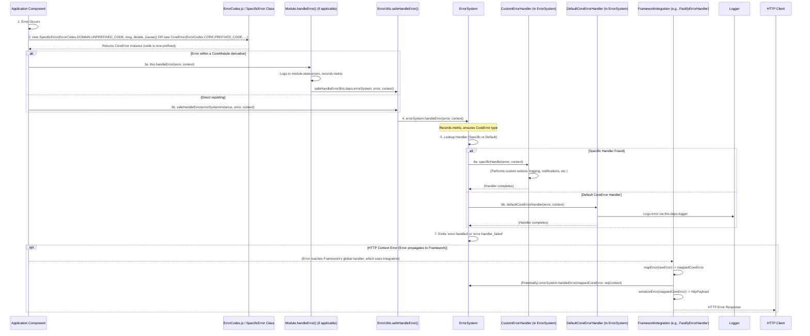
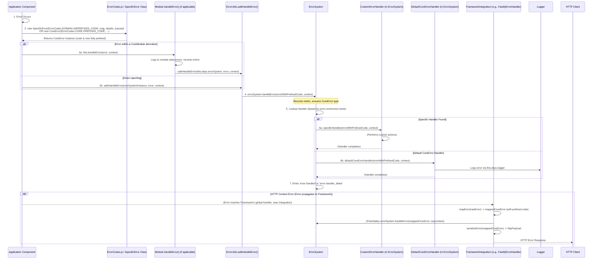

# TSMIS Error Handling System Documentation
Version: 2.1.0 (Refactored Core)

## Table of Contents

1.  [Introduction to the Error Handling System](#1-introduction-to-the-error-handling-system)
    * [1.1. Purpose & Philosophy](#11-purpose--philosophy)
    * [1.2. Key Components & Their Roles](#12-key-components--their-roles)
    * [1.3. Core Dependencies (System-Wide)](#13-core-dependencies-system-wide)
    * [1.4. Architectural Flow](#14-architectural-flow)
2.  [Component: `CoreError.js` - The Foundational Error Class](#2-component-coreerrorjs---the-foundational-error-class)
    * [2.1. Overview](#21-overview)
    * [2.2. Purpose & Key Features](#22-purpose--key-features)
    * [2.3. API Reference (`CoreError`)](#23-api-reference-coreerror)
        * [2.3.1. Constructor](#231-constructor)
        * [2.3.2. Instance Properties](#232-instance-properties)
        * [2.3.3. Instance Methods](#233-instance-methods)
        * [2.3.4. Static Methods](#234-static-methods)
    * [2.4. State Management](#24-state-management)
    * [2.5. Lifecycle Management](#25-lifecycle-management)
    * [2.6. Error Handling (Usage Context)](#26-error-handling-usage-context)
    * [2.7. Event Integration](#27-event-integration)
    * [2.8. Health Monitoring](#28-health-monitoring)
    * [2.9. Metrics Tracking](#29-metrics-tracking)
    * [2.10. Integrations (How CoreError is Used)](#210-integrations-how-coreerror-is-used)
    * [2.11. Usage Examples & Best Practices](#211-usage-examples--best-practices)
    * [2.12. Testing Strategy Notes](#212-testing-strategy-notes)
3.  [Component: Specialized Error Types (`src/core/errors/types/`)](#3-component-specialized-error-types-srccoreerrorstypes)
    * [3.1. Overview and Purpose](#31-overview-and-purpose)
    * [3.2. Common Pattern & Extension of `CoreError`](#32-common-pattern--extension-of-coreerror)
    * [3.3. Key Individual Error Types (Brief Descriptions & Purpose)](#33-key-individual-error-types-brief-descriptions--purpose)
        * [`AccessError.js`](#accesserrorjs)
        * [`AuthError.js`](#autherrorjs)
        * [`ConfigError.js`](#configerrorjs)
        * [`EventError.js`](#eventerrorjs)
        * [`ModuleError.js`](#moduleerrorjs)
        * [`NetworkError.js`](#networkerrorjs)
        * [`RouterError.js`](#routererrorjs)
        * [`ServiceError.js`](#serviceerrorjs)
        * [`ValidationError.js`](#validationerrorjs)
4.  [Component: Standardized Error Codes (`ErrorCodes.js`)](#4-component-standardized-error-codes-errorcodesjs)
    * [4.1. Overview & Purpose](#41-overview--purpose)
    * [4.2. Structure and Naming Convention](#42-structure-and-naming-convention)
    * [4.3. Usage Guidelines](#43-usage-guidelines)
    * [4.4. Integration with `CoreError` and `ErrorSystem`](#44-integration-with-coreerror-and-errorsystem)
5.  [Component: Central Management (`ErrorSystem.js`)](#5-component-central-management-errorsystemjs)
    * [5.1. Overview & Primary Responsibility](#51-overview--primary-responsibility)
    * [5.2. Key Functionalities & API](#52-key-functionalities--api)
    * [5.3. Adherence to Standardization Pillars (Recap)](#53-adherence-to-standardization-pillars-recap)
    * [5.4. State Management (`ErrorSystem` Specifics)](#54-state-management-errorsystem-specifics)
    * [5.5. Lifecycle Management (`ErrorSystem` Specifics)](#55-lifecycle-management-errorsystem-specifics)
    * [5.6. Error Handling within `ErrorSystem`](#56-error-handling-within-errorsystem)
        * [5.6.1. Internal Error Handling (`_handleInternalError`)](#561-internal-error-handling-_handleinternalerror)
        * [5.6.2. Processing Application Errors (`handleError`)](#562-processing-application-errors-handleerror)
        * [5.6.3. Default Error Handler (`defaultCoreErrorHandler`)](#563-default-error-handler-defaultcoreerrorhandler)
    * [5.7. Event Integration (`ErrorSystem` Specifics)](#57-event-integration-errorsystem-specifics)
    * [5.8. Health Monitoring (`ErrorSystem` Specifics)](#58-health-monitoring-errorsystem-specifics)
    * [5.9. Metrics Tracking (`ErrorSystem` Specifics)](#59-metrics-tracking-errorsystem-specifics)
    * [5.10. Integrations (Managed by `ErrorSystem`)](#510-integrations-managed-by-errorsystem)
    * [5.11. Usage Examples & Best Practices (`ErrorSystem`)](#511-usage-examples--best-practices-errorsystem)
    * [5.12. Testing Strategy Notes (`ErrorSystem`)](#512-testing-strategy-notes-errorsystem)
6.  [Framework Integration Layer (`src/core/errors/integrations/`)](#6-framework-integration-layer-srccoreerrorsintegrations)
    * [6.1. Interface: `IFrameworkIntegration.js`](#61-interface-iframeworkintegrationjs)
        * [6.1.1. Purpose & Role](#611-purpose--role)
        * [6.1.2. API Definition (`initialize`, `mapError`, `serializeError`, `shutdown`)](#612-api-definition-initialize-maperror-serializeerror-shutdown)
    * [6.2. Example Implementation: `FastifyErrorHandler.js`](#62-example-implementation-fastifyerrorhandlerjs)
        * [6.2.1. Overview](#621-overview)
        * [6.2.2. Key Methods & Logic Explained](#622-key-methods--logic-explained)
        * [6.2.3. How it Integrates with `ErrorSystem` and Fastify](#623-how-it-integrates-with-errorsystem-and-fastify)
    * [6.3. Logger Serialization Helper (`FastifyErrorSerializer.js`)](#63-logger-serialization-helper-fastifyerrorserializerjs)
7.  [Shared Error Utilities (`src/core/common/ErrorUtils.js`)](#7-shared-error-utilities-srccorecommonerrorutilsjs)
    * [7.1. `async safeHandleError(errorSystem, error, context = {})`](#71-async-safehandleerrorerrorsystem-error-context---)
        * [7.1.1. Purpose and Functionality](#711-purpose-and-functionality)
        * [7.1.2. Usage Example](#712-usage-example)
8.  [Overall Error Handling Workflow & Best Practices](#8-overall-error-handling-workflow--best-practices)
9.  [Testing Strategies for the Error Handling System](#9-testing-strategies-for-the-error-handling-system)
10. [Future Considerations & Improvements for Error Handling](#10-future-considerations--improvements-for-error-handling)

---

## 1. Introduction to the Error Handling System

### 1.1. Purpose & Philosophy
The TSMIS Error Handling System is a foundational part of the core architecture designed to provide a robust, consistent, and manageable approach to dealing with exceptions and operational errors throughout the application[cite: 1520]. Its core philosophy is to ensure that errors are:

* **Consistently Structured**: All custom application errors inherit from a base `CoreError` class, providing uniform properties like `code`, `message`, `details`, `timestamp`, and `cause`[cite: 1521].
* **Clearly Identifiable**: Standardized `ErrorCodes` allow for programmatic identification and precise understanding of specific error conditions[cite: 1522].
* **Centrally Processed**: The `ErrorSystem` acts as a central hub for reported errors, allowing for consistent logging, metrics, and custom handling logic[cite: 1523].
* **Contextually Rich**: Errors are encouraged to carry detailed contextual information to aid in debugging and resolution[cite: 1524].
* **User-Friendly (where applicable)**: For errors that propagate to users (e.g., via API responses), framework integrations ensure responses are informative and well-formatted[cite: 1525].
* **Resilient**: Mechanisms like `safeHandleError` prevent critical error reporting paths from failing silently[cite: 1526].
This systematic approach is vital for building a robust, maintainable, and observable application[cite: 1527].

### 1.2. Key Components & Their Roles
The Error Handling System is composed of several interconnected components, primarily residing within the `src/core/errors/` directory[cite: 1528]:

* **`CoreError.js`**: The foundational base class for all custom errors. Defines the standard structure and core functionalities for error objects[cite: 1529].
* **Specialized Error Types** (in `src/core/errors/types/`): Subclasses of `CoreError` (e.g., `ValidationError`, `ServiceError`, `ModuleError`) tailored for specific error domains[cite: 1530].
* **`ErrorCodes.js`**: A centralized registry of all unique error code strings used within the application, categorized by domain. Domain-specific codes are stored unprefixed, while `CoreError` subclasses handle prefixing[cite: 1532].
* **`ErrorSystem.js`**: The central service that manages error types, registers custom error handlers, processes reported errors, and coordinates framework integrations for error responses[cite: 1533].
* **`IFrameworkIntegration.js`** (in `src/core/errors/integrations/`): An interface defining the contract for adapters that bridge the `ErrorSystem` with specific web frameworks (e.g., Fastify)[cite: 1534].
* **`FastifyErrorHandler.js`** (in `src/core/errors/integrations/fastify/` - Example Integration): An implementation of `IFrameworkIntegration` tailored for the Fastify web framework[cite: 1535].
* **`FastifyErrorSerializer.js`** (in `src/core/errors/integrations/fastify/`): A utility to help format errors for Fastify's internal logger[cite: 1536].
* **`ErrorUtils.js`** (from `src/core/common/`): Contains shared utilities like `safeHandleError`[cite: 1537].

These components work together to create a cohesive error management strategy[cite: 1537].

### 1.3. Core Dependencies (System-Wide)
The error handling system, particularly `ErrorSystem.js` and its integrations, typically relies on:
* **Logger**: An injected logger instance (e.g., from `deps.logger`, defaulting to `console`) for outputting error information[cite: 1538].
* **Configuration**: Application configuration (e.g., `deps.config`) can influence aspects like development mode (for stack traces) or error history limits[cite: 1539].

### 1.4. Architectural Flow
Errors in TSMIS follow a structured reporting and handling path[cite: 1540]:
1. An error occurs. A `CoreError` subclass (e.g., `ValidationError`) is instantiated using an *unprefixed specific code* from `ErrorCodes.js` (e.g., `ErrorCodes.VALIDATION.INVALID_INPUT` which provides `'INVALID_INPUT'`). The subclass constructor prepends its domain prefix (e.g., `VALIDATION_`) to form the final `error.code` (e.g., `'VALIDATION_INVALID_INPUT'`)[cite: 1541].
2. The component encountering the error uses `safeHandleError` (often via its own `this.handleError` or `this._handleInternalError` method) to report it to the central `ErrorSystem`[cite: 1541].
3. `ErrorSystem` processes the error, potentially invoking custom handlers based on the error type or code[cite: 1542].
4. If the error originated from an HTTP request, a registered framework integration (like `FastifyErrorHandler`) uses `ErrorSystem` to process the error and then formats a standardized HTTP error response[cite: 1543].

**General Error Handling Flow in TSMIS**:


---
## 2. Component: `CoreError.js` - The Foundational Error Class

### 2.1. Overview
`CoreError.js` defines the `CoreError` class, which is the cornerstone of TSMIS's standardized error handling[cite: 1550]. All custom application errors must extend this class or one of its specific subclasses[cite: 1551]. It extends the native JavaScript `Error` class, enhancing it with additional structured properties[cite: 1552].

### 2.2. Purpose & Key Features
* **Standardized Structure**: Provides `name`, `code` (fully prefixed on the instance), `message`, `details`, `timestamp`, and `cause` properties[cite: 1553].
* **Error Codes**: Designed to be used with unique codes. When used with `ErrorCodes.js`[cite: 1554]:
    * `CoreError` subclasses receive an *unprefixed specific code* and prepend their domain[cite: 1554].
    * Direct `CoreError` instantiation typically uses a fully prefixed code (e.g., from `ErrorCodes.CORE`)[cite: 1554].
* **Contextual Details**: Allows attaching arbitrary, serializable `details`[cite: 1556].
* **Causation Chain**: Supports an `options.cause` parameter to link to the original error[cite: 1556].
* **Timestamping**: Automatically records the ISO 8601 timestamp of creation[cite: 1557].
* **JSON Serialization**: Provides a `toJSON()` method for structured JSON output[cite: 1558].
* **Deserialization**: Includes a static `fromJSON(data, ErrorType)` method[cite: 1559].
* **Extensibility**: Serves as the base for more specific error classes[cite: 1560].
* **Environment Awareness**: Includes logic (`isDevEnvironment`) for conditional behavior (e.g., stack traces in `toJSON()`)[cite: 1561].

### 2.3. API Reference (`CoreError`)

#### 2.3.1. Constructor
**`new CoreError(code: string, message: string, details: object = {}, options: { cause?: Error } = {})`**
* **`code`**: `string` - A unique error code[cite: 1562].
    * When `CoreError` is instantiated directly (e.g., `new CoreError(...)`), this `code` argument should be the final, fully prefixed error code string (e.g., `'CORE_UNKNOWN_ERROR'`)[cite: 1562].
    * When `CoreError` is used as a base class (i.e., `super(code, ...)` is called from a subclass like `ValidationError`), the `code` passed to `super()` is the already-prefixed code that the subclass has constructed (e.g., `ValidationError` passes `'VALIDATION_INVALID_INPUT'`).
* **`message`**: `string` - A human-readable description of the error[cite: 1563].
* **`details`**: `object` (optional) - Additional serializable information about the error[cite: 1564].
* **`options.cause`**: `Error` (optional) - The underlying error that caused this one[cite: 1565].

#### 2.3.2. Instance Properties
* `name: string`: The class name (e.g., "CoreError", "ValidationError")[cite: 1566].
* `code: string`: The fully prefixed error code stored on the instance[cite: 1566].
* `message: string`: The error message[cite: 1567].
* `details: object`: Sanitized additional details[cite: 1567].
* `timestamp: string`: ISO 8601 timestamp of creation[cite: 1567].
* `cause?: Error`: The wrapped original error, if any[cite: 1568].
* `stack?: string`: The error stack trace[cite: 1568].

#### 2.3.3. Instance Methods
* **`toJSON(): object`**: Returns a plain object representation, including `name`, `code`, `message`, `details`, `timestamp`[cite: 1569]. Includes `cause` (name, message, code, details, and dev-mode stack) and `stack` (in dev-mode)[cite: 1570].
* **`initCause(cause)`**: Initializes `this.cause`, ensuring it's an `Error` instance[cite: 1318, 1571]. (Defined as `initCause` in code [cite: 1318])
* **`sanitizeDetails(details)`**: Ensures `details` are serializable, providing a safe fallback[cite: 1327, 1572]. (Defined as `sanitizeDetails` in code [cite: 1327])
* **`isDevEnvironment()`**: Checks `process.env.NODE_ENV` or `window.ENV` to determine if it's a development/test environment[cite: 1333, 1573]. (Defined as `isDevEnvironment` in code [cite: 1333])

#### 2.3.4. Static Methods
* **`static fromJSON(data: object, ErrorType: typeof CoreError = CoreError): CoreError`**: Reconstructs an error instance (of `ErrorType`) from a plain object representation[cite: 1346, 1574].

### 2.4. State Management
Not Applicable. `CoreError` instances are data objects representing an error state; they do not manage an ongoing operational state themselves.

### 2.5. Lifecycle Management
Not Applicable. `CoreError` instances are created when an error occurs and do not have an independent lifecycle like `initialize()` or `shutdown()`.

### 2.6. Error Handling (Usage Context)
`CoreError` *is* the primary tool for representing errors[cite: 1579]. It is created and thrown by components when exceptional conditions arise[cite: 1579]. It is then caught and processed by error handling logic, often within the `ErrorSystem` or framework integrations[cite: 1580].

### 2.7. Event Integration
Not Applicable. `CoreError` instances themselves do not directly emit or subscribe to events[cite: 1581]. Error events are typically emitted by the system or module that *handles* a `CoreError`[cite: 1582].

### 2.8. Health Monitoring
Not Applicable[cite: 1583].

### 2.9. Metrics Tracking
Not Applicable. Error metrics are tracked by the systems that handle these error objects[cite: 1583].

### 2.10. Integrations (How CoreError is Used)
* **All TSMIS Components**: Any component that needs to signal an error should create and throw a `CoreError` or one of its subclasses[cite: 1584].
* **`ErrorSystem`**: `ErrorSystem.handleError()` expects to process `CoreError` instances. `ErrorSystem.createError()` produces them[cite: 1585].
* **Framework Integrations (e.g., `FastifyErrorHandler`)**: These integrations typically map raw framework errors to `CoreError` instances and use `CoreError.toJSON()` to serialize errors for HTTP responses[cite: 1586].

### 2.11. Usage Examples & Best Practices
* **Creation & Throwing**:
    When creating errors, always use codes from `ErrorCodes.js`. If using a specialized error subclass (e.g., `ValidationError`), pass the *unprefixed specific code* from the relevant domain in `ErrorCodes.js` to the subclass constructor (e.g., `ErrorCodes.VALIDATION.INVALID_INPUT` which now resolves to `'INVALID_INPUT'`). The subclass constructor will handle prefixing (e.g., `VALIDATION_INVALID_INPUT`). If using `new CoreError(...)` directly, ensure the code is fully prefixed (e.g., `ErrorCodes.CORE.UNKNOWN_ERROR` which is `'CORE_UNKNOWN_ERROR'`, or manually construct like `\`DOMAIN_${ErrorCodes.DOMAIN.CODE}\``).

**CoreError.js**: Instantiation and Usage Example

```javascript
// Assuming CoreError.js is in src/core/errors/CoreError.js
// Assuming ErrorCodes.js is in src/core/errors/ErrorCodes.js

// import { CoreError } from './CoreError.js'; // Or from wherever it's exported via an index file
// import { ErrorCodes } from './ErrorCodes.js';
// import { ServiceError } from './types/ServiceError.js'; // Example specific error
// import { ValidationError } from './types/ValidationError.js'; // Example specific error

// function performRiskyOperation(someInput) {
//   if (!someInput) {
//     // Using ValidationError with an unprefixed code from ErrorCodes.VALIDATION
//     // ErrorCodes.VALIDATION.INVALID_INPUT will now resolve to 'INVALID_INPUT'
//     throw new ValidationError(
//       ErrorCodes.VALIDATION.INVALID_INPUT, 
//       "Input cannot be empty for risky operation.",
//       { providedInput: someInput, field: 'someInput' }
//     );
//     // The error.code on this instance will be 'VALIDATION_INVALID_INPUT'
//   }
//   try {
//     // const result = externalService.call(someInput);
//     // if (!result.success) throw new Error(result.errorMessage);
//     // Simulating external error
//     throw new Error("External service call failed!");
//   } catch (externalError) {
//     // Wrapping the externalError in a more specific ServiceError
//     // Pass the unprefixed specific code from ErrorCodes.SERVICE
//     // ErrorCodes.SERVICE.EXTERNAL_API_ERROR will now resolve to 'EXTERNAL_API_ERROR'
//     throw new ServiceError(
//       ErrorCodes.SERVICE.EXTERNAL_API_ERROR, 
//       "Failed to complete operation due to an external service failure.",
//       { operation: 'performRiskyOperation', input: someInput },
//       { cause: externalError } // Preserving the original error
//     );
//     // The error.code on this instance will be 'SERVICE_EXTERNAL_API_ERROR'
//   }
// }

// try {
//   // performRiskyOperation(null); 
//   // For a generic CORE error:
//   // ErrorCodes.CORE.UNKNOWN_ERROR will still resolve to 'CORE_UNKNOWN_ERROR' (prefixed)
//   throw new CoreError(ErrorCodes.CORE.UNKNOWN_ERROR, "A generic unknown core error.");
//   // Here error.code will be 'CORE_UNKNOWN_ERROR'
// } catch (error) {
//   if (error instanceof CoreError) {
//     console.error("Caught a CoreError based error:");
//     console.error("Name:", error.name); // e.g., ValidationError, ServiceError, CoreError
//     console.error("Code:", error.code); // e.g., VALIDATION_INVALID_INPUT, SERVICE_EXTERNAL_API_ERROR, CORE_UNKNOWN_ERROR
//     console.error("Message:", error.message);
//     console.error("Details:", JSON.stringify(error.details, null, 2));
//     console.error("Timestamp:", error.timestamp);
//     if (error.cause) {
//       console.error("Caused by:", error.cause.message);
//     }
//     // For API response or structured logging:
//     // const errorResponse = error.toJSON();
//     // console.error("Serialized JSON:", JSON.stringify(errorResponse, null, 2));
//   } else {
//     console.error("Caught an unexpected error type:", error);
//   }
// }
```
* **Extending `CoreError`**: See Section 3[cite: 1603].
* **Catching & Inspecting**:
    When catching errors, check `error.code` against the fully prefixed string (e.g., `if (error.code === \`VALIDATION_${ErrorCodes.VALIDATION.INVALID_INPUT}\`)` assuming `ErrorCodes.VALIDATION.INVALID_INPUT` is `'INVALID_INPUT'`).

**CoreError.js**: Catching and Inspecting Errors
```javascript
// // Assume performRiskyOperation and error classes are defined as in previous examples
// // import { CoreError, ServiceError, ValidationError } from './core/errors'; // Example import
// // import { ErrorCodes } from './core/errors/ErrorCodes.js';

// // try {
//   // Call a function that might throw a CoreError or its subclass
//   // performRiskyOperation({ data: "some data" }); // This might throw ServiceError
//   // validateUserInput({ email: "invalid" }); // This might throw ValidationError
// // } catch (error) {
//   if (error instanceof ValidationError) {
//     console.error("--- Validation Error Specific Handling ---");
//     // ErrorCodes.VALIDATION.INVALID_INPUT is 'INVALID_INPUT'
//     // error.code is 'VALIDATION_INVALID_INPUT'
//     if (error.code === `VALIDATION_${ErrorCodes.VALIDATION.INVALID_INPUT}`) {
//         console.log("Caught the specific 'VALIDATION_INVALID_INPUT' error!");
//     }
//     console.error(`Validation failed for field(s): ${error.validationErrors.map(ve => ve.field).join(', ')}`);
//     // sendSpecificValidationErrorResponse(error);
//   } else if (error instanceof ServiceError) {
//     console.error("--- Service Error Specific Handling ---");
//     console.error(`Service operation failed with code: ${error.code}`); // e.g., SERVICE_EXTERNAL_API_ERROR
//     // triggerAlertForServiceFailure(error);
//   } else if (error instanceof CoreError) {
//     console.error("--- Generic CoreError Handling ---");
//     // ErrorCodes.CORE.INTERNAL_ERROR is 'CORE_INTERNAL_ERROR'
//     if (error.code === ErrorCodes.CORE.INTERNAL_ERROR) {
//         console.log("Caught a generic CORE_INTERNAL_ERROR!");
//     }
//     console.error(`A core error occurred: [${error.code}] ${error.message}`);
//   } else {
//     console.error("--- Unexpected Non-CoreError ---");
//     console.error(error.message);
//     // const wrappedError = new CoreError(ErrorCodes.CORE.UNKNOWN_ERROR, "An unexpected error occurred.", {}, { cause: error });
//     // errorSystem.handleError(wrappedError, { originalErrorType: error.constructor.name });
//   }
// // }
```

* **Best Practices**:
    * Always use a defined `code` from `ErrorCodes.js`. For specialized subclasses, use the specific unprefixed code from the relevant domain[cite: 1619].
    * Provide a clear, concise `message`[cite: 1619].
    * Include relevant, serializable `details` for debugging. Avoid sensitive data[cite: 1620].
    * Wrap underlying exceptions using the `cause` option to preserve context[cite: 1620].
    * Use specific subclasses of `CoreError` where appropriate for better semantic meaning[cite: 1621].

### 2.12. Testing Strategy Notes
* Test instantiation with all constructor parameters (`code`, `message`, `details`, `cause`)[cite: 1622].
* Verify all instance properties are set correctly (`name`, prefixed `code`, `message`, `details`, `timestamp`, `cause`)[cite: 1623].
* Test `toJSON()` output in both development/test mode (with stack traces) and production mode (without stack traces)[cite: 1623].
* Test `toJSON()` includes `cause` information correctly[cite: 1624].
* Test `static fromJSON()` can accurately reconstruct error instances[cite: 1624].
* Test `sanitizeDetails()` with serializable and non-serializable inputs[cite: 1625].

---
## 3. Component: Specialized Error Types (`src/core/errors/types/`)

### 3.1. Overview and Purpose
To provide more semantic meaning and enable domain-specific handling for different kinds of errors, TSMIS utilizes a set of specialized error classes[cite: 1626]. These classes all extend the base `CoreError` and are located in the `src/core/errors/types/` directory[cite: 1627]. Using specialized types allows for more precise error identification (e.g., distinguishing a `ValidationError` from a `NetworkError`) and can facilitate type-specific error handling logic within custom handlers registered with `ErrorSystem`[cite: 1628].

### 3.2. Common Pattern & Extension of `CoreError`
Each specialized error class generally follows this pattern[cite: 1629]:
1.  **Extends `CoreError`**: `export class SpecificError extends CoreError { ... }` [cite: 1629]
2.  **Constructor**:
    * Typically accepts `(specificCode, message, details = {}, options = {})`[cite: 1630].
    * The `specificCode` argument is the **unprefixed specific part** of the error code, obtained from the relevant domain in `ErrorCodes.js` (e.g., for `ValidationError`, if `ErrorCodes.VALIDATION.INVALID_INPUT` provides `'INVALID_INPUT'`, then `'INVALID_INPUT'` is passed as `specificCode`)[cite: 1631].
    * Calls `super(\`DOMAIN_${specificCode}\`, message, details, options)`. The `DOMAIN_` prefix (e.g., `VALIDATION_`, `AUTH_`) is hardcoded within the subclass's constructor to form the final, fully prefixed `error.code`[cite: 1630, 1631].
    * Sets `this.name` explicitly to its own class name (e.g., `this.name = 'ValidationError';`)[cite: 1632].
    * Often sets a default `this.statusCode` property appropriate for HTTP responses related to that error type (e.g., `this.statusCode = 400;` for `ValidationError`)[cite: 1633].
3.  **Additional Properties/Methods (Optional)**: May define additional properties (like `this.validationErrors` in `ValidationError`) or override methods (like `toJSON()` in `ValidationError` to include these extra properties)[cite: 1634].

### 3.3. Key Individual Error Types (Brief Descriptions & Purpose)
The following are the standard specialized error types provided in the TSMIS core[cite: 1635]:

* **`AccessError.js`**: Represents errors related to authorization and access control (e.g., user lacks permission for an action). Default `statusCode: 403`[cite: 1636].
* **`AuthError.js`**: Represents errors during authentication (e.g., invalid credentials, expired token, missing token). Default `statusCode: 401`[cite: 1636].
* **`ConfigError.js`**: Represents errors encountered during application configuration (loading, validation, missing required values). Default `statusCode: 500`[cite: 1637].
* **`EventError.js`**: Represents errors specific to the operation of `EventBusSystem` or `CoreEventBus` (e.g., event emission failure, invalid subscription pattern). Default `statusCode: 500`[cite: 1638].
* **`ModuleError.js`**: Represents errors specific to the `ModuleSystem` or the lifecycle/operation of a `CoreModule` (e.g., module initialization failure, missing module dependency). Default `statusCode: 500`[cite: 1639].
* **`NetworkError.js`**: Represents errors occurring during external network communications (e.g., request timeouts to other services, DNS lookup failures, connection refused). Default `statusCode: 503`, but can be overridden by `details.statusCode`[cite: 1640].
* **`RouterError.js`**: Represents errors specific to `RouterSystem` or `CoreRouter` (e.g., route registration conflicts, adapter failures, invalid route definitions). Default `statusCode: 500`[cite: 1641].
* **`ServiceError.js`**: A more generic error for issues within application services or their dependencies that don't fit other categories (e.g., database unavailable, unexpected failure in a business operation). Default `statusCode: 503`[cite: 1642].
* **`ValidationError.js`**: Represents failures in data validation, typically for user input or API request payloads. Default `statusCode: 400`. Includes a `validationErrors` array property detailing specific field validation failures.

**Example**: Defining and Using ValidationError
```javascript
// Example definition (src/core/errors/types/ValidationError.js)
// import { CoreError } from '../CoreError.js';
// import { ErrorCodes } from '../ErrorCodes.js'; // Assuming ErrorCodes.VALIDATION.INVALID_INPUT exists

// export class ValidationError extends CoreError {
//   constructor(specificCode, message, details = {}, options = {}) {
//     // 'specificCode' is expected to be an unprefixed code like 'INVALID_INPUT'
//     // from ErrorCodes.VALIDATION.INVALID_INPUT
//     super(\`VALIDATION_${specificCode}\`, message, details, options);
//     this.name = 'ValidationError';
//     this.statusCode = 400;
//     this.validationErrors = Array.isArray(details?.validationErrors) ? details.validationErrors : [];
//   }

//   toJSON() {
//     const json = super.toJSON();
//     json.validationErrors = this.validationErrors;
//     return json;
//   }

//   static fromJSON(data) {
//     const errorInstance = super.fromJSON(data, ValidationError);
//     errorInstance.validationErrors = Array.isArray(data?.validationErrors) ? data.validationErrors : [];
//     return errorInstance;
//   }
// }


// Example Usage:
// function validateUserInput(input) {
//   const errors = [];
//   if (!input.email || !input.email.includes('@')) {
//     errors.push({ field: 'email', message: 'A valid email is required.' });
//   }
//   if (!input.password || input.password.length < 8) {
//     errors.push({ field: 'password', message: 'Password must be at least 8 characters long.' });
//   }

//   if (errors.length > 0) {
//     throw new ValidationError(
//       ErrorCodes.VALIDATION.INVALID_INPUT, // This now resolves to the unprefixed 'INVALID_INPUT'
//       'User input validation failed.',
//       { validationErrors: errors, attemptId: 'user-reg-123' }
//     );
//   }
//   return true;
// }

// try {
//   validateUserInput({ email: 'test', password: 'short' });
// } catch (error) {
//   if (error instanceof ValidationError) {
//     console.error("--- Validation Error Caught ---");
//     console.error("Name:", error.name);          // ValidationError
//     console.error("Code:", error.code);          // Will be 'VALIDATION_INVALID_INPUT'
//     console.error("Message:", error.message);    // User input validation failed.
//     console.error("Status Code:", error.statusCode); // 400
//     console.error("Details:", JSON.stringify(error.details, null, 2));
//     console.error("Validation Errors Array:", JSON.stringify(error.validationErrors, null, 2));
//   }
// }
```
---
## 4. Component: Standardized Error Codes (`ErrorCodes.js`)

### 4.1. Overview & Purpose
`ErrorCodes.js` (located at `src/core/errors/ErrorCodes.js`) is the central definition for all application-specific error code strings[cite: 1663]. Its purpose is to:
* Provide a single source of truth for all error identifiers.
* Ensure consistency and prevent typos when creating and checking errors.
* Facilitate programmatic handling of errors based on unique codes.
* Offer a categorized and human-readable (for developers) map of possible error conditions.

### 4.2. Structure and Naming Convention
* The file exports a single, deeply frozen `ErrorCodes` object[cite: 1668].
* **Top-level keys** within `ErrorCodes` represent major domains or systems (e.g., `CORE`, `CONFIG`, `MODULE`, `VALIDATION`). These keys are conventionally `PascalCase` or `UPPER_SNAKE_CASE`[cite: 1669].
* **Nested keys** under each domain are the specific error identifiers, always in `UPPER_SNAKE_CASE` (e.g., `UNKNOWN_ERROR`, `INITIALIZATION_FAILED`)[cite: 1670].
* **Value Format**[cite: 1671]:
    * For codes within the generic `CORE` domain, the string value includes the `CORE_` prefix (e.g., `ErrorCodes.CORE.UNKNOWN_ERROR` is `'CORE_UNKNOWN_ERROR'`). These are typically used directly with `new CoreError(...)`.
    * For codes within other specific domains (e.g., `VALIDATION`, `CONFIG`), the string value is the **unprefixed specific part** of the code (e.g., `ErrorCodes.VALIDATION.INVALID_INPUT` is `'INVALID_INPUT'`). These are intended for use with corresponding `CoreError` subclasses.
* **Important Note on Prefixes**: `CoreError` subclasses (e.g., `ValidationError`) are responsible for prepending their domain prefix (e.g., `VALIDATION_`) to the specific, unprefixed code part (obtained from `ErrorCodes.js`) when an error instance is created. The final `error.code` property on an instantiated specialized error will thus be fully prefixed (e.g., `'VALIDATION_INVALID_INPUT'`).

### 4.3. Usage Guidelines
* **Importing**: Import the `ErrorCodes` object where needed: `import { ErrorCodes } from '../core/errors/ErrorCodes.js';` [cite: 1676]
* **Creating Errors**[cite: 1676]:
    * For specialized subclasses: `new ValidationError(ErrorCodes.VALIDATION.INVALID_INPUT, ...)` (where `ErrorCodes.VALIDATION.INVALID_INPUT` provides the unprefixed `'INVALID_INPUT'`). The `ValidationError` constructor adds the `VALIDATION_` prefix.
    * For generic `CoreError` using `CORE` domain codes: `new CoreError(ErrorCodes.CORE.INTERNAL_ERROR, ...)` (where `ErrorCodes.CORE.INTERNAL_ERROR` provides the prefixed `'CORE_INTERNAL_ERROR'`).
    * For generic `CoreError` representing a specific domain error (less common, prefer subclasses): `new CoreError(\`CONFIG_${ErrorCodes.CONFIG.LOAD_FAILED}\`, ...)` (manually prepending prefix to the unprefixed code from `ErrorCodes.CONFIG`).
* **Checking Error Codes**[cite: 1680]: In error handlers, compare `error.code` against the fully prefixed codes (e.g., `if (error.code === \`VALIDATION_${ErrorCodes.VALIDATION.INVALID_INPUT}\`)`).
* **Adding New Codes**:
    1.  Identify or create the appropriate domain object within `ErrorCodes`.
    2.  Add a new `UPPER_SNAKE_CASE` key with its corresponding string value (unprefixed for specific domains, prefixed for `CORE`).
    3.  Ensure all nested objects are also frozen with `Object.freeze()`.

### 4.4. Integration with `CoreError` and `ErrorSystem`
* **`CoreError` Subclasses**: Use unprefixed codes from `ErrorCodes.DOMAIN.SPECIFIC_CODE` in their constructors, prepending their domain prefix to create the final `error.code`[cite: 1684].
* **`ErrorSystem`**:
    * `createError(typeName, code, ...)`: Expects the unprefixed `code` from `ErrorCodes.js` when `typeName` refers to a specialized subclass. The subclass constructor then adds the prefix. If `typeName` is `'CoreError'`, `code` should be the fully prefixed code (e.g., from `ErrorCodes.CORE`).
    * `handleError(error, ...)`: Works with `error.code` which will be the fully prefixed code, allowing handlers to switch on these specific codes.

**Example**: Snippet from `ErrorCodes.js` (Illustrative)
```javascript
// src/core/errors/ErrorCodes.js (Illustrative Snippet - showing new unprefixed style for domains)

// export const ErrorCodes = Object.freeze({
//   CORE: Object.freeze({ // Values are fully prefixed
//     UNKNOWN_ERROR: 'CORE_UNKNOWN_ERROR',
//     INTERNAL_ERROR: 'CORE_INTERNAL_ERROR',
//     // ... other core errors
//   }),

//   // --- Module System & CoreModule Errors ---
//   MODULE: Object.freeze({ // Values are unprefixed specific parts
//     INITIALIZATION_FAILED: 'INITIALIZATION_FAILED',
//     MISSING_DEPENDENCIES: 'MISSING_DEPENDENCIES',
//     // ... other module system or generic module errors
//   }),

//   // --- Validation Error Specific Codes (used by ValidationError type) ---
//   VALIDATION: Object.freeze({ // Values are unprefixed specific parts
//     INVALID_INPUT: 'INVALID_INPUT',
//     SCHEMA_MISMATCH: 'SCHEMA_MISMATCH',
//     REQUIRED_FIELD: 'REQUIRED_FIELD',
//     // ... other specific validation failure codes
//   }),

//   // ... other domains like CONFIG, EVENT, ROUTER, SERVICE, NETWORK, AUTH, ACCESS ...
//   // e.g., CONFIG: Object.freeze({ LOAD_FAILED: 'LOAD_FAILED' })
// });
```

---
## 5. Component: Central Management (`ErrorSystem.js`)

### 5.1. Overview & Primary Responsibility
`ErrorSystem.js` defines the `ErrorSystem` class, which acts as the central orchestrator for error management[cite: 1688]. Its primary responsibility is to process errors reported from any part of the application, route them to appropriate handlers based on their type, manage framework integrations for consistent error responses, and serve as a factory for creating standardized error objects[cite: 1689].

### 5.2. Key Functionalities & API
* **Initialization & Shutdown**: `async initialize()` and `async shutdown()`[cite: 1690].
* **Error Processing**: `async handleError(error: Error, context = {}): Promise<void>` is the main method for application components to report errors[cite: 1691].
* **Handler Management**: `registerHandler(errorTypeName: string, handler: Function)` allows defining custom logic for specific error types[cite: 1692].
* **Integration Management**: `async registerIntegration(name, IntegrationClass, frameworkInstance, options)` for plugging in adapters like `FastifyErrorHandler`[cite: 1693].
* **Error Factory**: `createError(typeName, code, message, details, options): CoreError` for instantiating error objects. Expects an *unprefixed specific code* for `code` when `typeName` refers to a specialized subclass[cite: 1438, 1694].

### 5.3. Adherence to Standardization Pillars (Recap)
* **State Management**: Implements the standard `this.state` object. Also maintains `errorTypes`, `customHandlers`, and `integrations` maps[cite: 1695].
* **Lifecycle Management**: Follows standard `initialize`/`shutdown` patterns, emitting `LIFECYCLE_EVENTS`. `initialize()` validates registered error types. `shutdown()` cleans up handlers and integrations[cite: 1696].
* **Error Handling (Internal)**: Uses `_handleInternalError` for its own operational errors, reporting via `safeHandleError` (which uses console for `ErrorSystem`'s own errors)[cite: 1697].
* **Health Monitoring**: `checkHealth()` aggregates status from `errorsystem.state`, `errorsystem.handlers` (counts), and `errorsystem.integrations` (counts, and individual integration health if supported)[cite: 1698].
* **Metrics Tracking**: Records metrics for its lifecycle, internal errors, errors processed by `handleError`, and registrations of handlers/integrations[cite: 1699].
* **Factory Function**: `createErrorSystem(deps = {})` is provided[cite: 1700].

### 5.4. State Management (`ErrorSystem` Specifics)
Beyond the standard `this.state` object, `ErrorSystem` manages[cite: 1701]:
* **`errorTypes: Map<string, typeof CoreError>`**: A map storing the constructors of known `CoreError` subclasses, keyed by their class name[cite: 1701]. Used by `ErrorSystem.createError`[cite: 1702].
* **`customHandlers: Map<string, Function>`**: A map storing custom error handling functions, keyed by the `error.constructor.name` they are registered for[cite: 1702].
* **`integrations: Map<string, IFrameworkIntegration>`**: A map storing active framework integration instances, keyed by the name provided during registration[cite: 1703].

### 5.5. Lifecycle Management (`ErrorSystem` Specifics)
* **`initialize()`**: Key tasks include validating registered error types and preparing default handlers[cite: 1705]. It ensures the system is ready to process errors. Emits `system:initializing`, `system:initialized`, `system:running`[cite: 1705].
* **`shutdown()`**: Key tasks include attempting to gracefully shut down any registered integrations, clearing its internal maps of handlers and integrations, and removing its own event listeners[cite: 1706]. Emits `system:shutting_down`, `system:shutdown`[cite: 1707].

### 5.6. Error Handling within `ErrorSystem`

#### 5.6.1. Internal Error Handling (`_handleInternalError`)
For errors arising from its own operations, `ErrorSystem` uses its private `async _handleInternalError(error, context)` method[cite: 1708]. This method ensures the error is a `CoreError`, logs it to `ErrorSystem`'s own `this.state.errors`, records an internal metric, and logs the error to `console.error` (as `safeHandleError` with a null `errorSystem` would do).

#### 5.6.2. Processing Application Errors (`handleError`)
The public `async handleError(error: Error, context = {})` method is the primary entry point for external errors[cite: 1712]:
1. Records an `errorsystem.errors.received` metric[cite: 1712].
2. Ensures the input `error` is an instance of `CoreError`[cite: 1712]. If not, it wraps the original error in a generic `CoreError` (with code `ErrorCodes.CORE.UNKNOWN_ERROR`), preserving the original as `cause`[cite: 1713].
3. **Handler Lookup**: It determines the most specific handler by checking `this.customHandlers` for `error.constructor.name`, then for `CoreError.name`.
4. The `defaultCoreErrorHandler` is registered for `CoreError.name` by default[cite: 1716].
5. The chosen handler function is invoked[cite: 1717].
6. After the handler executes, `ErrorSystem` emits `error:handled` or `error:handler_failed` events.

#### 5.6.3. Default Error Handler (`defaultCoreErrorHandler`)
Registered for `CoreError.name` by default[cite: 1721]. If no more specific handler processes an error, this handler will be invoked[cite: 1721]. Its primary action is to log the error in a structured format (using `error.toJSON()`) via `this.deps.logger.error()`[cite: 1722].

### 5.7. Event Integration (`ErrorSystem` Specifics)
`ErrorSystem` is an `EventEmitter` and emits operational events[cite: 1723]:
* **`error:handled`**: After an error is processed by a handler[cite: 1724]. Payload: `{ error: CoreError, context: object, handlerName: string }`[cite: 1724].
* **`error:handler_failed`**: If a handler itself throws an error[cite: 1725]. Payload: `{ error: Error (handler's error), originalError: CoreError, context: object }`[cite: 1725].
* **`error:unhandled`**: If no handler could be invoked (unlikely with default)[cite: 1726]. Payload: `{ error: CoreError, context: object }`[cite: 1727].
It also emits standard system lifecycle events for itself.

### 5.8. Health Monitoring (`ErrorSystem` Specifics)
`ErrorSystem` provides a `checkHealth()` method[cite: 1728]. Default checks include[cite: 1729]:
* **`errorsystem.state`**: Its `status`, `uptime`, and internal error count[cite: 1729].
* **`errorsystem.handlers`**: Number of custom error handlers[cite: 1730].
* **`errorsystem.integrations`**: Number of framework integrations and their individual health if supported.

### 5.9. Metrics Tracking (`ErrorSystem` Specifics)
`ErrorSystem` records key metrics[cite: 1733]:
* **Lifecycle**: `errorsystem.initialized.success/failure`, `errorsystem.shutdown.success/failure`[cite: 1733].
* **Internal Operations**: `errorsystem.errors.internal`[cite: 1734].
* **Error Processing**: `errorsystem.errors.received` (Tags: `errorName`, `errorCode`).
* **Registrations**: `errorsystem.handlers.registered` (Tags: `errorTypeName`), `errorsystem.integrations.registered` (Tags: `integrationName`).

### 5.10. Integrations (Managed by `ErrorSystem`)
This details how `ErrorSystem` *manages and interacts with* its framework integrations[cite: 1738].
* **Framework Integrations (e.g., `FastifyErrorHandler`)**[cite: 1739]:
    * Registered via `errorSystem.registerIntegration(name, IntegrationClass, frameworkInstance, options)`[cite: 1739].
    * `ErrorSystem` can pass itself (`this`) to the integration's `initialize` method[cite: 1740].
    * Integrations map raw errors to `CoreError`, pass to `errorSystem.handleError()`, serialize `CoreError` for HTTP response, and send response.
* **Logger Dependency (`deps.logger`)**: Used for default error logging[cite: 1746].
* **Configuration (`deps.config`)**: Can influence behavior (e.g., `maxErrorHistory`)[cite: 1747].

**ErrorSystem - Core Structure & Error Processing Flow**:
```mermaid
graph TD
    subgraph ErrorOrigin [Error Origin]
        AppCode["Application Code / Other System"]
        Framework["HTTP Web Framework"]
    end

    subgraph ErrorSystemCore [ErrorSystem Core Components]
        direction LR
        ES_State[("this.state")]
        ES_Handlers[("Custom Handlers Map")]
        ES_Integrations[("Integrations Map")]
        ES_ErrorTypes[("Error Types Registry")]
    end
    
    AppCode -- "Reports error (e.g., new SubError(ErrorCodes.DOMAIN.CODE, ...)) via safeHandleError()" --> SafeErrorUtil["ErrorUtils.safeHandleError()"];
    Framework -- "Catches HTTP error" --> FwInt["FrameworkIntegration Instance"];
    
    FwInt -- "mapError(rawError)" --> MappedCoreError["Standardized CoreError (prefixed code)"];
    FwInt -- "errorSystem.handleError(MappedCoreError, reqCtx)" --> ES_HandleError["ErrorSystem.handleError()"];
    SafeErrorUtil -- "errorSystem.handleError(errorWithPrefixedCode, context)" --> ES_HandleError;
    
    ES_HandleError -- "1. Record Metric, Ensure CoreError" --> ES_State;
    ES_HandleError -- "2. Lookup Handler (based on error.constructor.name)" --> ES_Handlers;
    ES_Handlers -- "3a. Found Specific/Default Handler" --> ChosenHandler["Chosen Error Handler"];
    ChosenHandler -- "4. Process Error (e.g., log, notify)" --> LoggingMonitoring["External Logging/Monitoring Services"];
    ChosenHandler -- "(or DefaultHandler logs via Logger)" --> LoggerDep["Logger Dependency"];
    ES_HandleError -- "5. Emit 'error:handled' or 'error:handler_failed'" --> EventBusLink["(Event on ErrorSystem)"];

    ES_CreateError["ErrorSystem.createError(typeName, unprefixedCode, ...)"] -- "Uses" --> ES_ErrorTypes;
    AppCode -- "Creates error via factory" --> ES_CreateError;
    ES_CreateError -- returns --> AppCodeErrInst["Instantiated Error (prefixed code)"]


    classDef stateNode fill:#f9f,stroke:#333,stroke-width:2px;
    classDef utilNode fill:#e8f8f5,stroke:#333,stroke-width:1px;
    class ES_State, ES_Handlers, ES_Integrations, ES_ErrorTypes stateNode;
    class SafeErrorUtil, MappedCoreError, SerializedPayload utilNode;
```

### 5.11. Usage Examples & Best Practices (`ErrorSystem`)

**ErrorSystem**: Registering a Custom Error Handler
```javascript
// // In application setup, after ErrorSystem is initialized
// // const errorSystem = container.resolve('errorSystem');
// // import { ValidationError } from '../core/errors/types/ValidationError.js';
// // import { CoreError } from '../core/errors/CoreError.js';

// // Custom handler for ValidationErrors
// errorSystem.registerHandler(ValidationError.name, async (validationError, context) => {
//   errorSystem.deps.logger.warn(`[ValidationErrorHandler] Validation Failed for ${context.source}:`, {
//     code: validationError.code, // This will be the prefixed code, e.g., VALIDATION_INVALID_INPUT
//     message: validationError.message,
//     validationErrors: validationError.validationErrors, // Specific to ValidationError
//     context: context,
//   });
//   // Example: Notify a monitoring service or take specific action
//   // await monitoringService.reportValidationError(validationError, context);
// });

// // Register a fallback handler for any CoreError not specifically handled by other custom handlers
// // Note: ErrorSystem constructor already registers a defaultCoreErrorHandler for CoreError.name
// // This would override it if registered after initialization.
// errorSystem.registerHandler(CoreError.name, async (coreError, context) => {
//   errorSystem.deps.logger.error(`[CustomDefaultCoreErrorHandler] Core Error Occurred for ${context.source}:`, {
//     error: coreError.toJSON(), // Use toJSON for structured logging
//     context: context,
//   });
// });
```

**ErrorSystem**: Registering FastifyErrorHandler Integration
```javascript
// // Assuming ErrorSystem instance and Fastify app instance are available
// // import { FastifyErrorHandler } from '../core/errors/integrations/fastify/FastifyErrorHandler.js';
// // import Fastify from 'fastify';

// // const errorSystem = container.resolve('errorSystem');
// // const fastifyApp = Fastify({ logger: true /* other options */ });
// // const appLogger = fastifyApp.log; // Or your main application logger

// async function setupFastifyErrorIntegration(app, errSys, logger) {
//   try {
//     await errSys.registerIntegration(
//       'fastifyMain',          // A name for this integration instance
//       FastifyErrorHandler,    // The integration class constructor
//       app,                    // The Fastify framework instance
//       { errorSystem: errSys, logger } // Options for the FastifyErrorHandler
//     );
//     logger.info('[AppSetup] FastifyErrorHandler integration registered with ErrorSystem.');
//   } catch (integrationError) {
//     logger.error('[AppSetup] Failed to register FastifyErrorHandler with ErrorSystem:', integrationError);
//     // Potentially a critical failure
//     throw integrationError;
//   }
// }

// // setupFastifyErrorIntegration(fastifyApp, errorSystem, appLogger);
```

**ErrorSystem**: Application Code Reporting an Error
```javascript
// // Inside a service or module method
// // Assume 'this.errorSystem' is an injected ErrorSystem instance
// // Assume 'this.logger' is an injected logger instance
// // import { ErrorCodes } from '../core/errors/ErrorCodes.js';
// // import { ValidationError } from '../core/errors/types/ValidationError.js'; // For typeName

// async function processUserData(userId, data) {
//   try {
//     if (!data.email) {
//       // Use errorSystem.createError for consistency.
//       // Pass the typeName and the unprefixed specific code.
//       // ErrorCodes.VALIDATION.REQUIRED_FIELD should now provide 'REQUIRED_FIELD'
//       throw this.errorSystem.createError(
//         'ValidationError', // Type name (class name of the error)
//         ErrorCodes.VALIDATION.REQUIRED_FIELD, // Specific unprefixed code from ErrorCodes.VALIDATION
//         'Email is required for user processing.',
//         { field: 'email', userId, component: 'UserProcessor' }
//       );
//       // The resulting error.code on the thrown error will be 'VALIDATION_REQUIRED_FIELD'
//     }
//     // ... other processing ...
//     this.logger.info(`[UserProcessor] Successfully processed data for user ${userId}`);
//   } catch (error) {
//     // Let ErrorSystem handle it
//     const processingContext = {
//       operation: 'processUserData',
//       userId,
//       inputDataSummary: { hasEmail: !!data.email, keyCount: Object.keys(data).length }
//     };
//     await this.errorSystem.handleError(error, processingContext);

//     // Re-throw if the caller needs to act on the error (e.g., API layer to send HTTP response)
//     throw error;
//   }
// }
```

* **Best Practices**:
    * Initialize `ErrorSystem` early[cite: 1777].
    * Register specific handlers for common, actionable error types[cite: 1777].
    * Always use a framework integration for web applications[cite: 1777].
    * Provide rich context when calling `handleError`[cite: 1778].
    * Ensure a capable, structured logger is injected[cite: 1778].

### 5.12. Testing Strategy Notes (`ErrorSystem`)
* Test handler registration and invocation[cite: 1779].
* Test `handleError` with `CoreError`s, subclasses, and native errors (wrapping)[cite: 1780].
* Test `createError` factory[cite: 1780].
* Test `registerIntegration` with mock `IFrameworkIntegration`[cite: 1781].
* Test lifecycle, health checks, and metrics[cite: 1781].
* Test behavior with misconfigured dependencies (graceful degradation, console fallbacks)[cite: 1782].

---
## 6. Framework Integration Layer (`src/core/errors/integrations/`)
To bridge `ErrorSystem` with web frameworks like Fastify, TSMIS employs an integration layer.

### 6.1. Interface: `IFrameworkIntegration.js`

#### 6.1.1. Purpose & Role
`IFrameworkIntegration.js` defines the standard contract for framework-specific error handling adapters[cite: 1785]. This allows `ErrorSystem` to manage integrations polymorphically[cite: 1786]. The integration captures framework errors, processes them via `ErrorSystem`, and formats HTTP error responses[cite: 1787].

#### 6.1.2. API Definition (`initialize`, `mapError`, `serializeError`, `shutdown`)
Key methods defined by `IFrameworkIntegration`[cite: 1788]:
* **`async initialize(framework: object, options: { errorSystem?: ErrorSystem, logger?: object })`**: Sets up integration with the framework (e.g., registers global error handler). Receives `ErrorSystem` and `logger`[cite: 1789].
* **`mapError(frameworkError: Error, requestContext = {}): CoreError`**: Converts raw framework error to a `CoreError`[cite: 1789].
* **`serializeError(coreError: CoreError, requestContext = {}): object`**: Transforms `CoreError` to HTTP response payload[cite: 1790].
* **`async shutdown(): Promise<void>|void`** (Optional): Cleanup for integration[cite: 1791].

**IFrameworkIntegration.js**: Interface Definition
```javascript
// src/core/errors/integrations/IFrameworkIntegration.js (Illustrative Content)
// import { CoreError } from '../CoreError.js';
// import { ErrorSystem } from '../ErrorSystem.js'; // For type hinting

// export class IFrameworkIntegration {
//   /**
//    * Initializes the integration with the specific web framework instance.
//    * @param {object} framework - The instance of the web framework.
//    * @param {object} [options={}] - Integration-specific options.
//    * @param {ErrorSystem} [options.errorSystem] - An instance of the ErrorSystem.
//    * @param {object} [options.logger] - A logger instance.
//    * @returns {Promise<void>|void}
//    */
//   async initialize(framework, options = {}) {
//     throw new Error('IFrameworkIntegration.initialize() must be implemented by subclass.');
//   }

//   /**
//    * Maps a raw error to a standardized CoreError instance.
//    * @param {Error} frameworkError - The raw error object.
//    * @param {object} [requestContext={}] - Optional context from the request.
//    * @returns {CoreError} An instance of CoreError or its subclass.
//    */
//   mapError(frameworkError, requestContext = {}) {
//     throw new Error('IFrameworkIntegration.mapError() must be implemented by subclass.');
//   }

//   /**
//    * Serializes a CoreError instance into a format for an HTTP response body.
//    * @param {CoreError} coreError - The CoreError instance to serialize.
//    * @param {object} [requestContext={}] - Optional context from the request.
//    * @returns {object} A plain object representing the error response payload.
//    */
//   serializeError(coreError, requestContext = {}) {
//     throw new Error('IFrameworkIntegration.serializeError() must be implemented by subclass.');
//   }

//   /**
//    * Optional method for cleanup during ErrorSystem shutdown.
//    * @returns {Promise<void>|void}
//    */
//   async shutdown() {
//     // Optional: Subclasses can implement this.
//   }
// }
```

### 6.2. Example Implementation: `FastifyErrorHandler.js`

#### 6.2.1. Overview
`FastifyErrorHandler.js` implements `IFrameworkIntegration` for Fastify[cite: 1797]. It hooks into Fastify's error handling for consistent error processing and HTTP responses[cite: 1798].

#### 6.2.2. Key Methods & Logic Explained
* **`async initialize(fastify, options)`**[cite: 1799]:
    * Stores `options.errorSystem` and `options.logger`[cite: 1800].
    * Adds Fastify `onRequest` hook for `request.errorContext`[cite: 1800].
    * Calls `fastify.setErrorHandler()` to register Fastify's global error handler. This handler[cite: 1801]:
        1.  Calls `this.mapError()` to get a `CoreError`[cite: 1801].
        2.  Calls `await this.errorSystem.handleError()` for processing[cite: 1802].
        3.  Calls `this.serializeError()` for JSON payload[cite: 1803].
        4.  Uses `reply.status().send()` to send HTTP response[cite: 1804].
* **`mapError(frameworkError, requestContext)`**[cite: 1805]:
    * Returns `frameworkError` if already `CoreError`[cite: 1806].
    * Handles Fastify validation errors (`.validation` or `FST_ERR_VALIDATION`) creating `ValidationError`[cite: 1807].
    * Handles Fastify "Not Found" errors (`FST_ERR_NOT_FOUND` or `statusCode 404`) creating `NetworkError`[cite: 1808].
    * Wraps other errors in `CoreError` with `ErrorCodes.CORE.UNKNOWN_ERROR`[cite: 1809].
    * Ensures appropriate `statusCode` on the `CoreError`[cite: 1810].
* **`serializeError(coreError, requestContext)`**[cite: 1811]:
    * Relies on `coreError.toJSON()`[cite: 1812].
    * May add minimal, safe `requestContext` (like `requestId`).

**FastifyErrorHandler.js**: Example Implementation Snippet
```javascript
// src/core/errors/integrations/fastify/FastifyErrorHandler.js (Illustrative Snippet)
// import { IFrameworkIntegration } from '../IFrameworkIntegration.js';
// import { CoreError } from '../../CoreError.js';
// import { ErrorCodes } from '../../ErrorCodes.js';
// import { ValidationError, NetworkError } from '../../types/index.js';

// export class FastifyErrorHandler extends IFrameworkIntegration {
//   errorSystem = null;
//   logger = console;
//   initialized = false;

//   constructor() { super(); }

//   async initialize(fastify, options = {}) {
//     if (this.initialized) return;
//     this.errorSystem = options.errorSystem;
//     this.logger = options.logger || this.logger;
//     fastify.addHook('onRequest', async (request, reply) => {
//       request.errorContext = { /* requestId, url, method, ip, timestamp */ };
//     });
//     fastify.setErrorHandler(async (error, request, reply) => {
//       const requestContext = { ...request.errorContext, params: request.params, query: request.query };
//       const mappedCoreError = this.mapError(error, requestContext); // mappedCoreError.code will be prefixed

//       if (this.errorSystem) {
//         await this.errorSystem.handleError(mappedCoreError, requestContext);
//       } else {
//         this.logger.error('[FastifyErrorHandler] ErrorSystem unavailable. Logging raw mapped error:', {
//           error: mappedCoreError.toJSON ? mappedCoreError.toJSON() : mappedCoreError, context: requestContext,
//         });
//       }
//       const responsePayload = this.serializeError(mappedCoreError, requestContext);
//       let statusCode = mappedCoreError.statusCode || 500;
//       if (typeof statusCode !== 'number' || statusCode < 100 || statusCode > 599) statusCode = 500;
//       reply.status(statusCode).send(responsePayload);
//     });
//     this.initialized = true;
//   }

//   mapError(frameworkError, requestContext = {}) {
//     if (frameworkError instanceof CoreError) return frameworkError;
//     // Example: Fastify validation errors
//     if (frameworkError.code === 'FST_ERR_VALIDATION' || frameworkError.validation) {
//       const validationDetails = frameworkError.validation?.map(vErr => ({ /* ... */ }));
//       // ErrorCodes.VALIDATION.SCHEMA_MISMATCH is now 'SCHEMA_MISMATCH'
//       const validationError = new ValidationError(
//         ErrorCodes.VALIDATION.SCHEMA_MISMATCH,
//         frameworkError.message || 'Request validation failed.',
//         { validationErrors: validationDetails || [], rawFastifyValidation: frameworkError.validation },
//         { cause: frameworkError }
//       );
//       validationError.statusCode = frameworkError.statusCode || 400;
//       return validationError; // error.code will be 'VALIDATION_SCHEMA_MISMATCH'
//     }
//     // ... other specific mappings ...
//     // Fallback for generic errors
//     return new CoreError(
//         ErrorCodes.CORE.UNKNOWN_ERROR, // This is already 'CORE_UNKNOWN_ERROR'
//         frameworkError.message, {}, { cause: frameworkError }
//     );
//   }

//   serializeError(coreError, requestContext = {}) {
//     if (coreError instanceof CoreError) {
//       const serialized = coreError.toJSON(); // This contains the prefixed error.code
//       return { ...serialized /*, context: { requestId: requestContext?.requestId } */ };
//     }
//     return { /* fallback serialization */ };
//   }
// }
```

#### 6.2.3. How it Integrates with `ErrorSystem` and Fastify
1.  **Registration**: `FastifyErrorHandler` instance registered with `ErrorSystem` via `errorSystem.registerIntegration()`[cite: 1830].
2.  **Initialization**: `ErrorSystem` calls `fastifyErrorHandler.initialize()`[cite: 1831].
3.  **Runtime**: Fastify's global error handler (set by `FastifyErrorHandler`) invokes `FastifyErrorHandler` methods, which coordinate with `ErrorSystem`[cite: 1832].

### 6.3. Logger Serialization Helper (`FastifyErrorSerializer.js`)
Fastify uses Pino logger, allowing custom error serializers[cite: 1833]. `FastifyErrorSerializer.js` provides `createFastifyLoggerErrorSerializer(serializeMethod)` to configure Fastify's logger to use `FastifyErrorHandler.serializeError` for consistent structured error logging.

**FastifyErrorSerializer.js**: Utility Definition
```javascript
// src/core/errors/integrations/fastify/FastifyErrorSerializer.js (Illustrative Content)

// export function createFastifyLoggerErrorSerializer(serializeMethod) {
//   if (typeof serializeMethod !== 'function') {
//     console.warn('[FastifyErrorSerializer] serializeMethod is not a function.');
//     return {
//       serializer: (error) => ({ 
//         message: error.message, 
//         stack: error.stack, 
//         code: error.code, // This will be the prefixed code
//         name: error.name 
//       })
//     };
//   }
//   return {
//     serializer: (error) => serializeMethod(error, {}), // serializeMethod expects a CoreError
//   };
// }
```

---
## 7. Shared Error Utilities (`src/core/common/ErrorUtils.js`)

### 7.1. `async safeHandleError(errorSystem, error, context = {})`

#### 7.1.1. Purpose and Functionality
This utility (in `src/core/common/ErrorUtils.js`) provides a fallback for error reporting[cite: 1840]. It tries to delegate to `errorSystem.handleError()`[cite: 1841]. If `errorSystem` is unavailable or `handleError()` fails, `safeHandleError` catches this and logs the original (and forwarding error) to `console.error`, ensuring errors are not lost[cite: 1842].

#### 7.1.2. Usage Example
**Example**: Usage of safeHandleError
```javascript
// Example usage of safeHandleError within a component's method:
// Assume 'this.deps.errorSystem' holds the ErrorSystem instance
// import { CoreError } from '../errors/CoreError.js';
// import { ServiceError } from '../errors/types/ServiceError.js'; // Example specific error
// import { ErrorCodes } from '../errors/ErrorCodes.js';
// import { safeHandleError } from '../common/ErrorUtils.js';

// async function someOperationInComponent() {
//   try {
//     if (true /* some condition leads to error */) {
//       throw new Error("A raw error occurred during the operation.");
//     }
//   } catch (rawError) {
//     // Create a standardized ServiceError
//     // ErrorCodes.SERVICE.OPERATION_FAILED is now 'OPERATION_FAILED'
//     const operationError = new ServiceError(
//       ErrorCodes.SERVICE.OPERATION_FAILED, 
//       `The operation failed: ${rawError.message}`,
//       { operationName: 'someOperationInComponent', inputParameters: { /*...*/ } },
//       { cause: rawError }
//     );
//     // operationError.code will be 'SERVICE_OPERATION_FAILED'

//     await safeHandleError(this.deps.errorSystem, operationError, {
//       source: this.constructor.name,
//       customContext: 'Additional info about where in the operation it failed.'
//     });
//     // throw operationError; // Optionally re-throw
//   }
// }
```

---
## 8. Overall Error Handling Workflow & Best Practices

The general workflow for errors in TSMIS:
1.  **Detection & Instantiation**: Errors are detected. Specific `CoreError` subclasses are instantiated with **unprefixed specific codes** from `ErrorCodes.DOMAIN.CODE_NAME` (the subclass constructor prepends the domain). Generic `CoreError` instances use fully prefixed codes from `ErrorCodes.CORE.CODE_NAME` or manually constructed prefixed codes. All include clear messages, details, and wrapped causes[cite: 1851].
2.  **Local Handling Attempt (Optional)**: A component might attempt local recovery[cite: 1852].
3.  **Centralized Reporting**: Significant errors are reported to `ErrorSystem` via `module.handleError()` or `safeHandleError()`[cite: 1853].
4.  **`ErrorSystem` Processing**: `ErrorSystem` invokes appropriate handlers[cite: 1854]. Handlers perform logging, metrics, notifications[cite: 1854].
5.  **API Response (if applicable)**: For HTTP errors, the framework integration uses the processed `CoreError` for a standardized response[cite: 1855].

**General Error Handling Flow in TSMIS (Recap)**:


**Best Practices:**
* **Specificity**: Use the most specific `CoreError` subclass. Pass the corresponding *unprefixed specific code* from `ErrorCodes.js` to its constructor[cite: 1863].
* **Context is Key**: Always provide rich, serializable `details` and wrap `cause`[cite: 1863].
* **Report, Don't Just Log (Usually)**: Prefer reporting to `ErrorSystem` over just `console.log` for significant errors[cite: 1864].
* **Idempotent Handlers**: Design custom error handlers in `ErrorSystem` to be idempotent if they might be called multiple times[cite: 1865].
* **Security**: Be mindful of not leaking sensitive information in error messages or details exposed to clients. `CoreError.toJSON()` and framework serializers should consider this[cite: 1867].
* **Test Error Paths**: Thoroughly test error conditions[cite: 1868].

---
## 9. Testing Strategies for the Error Handling System
* **`CoreError` & Subclasses**: Verify properties, `toJSON()` (dev/prod), `cause`, `fromJSON()`. For subclasses, test `statusCode` and specific properties (e.g., `ValidationError.validationErrors`).
* **`ErrorCodes.js`**: Ensure correct import and use in error instantiation tests[cite: 1870].
* **`ErrorSystem.js`**:
    * Test `initialize()`/`shutdown()` lifecycles, state, events.
    * Test `registerHandler()`: invocation by `handleError()` based on error type.
    * Test `handleError()`: with `CoreError`s, subclasses, native errors (wrapping), event emissions.
    * Test `defaultCoreErrorHandler` behavior.
    * Test `createError()` factory method.
    * Test `registerIntegration()` with mock `IFrameworkIntegration`.
    * Test internal error handling.
    * Test health checks and metrics.
* **`IFrameworkIntegration.js` Implementations (e.g., `FastifyErrorHandler.js`)**:
    * Test `initialize()` with mock framework.
    * Test `mapError()` with various errors for correct mapping to `CoreError` types.
    * Test `serializeError()` for correct HTTP payload generation.
    * Conduct integration tests with mock framework routes.
* **`ErrorUtils.js`**:
    * Test `safeHandleError()` with working, null/invalid, and failing `ErrorSystem` mock, verify console fallbacks.
    * Test `createStandardHealthCheckResult()` for correct output structure.

---
## 10. Future Considerations & Improvements for Error Handling
(Drawn from the more general "ErrorSystem Related" in the main SoT conclusion)
* **Enhanced Error Tracking & Analytics**: Aggregation, deduplication, unique IDs for cross-system tracing. Integration with services like Sentry, Rollbar[cite: 1882].
* **Expanded Framework Integrations**: Adapters for other frameworks (Express, Koa) or API styles (GraphQL)[cite: 1883].
* **Security for Error Details**: Sophisticated sanitization and configurable redaction for sensitive data[cite: 1884].
* **Error Analysis Tools**: Develop tools for pattern analysis, automated root cause analysis[cite: 1885].
* **Improved Developer Experience for Error Debugging**: Enhance context in dev mode, link error codes to detailed documentation[cite: 1886].
* **Error Code to Message Localization**: For user-facing errors, map `ErrorCodes` to localized messages[cite: 1887].