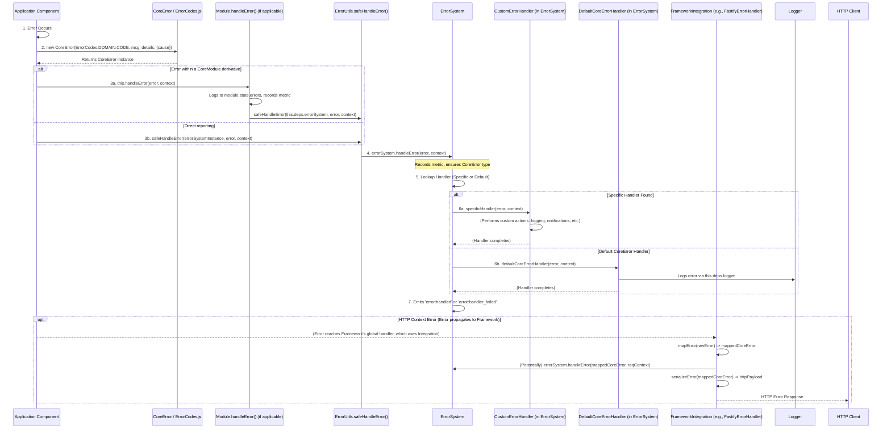
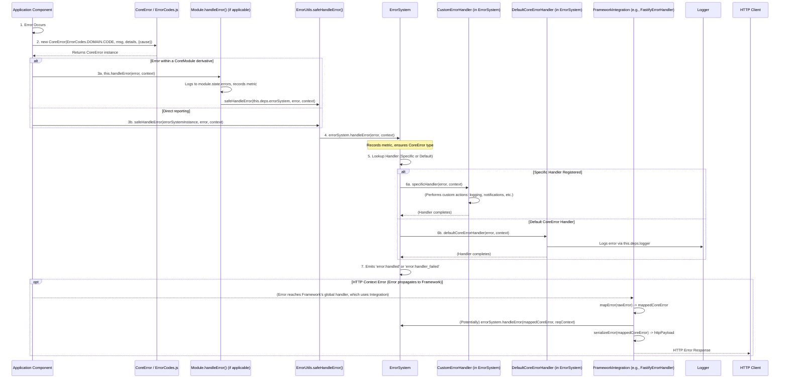

# TSMIS Error Handling System Documentation
Version: 2.0.0 (Refactored Core)

## Table of Contents

1.  [Introduction to the Error Handling System](#1-introduction-to-the-error-handling-system)
    * [1.1. Purpose & Philosophy](#11-purpose--philosophy)
    * [1.2. Key Components & Their Roles](#12-key-components--their-roles)
    * [1.3. Core Dependencies (System-Wide)](#13-core-dependencies-system-wide)
    * [1.4. Architectural Flow](#14-architectural-flow)
2.  [Component: `CoreError.js` - The Foundational Error Class](#2-component-coreerrorjs---the-foundational-error-class)
    * [2.1. Overview](#21-overview)
    * [2.2. Purpose & Key Features](#22-purpose--key-features)
    * [2.3. API Reference (`CoreError`)](#23-api-reference-coreerror)
        * [2.3.1. Constructor](#231-constructor)
        * [2.3.2. Instance Properties](#232-instance-properties)
        * [2.3.3. Instance Methods](#233-instance-methods)
        * [2.3.4. Static Methods](#234-static-methods)
    * [2.4. State Management](#24-state-management)
    * [2.5. Lifecycle Management](#25-lifecycle-management)
    * [2.6. Error Handling (Usage Context)](#26-error-handling-usage-context)
    * [2.7. Event Integration](#27-event-integration)
    * [2.8. Health Monitoring](#28-health-monitoring)
    * [2.9. Metrics Tracking](#29-metrics-tracking)
    * [2.10. Integrations (How CoreError is Used)](#210-integrations-how-coreerror-is-used)
    * [2.11. Usage Examples & Best Practices](#211-usage-examples--best-practices)
    * [2.12. Testing Strategy Notes](#212-testing-strategy-notes)
3.  [Component: Specialized Error Types (`src/core/errors/types/`)](#3-component-specialized-error-types-srccoreerrorstypes)
    * [3.1. Overview and Purpose](#31-overview-and-purpose)
    * [3.2. Common Pattern & Extension of `CoreError`](#32-common-pattern--extension-of-coreerror)
    * [3.3. Key Individual Error Types (Brief Descriptions & Purpose)](#33-key-individual-error-types-brief-descriptions--purpose)
        * [`AccessError.js`](#accesserrorjs)
        * [`AuthError.js`](#autherrorjs)
        * [`ConfigError.js`](#configerrorjs)
        * [`EventError.js`](#eventerrorjs)
        * [`ModuleError.js`](#moduleerrorjs)
        * [`NetworkError.js`](#networkerrorjs)
        * [`RouterError.js`](#routererrorjs)
        * [`ServiceError.js`](#serviceerrorjs)
        * [`ValidationError.js`](#validationerrorjs)
4.  [Component: Standardized Error Codes (`ErrorCodes.js`)](#4-component-standardized-error-codes-errorcodesjs)
    * [4.1. Overview & Purpose](#41-overview--purpose)
    * [4.2. Structure and Naming Convention](#42-structure-and-naming-convention)
    * [4.3. Usage Guidelines](#43-usage-guidelines)
    * [4.4. Integration with `CoreError` and `ErrorSystem`](#44-integration-with-coreerror-and-errorsystem)
5.  [Component: Central Management (`ErrorSystem.js`)](#5-component-central-management-errorsystemjs)
    * [5.1. Overview & Primary Responsibility](#51-overview--primary-responsibility)
    * [5.2. Key Functionalities & API](#52-key-functionalities--api)
    * [5.3. Adherence to Standardization Pillars (Recap)](#53-adherence-to-standardization-pillars-recap)
    * [5.4. State Management (`ErrorSystem` Specifics)](#54-state-management-errorsystem-specifics)
    * [5.5. Lifecycle Management (`ErrorSystem` Specifics)](#55-lifecycle-management-errorsystem-specifics)
    * [5.6. Error Handling within `ErrorSystem`](#56-error-handling-within-errorsystem)
        * [5.6.1. Internal Error Handling (`_handleInternalError`)](#561-internal-error-handling-_handleinternalerror)
        * [5.6.2. Processing Application Errors (`handleError`)](#562-processing-application-errors-handleerror)
        * [5.6.3. Default Error Handler (`defaultCoreErrorHandler`)](#563-default-error-handler-defaultcoreerrorhandler)
    * [5.7. Event Integration (`ErrorSystem` Specifics)](#57-event-integration-errorsystem-specifics)
    * [5.8. Health Monitoring (`ErrorSystem` Specifics)](#58-health-monitoring-errorsystem-specifics)
    * [5.9. Metrics Tracking (`ErrorSystem` Specifics)](#59-metrics-tracking-errorsystem-specifics)
    * [5.10. Integrations (Managed by `ErrorSystem`)](#510-integrations-managed-by-errorsystem)
    * [5.11. Usage Examples & Best Practices (`ErrorSystem`)](#511-usage-examples--best-practices-errorsystem)
    * [5.12. Testing Strategy Notes (`ErrorSystem`)](#512-testing-strategy-notes-errorsystem)
6.  [Framework Integration Layer (`src/core/errors/integrations/`)](#6-framework-integration-layer-srccoreerrorsintegrations)
    * [6.1. Interface: `IFrameworkIntegration.js`](#61-interface-iframeworkintegrationjs)
        * [6.1.1. Purpose & Role](#611-purpose--role)
        * [6.1.2. API Definition (`initialize`, `mapError`, `serializeError`, `shutdown`)](#612-api-definition-initialize-maperror-serializeerror-shutdown)
    * [6.2. Example Implementation: `FastifyErrorHandler.js`](#62-example-implementation-fastifyerrorhandlerjs)
        * [6.2.1. Overview](#621-overview)
        * [6.2.2. Key Methods & Logic Explained](#622-key-methods--logic-explained)
        * [6.2.3. How it Integrates with `ErrorSystem` and Fastify](#623-how-it-integrates-with-errorsystem-and-fastify)
    * [6.3. Logger Serialization Helper (`FastifyErrorSerializer.js`)](#63-logger-serialization-helper-fastifyerrorserializerjs)
7.  [Shared Error Utilities (`src/core/common/ErrorUtils.js`)](#7-shared-error-utilities-srccorecommonerrorutilsjs)
    * [7.1. `async safeHandleError(errorSystem, error, context = {})`](#71-async-safehandleerrorerrorsystem-error-context---)
        * [7.1.1. Purpose and Functionality](#711-purpose-and-functionality)
        * [7.1.2. Usage Example](#712-usage-example)
8.  [Overall Error Handling Workflow & Best Practices](#8-overall-error-handling-workflow--best-practices)
9.  [Testing Strategies for the Error Handling System](#9-testing-strategies-for-the-error-handling-system)
10. [Future Considerations & Improvements for Error Handling](#10-future-considerations--improvements-for-error-handling)

---

## 1. Introduction to the Error Handling System

### 1.1. Purpose & Philosophy

The TSMIS Error Handling System is a foundational part of the core architecture designed to provide a robust, consistent, and manageable approach to dealing with exceptions and operational errors throughout the application. Its core philosophy is to ensure that errors are:

* **Consistently Structured**: All custom application errors inherit from a base `CoreError` class, providing uniform properties like `code`, `message`, `details`, `timestamp`, and `cause`.
* **Clearly Identifiable**: Standardized `ErrorCodes` allow for programmatic identification and precise understanding of specific error conditions.
* **Centrally Processed**: The `ErrorSystem` acts as a central hub for reported errors, allowing for consistent logging, metrics, and custom handling logic.
* **Contextually Rich**: Errors are encouraged to carry detailed contextual information to aid in debugging and resolution.
* **User-Friendly (where applicable)**: For errors that propagate to users (e.g., via API responses), framework integrations ensure responses are informative and well-formatted.
* **Resilient**: Mechanisms like `safeHandleError` prevent critical error reporting paths from failing silently.

This systematic approach is vital for building a robust, maintainable, and observable application.

### 1.2. Key Components & Their Roles

The Error Handling System is composed of several interconnected components, primarily residing within the `src/core/errors/` directory:

* **`CoreError.js`**: The foundational base class for all custom errors. Defines the standard structure and core functionalities for error objects.
* **Specialized Error Types** (in `src/core/errors/types/`): Subclasses of `CoreError` (e.g., `ValidationError`, `ServiceError`, `ModuleError`) tailored for specific error domains. They often carry additional domain-specific properties or default HTTP status codes.
* **`ErrorCodes.js`**: A centralized registry of all unique error code strings used within the application, categorized by domain.
* **`ErrorSystem.js`**: The central service that manages error types, registers custom error handlers, processes reported errors, and coordinates framework integrations for error responses.
* **`IFrameworkIntegration.js`** (in `src/core/errors/integrations/`): An interface defining the contract for adapters that bridge the `ErrorSystem` with specific web frameworks (e.g., Fastify).
* **`FastifyErrorHandler.js`** (in `src/core/errors/integrations/fastify/` - Example Integration): An implementation of `IFrameworkIntegration` tailored for the Fastify web framework.
* **`FastifyErrorSerializer.js`** (in `src/core/errors/integrations/fastify/`): A utility to help format errors for Fastify's internal logger.
* **`ErrorUtils.js`** (from `src/core/common/`): Contains shared utilities like `safeHandleError`.

These components work together to create a cohesive error management strategy.

### 1.3. Core Dependencies (System-Wide)

The error handling system, particularly `ErrorSystem.js` and its integrations, typically relies on:
* **Logger**: An injected logger instance (e.g., from `deps.logger`, defaulting to `console`) for outputting error information.
* **Configuration**: Application configuration (e.g., `deps.config`) can influence aspects like development mode (for stack traces) or error history limits.

### 1.4. Architectural Flow

Errors in TSMIS follow a structured reporting and handling path:
1. An error occurs and is represented as a `CoreError` (or subclass) instance, using a defined `ErrorCodes`.
2. The component encountering the error uses `safeHandleError` (often via its own `this.handleError` or `this._handleInternalError` method) to report it to the central `ErrorSystem`.
3. `ErrorSystem` processes the error, potentially invoking custom handlers.
4. If the error originated from an HTTP request, a registered framework integration (like `FastifyErrorHandler`) uses `ErrorSystem` to process the error and then formats a standardized HTTP error response.

**General Error Handling Flow in TSMIS**: 



---
## 2. Component: `CoreError.js` - The Foundational Error Class

### 2.1. Overview
`CoreError.js` defines the `CoreError` class, which is the cornerstone of TSMIS's standardized error handling. All custom application errors must extend this class or one of its specific subclasses. It extends the native JavaScript `Error` class, enhancing it with additional structured properties.

### 2.2. Purpose & Key Features
* **Standardized Structure**: Provides `name`, `code`, `message`, `details`, `timestamp`, and `cause` properties.
* **Error Codes**: Designed to be used with unique codes from `ErrorCodes.js`. The `code` property on a `CoreError` instance will typically be the fully prefixed code (e.g., `VALIDATION_INVALID_INPUT`).
* **Contextual Details**: Allows attaching arbitrary, serializable `details`.
* **Causation Chain**: Supports an `options.cause` parameter to link to the original error, preserving its context and stack trace.
* **Timestamping**: Automatically records the ISO 8601 timestamp of when the error instance was created.
* **JSON Serialization**: Provides a `toJSON()` method for converting error objects into a structured JSON format, suitable for API responses or logging. This method conditionally includes stack traces for development/test environments.
* **Deserialization**: Includes a static `fromJSON(data, ErrorType)` method to reconstruct `CoreError` (or subclass) instances from JSON data.
* **Extensibility**: Serves as the base for more specific error classes.
* **Environment Awareness**: Includes logic (`_isDevEnvironment`) to determine if the application is running in a development or test environment, which can affect the verbosity of `toJSON()`.

### 2.3. API Reference (`CoreError`)

#### 2.3.1. Constructor
**`new CoreError(code: string, message: string, details: object = {}, options: { cause?: Error } = {})`**
* **`code`**: `string` - The fully prefixed error code (e.g., `CORE_UNKNOWN_ERROR`, `VALIDATION_INVALID_INPUT`). Subclasses often construct this prefixed code themselves.
* **`message`**: `string` - A human-readable description of the error.
* **`details`**: `object` (optional) - Additional serializable information about the error.
* **`options.cause`**: `Error` (optional) - The underlying error that caused this one.

#### 2.3.2. Instance Properties
* `name: string`: The class name (e.g., "CoreError", "ValidationError").
* `code: string`: The error code provided.
* `message: string`: The error message.
* `details: object`: Sanitized additional details.
* `timestamp: string`: ISO 8601 timestamp of creation.
* `cause?: Error`: The wrapped original error, if any.
* `stack?: string`: The error stack trace.

#### 2.3.3. Instance Methods
* **`toJSON(): object`**: Returns a plain object representation, including `name`, `code`, `message`, `details`, `timestamp`. Includes `cause` (name, message, code, details, and dev-mode stack) and `stack` (in dev-mode).
* **`_initCause(cause)`** (private): Initializes `this.cause`, ensuring it's an `Error` instance.
* **`_sanitizeDetails(details)`** (private): Ensures `details` are serializable, providing a safe fallback.
* **`_isDevEnvironment()`** (private): Checks `process.env.NODE_ENV` or `window.ENV` to determine if it's a development/test environment.

#### 2.3.4. Static Methods
* **`static fromJSON(data: object, ErrorType: typeof CoreError = CoreError): CoreError`**: Reconstructs an error instance (of `ErrorType`) from a plain object representation.

### 2.4. State Management
Not Applicable. `CoreError` instances are data objects representing an error state; they do not manage an ongoing operational state themselves.

### 2.5. Lifecycle Management
Not Applicable. `CoreError` instances are created when an error occurs and do not have an independent lifecycle like `initialize()` or `shutdown()`.

### 2.6. Error Handling (Usage Context)
`CoreError` *is* the primary tool for representing errors. It is created and thrown by components when exceptional conditions arise. It is then caught and processed by error handling logic, often within the `ErrorSystem` or framework integrations.

### 2.7. Event Integration
Not Applicable. `CoreError` instances themselves do not directly emit or subscribe to events. Error events are typically emitted by the system or module that *handles* a `CoreError`.

### 2.8. Health Monitoring
Not Applicable.

### 2.9. Metrics Tracking
Not Applicable. Error metrics are tracked by the systems that handle these error objects.

### 2.10. Integrations (How CoreError is Used)
* **All TSMIS Components**: Any component that needs to signal an error should create and throw a `CoreError` or one of its subclasses.
* **`ErrorSystem`**: `ErrorSystem.handleError()` expects to process `CoreError` instances. `ErrorSystem.createError()` produces them.
* **Framework Integrations (e.g., `FastifyErrorHandler`)**: These integrations typically map raw framework errors to `CoreError` instances and use `CoreError.toJSON()` to serialize errors for HTTP responses.

### 2.11. Usage Examples & Best Practices
* **Creation & Throwing**:
    
    **CoreError.js**: Instantiation and Usage Example

    ```javascript
    // Assuming CoreError.js is in src/core/errors/CoreError.js
    // Assuming ErrorCodes.js is in src/core/errors/ErrorCodes.js

    // import { CoreError } from './CoreError.js'; // Or from wherever it's exported via an index file
    // import { ErrorCodes } from './ErrorCodes.js';
    // import { ServiceError } from './types/ServiceError.js'; // Example specific error

    // function performRiskyOperation(someInput) {
    //   if (!someInput) {
    //     throw new CoreError(
    //       ErrorCodes.CORE.INVALID_ARGUMENT, // Or a more specific CONFIG error code
    //       "Input cannot be empty for risky operation.",
    //       { providedInput: someInput }
    //     );
    //   }
    //   try {
    //     // const result = externalService.call(someInput);
    //     // if (!result.success) throw new Error(result.errorMessage); // Simulating external error
    //     throw new Error("External service call failed!"); // Placeholder for actual operation
    //   } catch (externalError) {
    //     // Wrapping the externalError in a more specific ServiceError
    //     throw new ServiceError(
    //       ErrorCodes.SERVICE.EXTERNAL_API_ERROR, // Assuming this code exists in ErrorCodes.SERVICE
    //       "Failed to complete operation due to an external service failure.",
    //       { operation: 'performRiskyOperation', input: someInput },
    //       { cause: externalError } // Preserving the original error
    //     );
    //   }
    // }

    // try {
    //   performRiskyOperation(null);
    // } catch (error) {
    //   if (error instanceof CoreError) {
    //     console.error("Caught a CoreError based error:");
    //     console.error("Name:", error.name);
    //     console.error("Code:", error.code);
    //     console.error("Message:", error.message);
    //     console.error("Details:", JSON.stringify(error.details, null, 2));
    //     console.error("Timestamp:", error.timestamp);
    //     if (error.cause) {
    //       console.error("Caused by:", error.cause.message);
    //     }
    //     // For API response or structured logging:
    //     // const errorResponse = error.toJSON();
    //     // console.error("Serialized JSON:", JSON.stringify(errorResponse, null, 2));
    //   } else {
    //     console.error("Caught an unexpected error type:", error);
    //   }
    // }
    ```
* **Extending `CoreError`**: See Section 3 for specialized error types.
* **Catching & Inspecting**:

    **CoreError.js**: Catching and Inspecting Errors

    ```javascript
    // // Assume performRiskyOperation and error classes are defined as in previous examples
    // // import { CoreError, ServiceError, ValidationError } from './core/errors'; // Example import
    // // import { ErrorCodes } from './core/errors/ErrorCodes';

    // try {
    //   // Call a function that might throw a CoreError or its subclass
    //   // performRiskyOperation({ data: "some data" }); // This might throw ServiceError
    //   // validateUserInput({ email: "invalid" }); // This might throw ValidationError
    // } catch (error) {
    //   if (error instanceof ValidationError) {
    //     console.error("--- Validation Error Specific Handling ---");
    //     console.error(`Validation failed for field(s): ${error.validationErrors.map(ve => ve.field).join(', ')}`);
    //     // console.log(JSON.stringify(error.toJSON(), null, 2));
    //     // sendSpecificValidationErrorResponse(error);
    //   } else if (error instanceof ServiceError) {
    //     console.error("--- Service Error Specific Handling ---");
    //     console.error(`Service operation failed with code: ${error.code}`);
    //     // console.log(JSON.stringify(error.toJSON(), null, 2));
    //     // triggerAlertForServiceFailure(error);
    //   } else if (error instanceof CoreError) {
    //     console.error("--- Generic CoreError Handling ---");
    //     console.error(`A core error occurred: [${error.code}] ${error.message}`);
    //     // console.log(JSON.stringify(error.toJSON(), null, 2));
    //   } else {
    //     console.error("--- Unexpected Non-CoreError ---");
    //     console.error(error.message);
    //     // It's good practice to wrap unexpected errors into CoreError if reporting further
    //     // const wrappedError = new CoreError(ErrorCodes.CORE.UNKNOWN_ERROR, "An unexpected error occurred.", {}, { cause: error });
    //     // errorSystem.handleError(wrappedError, { originalErrorType: error.constructor.name });
    //   }
    // }
    ```
* **Best Practices**:
    * Always use a defined `code` from `ErrorCodes.js`.
    * Provide a clear, concise `message`.
    * Include relevant, serializable `details` for debugging. Avoid sensitive data.
    * Wrap underlying exceptions using the `cause` option to preserve context.
    * Use specific subclasses of `CoreError` where appropriate for better semantic meaning.

### 2.12. Testing Strategy Notes
* Test instantiation with all constructor parameters (`code`, `message`, `details`, `cause`).
* Verify all instance properties are set correctly.
* Test `toJSON()` output in both development/test mode (with stack traces) and production mode (without stack traces).
* Test `toJSON()` includes `cause` information correctly.
* Test `static fromJSON()` can accurately reconstruct error instances.
* Test `_sanitizeDetails()` with serializable and non-serializable inputs.

---
## 3. Component: Specialized Error Types (`src/core/errors/types/`)

### 3.1. Overview and Purpose
To provide more semantic meaning and enable domain-specific handling for different kinds of errors, TSMIS utilizes a set of specialized error classes. These classes all extend the base `CoreError` and are located in the `src/core/errors/types/` directory. Using specialized types allows for more precise error identification (e.g., distinguishing a `ValidationError` from a `NetworkError`) and can facilitate type-specific error handling logic within custom handlers registered with `ErrorSystem`.

### 3.2. Common Pattern & Extension of `CoreError`
Each specialized error class generally follows this pattern:
1.  **Extends `CoreError`**: `export class SpecificError extends CoreError { ... }`
2.  **Constructor**:
    * Typically accepts `(specificCode, message, details = {}, options = {})`.
    * Calls `super(\`DOMAIN_${specificCode}\`, message, details, options)`. The `DOMAIN_` prefix (e.g., `VALIDATION_`, `AUTH_`, `MODULE_`) is hardcoded or constructed within the subclass's constructor to ensure the final `error.code` is globally unique and indicative of its domain. The `specificCode` argument is the part of the code unique within that domain (e.g., `INVALID_INPUT` for `ValidationError`).
    * Sets `this.name` explicitly to its own class name (e.g., `this.name = 'ValidationError';`).
    * Often sets a default `this.statusCode` property appropriate for HTTP responses related to that error type (e.g., `this.statusCode = 400;` for `ValidationError`).
3.  **Additional Properties/Methods (Optional)**: May define additional properties (like `this.validationErrors` in `ValidationError`) or override methods (like `toJSON()` in `ValidationError` to include these extra properties).

### 3.3. Key Individual Error Types (Brief Descriptions & Purpose)

The following are the standard specialized error types provided in the TSMIS core:

* **`AccessError.js`**: Represents errors related to authorization and access control (e.g., user lacks permission for an action). Default `statusCode: 403`.
* **`AuthError.js`**: Represents errors during authentication (e.g., invalid credentials, expired token, missing token). Default `statusCode: 401`.
* **`ConfigError.js`**: Represents errors encountered during application configuration (loading, validation, missing required values). Default `statusCode: 500`.
* **`EventError.js`**: Represents errors specific to the operation of `EventBusSystem` or `CoreEventBus` (e.g., event emission failure, invalid subscription pattern). Default `statusCode: 500`.
* **`ModuleError.js`**: Represents errors specific to the `ModuleSystem` or the lifecycle/operation of a `CoreModule` (e.g., module initialization failure, missing module dependency). Default `statusCode: 500`.
* **`NetworkError.js`**: Represents errors occurring during external network communications (e.g., request timeouts to other services, DNS lookup failures, connection refused). Default `statusCode: 503`, but can be overridden by `details.statusCode`.
* **`RouterError.js`**: Represents errors specific to `RouterSystem` or `CoreRouter` (e.g., route registration conflicts, adapter failures, invalid route definitions). Default `statusCode: 500`.
* **`ServiceError.js`**: A more generic error for issues within application services or their dependencies that don't fit other categories (e.g., database unavailable, unexpected failure in a business operation). Default `statusCode: 503`.
* **`ValidationError.js`**: Represents failures in data validation, typically for user input or API request payloads. Default `statusCode: 400`. Includes a `validationErrors` array property detailing specific field validation failures.

**Example**: Defining and Using ValidationError

```javascript
// Example definition (src/core/errors/types/ValidationError.js)
// import { CoreError } from '../CoreError.js';
// import { ErrorCodes } from '../ErrorCodes.js'; // Assuming ErrorCodes.VALIDATION.* exists

// export class ValidationError extends CoreError {
//   constructor(specificCode, message, details = {}, options = {}) {
//     super(`VALIDATION_${specificCode}`, message, details, options);
//     this.name = 'ValidationError';
//     this.statusCode = 400;
//     this.validationErrors = Array.isArray(details?.validationErrors) ? details.validationErrors : [];
//   }

//   toJSON() {
//     const json = super.toJSON();
//     json.validationErrors = this.validationErrors;
//     return json;
//   }

//   static fromJSON(data) {
//     const errorInstance = super.fromJSON(data, ValidationError);
//     errorInstance.validationErrors = Array.isArray(data?.validationErrors) ? data.validationErrors : [];
//     return errorInstance;
//   }
// }


// Example Usage:
// function validateUserInput(input) {
//   const errors = [];
//   if (!input.email || !input.email.includes('@')) {
//     errors.push({ field: 'email', message: 'A valid email is required.' });
//   }
//   if (!input.password || input.password.length < 8) {
//     errors.push({ field: 'password', message: 'Password must be at least 8 characters long.' });
//   }

//   if (errors.length > 0) {
//     throw new ValidationError(
//       ErrorCodes.VALIDATION.INVALID_INPUT, // Assuming this is 'INVALID_INPUT'
//       'User input validation failed.',
//       { validationErrors: errors, attemptId: 'user-reg-123' }
//     );
//   }
//   return true;
// }

// try {
//   validateUserInput({ email: 'test', password: 'short' });
// } catch (error) {
//   if (error instanceof ValidationError) {
//     console.error("--- Validation Error Caught ---");
//     console.error("Name:", error.name);
//     console.error("Code:", error.code); // Will be VALIDATION_INVALID_INPUT
//     console.error("Message:", error.message);
//     console.error("Status Code:", error.statusCode);
//     console.error("Details:", JSON.stringify(error.details, null, 2));
//     console.error("Validation Errors Array:", JSON.stringify(error.validationErrors, null, 2));
//   }
// }
```

---
## 4. Component: Standardized Error Codes (`ErrorCodes.js`)

### 4.1. Overview & Purpose
`ErrorCodes.js` (located at `src/core/errors/ErrorCodes.js`) is the central definition for all application-specific error code strings. Its purpose is to:
* Provide a single source of truth for all error identifiers.
* Ensure consistency and prevent typos when creating and checking errors.
* Facilitate programmatic handling of errors based on unique codes.
* Offer a categorized and human-readable (for developers) map of possible error conditions.

### 4.2. Structure and Naming Convention
* The file exports a single, deeply frozen `ErrorCodes` object.
* **Top-level keys** within `ErrorCodes` represent major domains or systems (e.g., `CORE`, `CONFIG`, `MODULE`, `VALIDATION`, `AUTH`, `ACCESS`, `NETWORK`, `EVENT`, `ROUTER`, and potentially business-module specific domains like `INVENTORY`). These keys are conventionally `PascalCase` or `UPPER_SNAKE_CASE`.
* **Nested keys** under each domain are the specific error identifiers, always in `UPPER_SNAKE_CASE` (e.g., `UNKNOWN_ERROR`, `INITIALIZATION_FAILED`).
* **Value**: The string value of each error code constant is typically the same as its key (e.g., `ErrorCodes.CORE.UNKNOWN_ERROR` would have the string value `'UNKNOWN_ERROR'`).
    * **Important**: When these specific codes (like `'INVALID_INPUT'`) are passed to the constructor of a specialized `CoreError` subclass (e.g., `new ValidationError('INVALID_INPUT', ...)`), the subclass's constructor is responsible for prepending its domain prefix to form the final, fully qualified `error.code` (e.g., `'VALIDATION_INVALID_INPUT'`). The base `CoreError` constructor itself does not add a prefix.

**Example**: Snippet from ErrorCodes.js

```javascript
// src/core/errors/ErrorCodes.js (Illustrative Snippet)

// export const ErrorCodes = Object.freeze({
//   // --- Generic Core System Errors ---
//   CORE: Object.freeze({
//     UNKNOWN_ERROR: 'UNKNOWN_ERROR',
//     INTERNAL_ERROR: 'INTERNAL_ERROR',
//     INITIALIZATION_FAILED: 'INITIALIZATION_FAILED',
//     // ... other core errors
//   }),

//   // --- Module System & CoreModule Errors ---
//   MODULE: Object.freeze({
//     INITIALIZATION_FAILED: 'INITIALIZATION_FAILED', // Specific part of the code
//     MISSING_DEPENDENCIES: 'MISSING_DEPENDENCIES',
//     // ... other module system or generic module errors
//   }),

//   // --- Validation Error Specific Codes (used by ValidationError type) ---
//   VALIDATION: Object.freeze({
//     INVALID_INPUT: 'INVALID_INPUT', // Specific part of the code
//     SCHEMA_MISMATCH: 'SCHEMA_MISMATCH',
//     REQUIRED_FIELD: 'REQUIRED_FIELD',
//     // ... other specific validation failure codes
//   }),

//   // ... other domains like CONFIG, EVENT, ROUTER, SERVICE, NETWORK, AUTH, ACCESS ...
//   // ... and business module specific domains like INVENTORY ...
// });
```

### 4.3. Usage Guidelines
* **Importing**: Import the `ErrorCodes` object where needed:
    `import { ErrorCodes } from '../core/errors/ErrorCodes.js';`
* **Creating Errors**: When instantiating `CoreError` or its subclasses, use the constants from `ErrorCodes`:
    * For generic `CoreError`: `new CoreError(ErrorCodes.CORE.INTERNAL_ERROR, ...)` (Here, `ErrorCodes.CORE.INTERNAL_ERROR` itself should be the fully prefixed string, e.g., `'CORE_INTERNAL_ERROR'`. *Self-correction: The previous description implied unprefixed values. For direct `CoreError` usage, the code value should be globally unique as `CoreError` doesn't add a prefix.*)
    * For specific subclasses (e.g., `ValidationError`): `new ValidationError(ErrorCodes.VALIDATION.INVALID_INPUT, ...)` (Here, `ErrorCodes.VALIDATION.INVALID_INPUT` would be the specific part, e.g., `'INVALID_INPUT'`, and `ValidationError` constructor prepends `VALIDATION_`).
    * *Correction*: To maintain consistency, it's better if `ErrorCodes.js` stores the *specific, unprefixed* code part, and the `CoreError` subclasses always prepend their domain. If a direct `CoreError` is needed with a specific domain, that domain prefix must be added manually or `ErrorSystem.createError` should be used. Let's assume `ErrorCodes.js` stores the unprefixed part.
* **Checking Error Codes**: In error handlers, compare `error.code` against the fully prefixed codes (e.g., `if (error.code === \`VALIDATION_${ErrorCodes.VALIDATION.INVALID_INPUT}\`)`). The `ErrorSystem` and its custom handlers will see the fully prefixed code on the error instance.
* **Adding New Codes**:
    1.  Identify or create the appropriate domain object within `ErrorCodes`.
    2.  Add a new `UPPER_SNAKE_CASE` key with its corresponding string value (the unprefixed code).
    3.  Ensure all nested objects are also frozen with `Object.freeze()`.

### 4.4. Integration with `CoreError` and `ErrorSystem`
* **`CoreError` Subclasses**: Use codes from `ErrorCodes.DOMAIN.SPECIFIC_CODE` in their constructors, prepending their domain prefix to create the final `error.code`.
* **`ErrorSystem`**:
    * `createError(typeName, code, ...)`: Expects the unprefixed `code` from `ErrorCodes.js` and uses `typeName` to find the correct `CoreError` subclass (which then adds the prefix).
    * `handleError(error, ...)`: Works with `error.code` which will be the fully prefixed code, allowing handlers to switch on these specific codes.

---
## 5. Component: Central Management (`ErrorSystem.js`)

**(This section provides a detailed summary. For the most exhaustive API details, refer to the standalone `error-system-docs.md`.)**

### 5.1. Overview & Primary Responsibility
`ErrorSystem.js` defines the `ErrorSystem` class, which acts as the central orchestrator for error management. Its primary responsibility is to process errors reported from any part of the application, route them to appropriate handlers based on their type, manage framework integrations for consistent error responses, and serve as a factory for creating standardized error objects.

### 5.2. Key Functionalities & API
* **Initialization & Shutdown**: `async initialize()` and `async shutdown()`.
* **Error Processing**: `async handleError(error: Error, context = {}): Promise<void>` is the main method for application components to report errors.
* **Handler Management**: `registerHandler(errorTypeName: string, handler: Function)` allows defining custom logic for specific error types.
* **Integration Management**: `async registerIntegration(name, IntegrationClass, frameworkInstance, options)` for plugging in adapters like `FastifyErrorHandler`.
* **Error Factory**: `createError(typeName, code, message, details, options): CoreError` for instantiating error objects.

### 5.3. Adherence to Standardization Pillars (Recap)
* **State Management**: Implements the standard `this.state` object. Also maintains `errorTypes`, `customHandlers`, and `integrations` maps.
* **Lifecycle Management**: Follows standard `initialize`/`shutdown` patterns, emitting `LIFECYCLE_EVENTS`. `initialize()` validates registered error types. `shutdown()` cleans up handlers and integrations.
* **Error Handling (Internal)**: Uses `_handleInternalError` for its own operational errors, reporting via `safeHandleError`.
* **Health Monitoring**: `checkHealth()` aggregates status from `errorsystem.state`, `errorsystem.handlers` (counts), and `errorsystem.integrations` (counts, and individual integration health if supported).
* **Metrics Tracking**: Records metrics for its lifecycle, internal errors, errors processed by `handleError`, and registrations of handlers/integrations.
* **Factory Function**: `createErrorSystem(deps = {})` is provided.

### 5.4. State Management (`ErrorSystem` Specifics)
Beyond the standard `this.state` object, `ErrorSystem` manages:
* **`errorTypes: Map<string, typeof CoreError>`**: A map storing the constructors of known `CoreError` subclasses (e.g., from `src/core/errors/types/`), keyed by their class name. Used by `ErrorSystem.createError`.
* **`customHandlers: Map<string, Function>`**: A map storing custom error handling functions, keyed by the `error.constructor.name` they are registered for.
* **`integrations: Map<string, IFrameworkIntegration>`**: A map storing active framework integration instances (like `FastifyErrorHandler`), keyed by the name provided during registration.

### 5.5. Lifecycle Management (`ErrorSystem` Specifics)
* **`initialize()`**: Key tasks include validating any pre-loaded error types that might be passed to its constructor or discovered (though the refactor primarily loads types via static imports) and preparing default handlers. It ensures the system is ready to process errors. Emits `system:initializing`, `system:initialized`, `system:running`.
* **`shutdown()`**: Key tasks include attempting to gracefully shut down any registered integrations (if they have a `shutdown` method), clearing its internal maps of handlers and integrations, and removing its own event listeners. Emits `system:shutting_down`, `system:shutdown`.

### 5.6. Error Handling within `ErrorSystem`

#### 5.6.1. Internal Error Handling (`_handleInternalError`)
For errors arising from its own operations (e.g., an invalid argument to `registerHandler`, failure during `initialize`), `ErrorSystem` uses its private `_handleInternalError(error, context)` method. This method:
1. Ensures the error is a `CoreError`.
2. Logs the error to `ErrorSystem`'s own `this.state.errors`.
3. Records an `errorsystem.errors.internal` metric.
4. Calls `safeHandleError(null, error, context)` (passing `null` for `errorSystem` to indicate the error originated within `ErrorSystem` itself, thus relying on `safeHandleError`'s console fallback).

#### 5.6.2. Processing Application Errors (`handleError`)
The public `async handleError(error: Error, context = {})` method is the primary entry point for external errors:
1. Records an `errorsystem.errors.received` metric.
2. Ensures the input `error` is an instance of `CoreError`. If not (e.g., a native `Error` or an error from a third-party library), it wraps the original error in a generic `CoreError` (with code like `ErrorCodes.CORE.UNKNOWN_ERROR`), preserving the original as `cause`.
3. **Handler Lookup**: It determines the most specific handler by:
    * First checking `this.customHandlers` for a handler registered for `error.constructor.name` (e.g., a handler for `ValidationError`).
    * If no specific handler is found, it checks for a handler registered for the generic `CoreError.name`.
4. The `defaultCoreErrorHandler` is registered for `CoreError.name` during construction, ensuring a fallback.
5. The chosen handler function `async handler(processedError, context)` is invoked.
6. After the handler executes:
    * `ErrorSystem` emits an `error:handled` event if the handler completed without throwing.
    * If the handler itself throws an error, `ErrorSystem` catches this, logs it (using its internal logger via `_handleInternalError`), and emits an `error:handler_failed` event.

#### 5.6.3. Default Error Handler (`defaultCoreErrorHandler`)
Registered for `CoreError.name` by default. If no more specific handler processes an error that is (or has been wrapped into) a `CoreError`, this handler will be invoked. Its primary action is to log the error in a structured format (using `error.toJSON()`) along with its context, via `this.deps.logger.error()`.

### 5.7. Event Integration (`ErrorSystem` Specifics)
`ErrorSystem` is an `EventEmitter` and emits operational events related to its error processing:
* **`error:handled`**: After an error has been successfully processed by a registered or default handler. Payload: `{ error: CoreError, context: object, handlerName: string }`.
* **`error:handler_failed`**: If a registered error handler itself throws an error during execution. Payload: `{ error: Error (the handler's error), originalError: CoreError, context: object }`.
* **`error:unhandled`**: (Less likely with the refactored default handler for `CoreError`) If `handleError` receives an error for which no handler could be invoked. Payload: `{ error: CoreError, context: object }`.
It also emits standard system lifecycle events for itself.

### 5.8. Health Monitoring (`ErrorSystem` Specifics)
`ErrorSystem` provides a `checkHealth()` method adhering to the standard. Its default registered health checks include:
* **`errorsystem.state`**: Reports its current lifecycle `status`, `uptime`, and the count of internal errors logged in `this.state.errors`.
* **`errorsystem.handlers`**: Reports the number of custom error handlers currently registered.
* **`errorsystem.integrations`**: Reports the number of framework integrations currently registered. If these integrations implement `checkHealth()`, their individual health statuses can be included in the `detail` part of this check.

### 5.9. Metrics Tracking (`ErrorSystem` Specifics)
`ErrorSystem` records the following key metrics:
* **Lifecycle**: `errorsystem.initialized.success`, `errorsystem.initialized.failure`, `errorsystem.shutdown.success`, `errorsystem.shutdown.failure`.
* **Internal Operations**: `errorsystem.errors.internal` (for errors within `ErrorSystem`'s own logic).
* **Error Processing**:
    * `errorsystem.errors.received`: Count of all errors passed to `handleError`. Tags: `errorName` (e.g., `ValidationError`), `errorCode` (e.g., `VALIDATION_INVALID_INPUT`).
* **Registrations**:
    * `errorsystem.handlers.registered`: Count of custom error handlers added. Tags: `errorTypeName`.
    * `errorsystem.integrations.registered`: Count of framework integrations added. Tags: `integrationName`.

### 5.10. Integrations (Managed by `ErrorSystem`)
This details how `ErrorSystem` *manages and interacts with* other components, specifically its framework integrations.
* **Framework Integrations (e.g., `FastifyErrorHandler`)**:
    * These are crucial components registered with `ErrorSystem` via `errorSystem.registerIntegration(name, IntegrationClass, frameworkInstance, options)`.
    * `ErrorSystem` can pass itself (`this`) as part of the `options` to the integration's `initialize` method, allowing the integration to call back `errorSystem.handleError()`.
    * The role of these integrations is to:
        1.  Capture errors at the boundary of a specific framework (e.g., errors in Fastify route handlers or middleware).
        2.  Use their `mapError()` method to convert these raw/framework errors into standardized `CoreError` instances.
        3.  Pass this `CoreError` to `errorSystem.handleError()` for centralized logging, metric recording, and invocation of any relevant custom application-level handlers.
        4.  Use their `serializeError()` method to convert the `CoreError` (which might have been modified or annotated by handlers) into an HTTP response payload suitable for the client.
        5.  Send the HTTP response using the framework's native mechanisms, with an appropriate status code (typically derived from `coreError.statusCode`).
* **Logger Dependency (`deps.logger`)**: Used for default error logging and `ErrorSystem`'s internal logs.
* **Configuration (`deps.config`)**: Can influence `ErrorSystem`'s behavior (e.g., `maxErrorHistory`, dev mode for integrations).

**ErrorSystem - Core Structure & Error Processing Flow**: 

```mermaid
graph TD
    subgraph ErrorOrigin [Error Origin]
        AppCode["Application Code / Other System"]
        Framework["HTTP Web Framework"]
    end

    subgraph ErrorSystemCore [ErrorSystem Core Components]
        direction LR
        ES_State[("this.state")]
        ES_Handlers[("Custom Handlers Map")]
        ES_Integrations[("Integrations Map")]
        ES_ErrorTypes[("Error Types Registry")]
    end
    
    AppCode -- "Reports error via safeHandleError()" --> SafeErrorUtil["ErrorUtils.safeHandleError()"];
    Framework -- "Catches HTTP error" --> FwInt["FrameworkIntegration Instance"];
    
    FwInt -- "mapError(rawError)" --> MappedCoreError["Standardized CoreError"];
    FwInt -- "errorSystem.handleError(MappedCoreError, reqCtx)" --> ES_HandleError["ErrorSystem.handleError()"];
    SafeErrorUtil -- "errorSystem.handleError(error, context)" --> ES_HandleError;
    
    ES_HandleError -- "1. Record Metric, Ensure CoreError" --> ES_State;
    ES_HandleError -- "2. Lookup Handler" --> ES_Handlers;
    ES_Handlers -- "3a. Found Specific/Default Handler" --> ChosenHandler["Chosen Error Handler"];
    ChosenHandler -- "4. Process Error" --> LoggingMonitoring["External Logging/Monitoring Services"];
    ChosenHandler -- "(or DefaultHandler logs via Logger)" --> LoggerDep["Logger Dependency"];
    ES_HandleError -- "5. Emit 'error:handled' or 'error:handler_failed'" --> EventBusLink["(Event on ErrorSystem)"];

    FwInt -- "Uses" --> ES_HandleError; %% For central processing
    FwInt -- "serializeError(MappedCoreError)" --> SerializedPayload["HTTP Error Payload"];
    SerializedPayload -- "reply.status(code).send()" --> Framework;
    Framework -- "HTTP Error Response" --> Client["HTTP Client"];

    AppCode -- "Creates error via errorSystem.createError()" --> ES_CreateError["ErrorSystem.createError()"];
    ES_CreateError -- "Uses" --> ES_ErrorTypes;


    classDef stateNode fill:#f9f,stroke:#333,stroke-width:2px;
    classDef utilNode fill:#e8f8f5,stroke:#333,stroke-width:1px;
    class ES_State, ES_Handlers, ES_Integrations, ES_ErrorTypes stateNode;
    class SafeErrorUtil, MappedCoreError, SerializedPayload utilNode;
```

### 5.11. Usage Examples & Best Practices (`ErrorSystem`)

**ErrorSystem**: Registering a Custom Error Handler

```javascript
// // In application setup, after ErrorSystem is initialized
// // const errorSystem = container.resolve('errorSystem');
// // import { ValidationError } from '../core/errors/types/ValidationError.js';
// // import { CoreError } from '../core/errors/CoreError.js';

// // Custom handler for ValidationErrors
// errorSystem.registerHandler(ValidationError.name, async (validationError, context) => {
//   errorSystem.deps.logger.warn(`[ValidationErrorHandler] Validation Failed for ${context.source}:`, {
//     code: validationError.code,
//     message: validationError.message,
//     validationErrors: validationError.validationErrors, // Specific to ValidationError
//     context: context,
//   });
//   // Example: Notify a monitoring service or take specific action
//   // await monitoringService.reportValidationError(validationError, context);
// });

// // Register a fallback handler for any CoreError not specifically handled by other custom handlers
// // Note: ErrorSystem constructor already registers a defaultCoreErrorHandler for CoreError.name
// // This would override it if registered after initialization.
// errorSystem.registerHandler(CoreError.name, async (coreError, context) => {
//   errorSystem.deps.logger.error(`[CustomDefaultCoreErrorHandler] Core Error Occurred for ${context.source}:`, {
//     error: coreError.toJSON(), // Use toJSON for structured logging
//     context: context,
//   });
// });
```

**ErrorSystem**: Registering FastifyErrorHandler Integration

```javascript
// // Assuming ErrorSystem instance and Fastify app instance are available
// // import { FastifyErrorHandler } from '../core/errors/integrations/fastify/FastifyErrorHandler.js';
// // import Fastify from 'fastify';

// // const errorSystem = container.resolve('errorSystem');
// // const fastifyApp = Fastify({ logger: true /* other options */ });
// // const appLogger = fastifyApp.log; // Or your main application logger

// async function setupFastifyErrorIntegration(app, errSys, logger) {
//   try {
//     await errSys.registerIntegration(
//       'fastifyMain',          // A name for this integration instance
//       FastifyErrorHandler,    // The integration class constructor
//       app,                    // The Fastify framework instance
//       { errorSystem: errSys, logger } // Options for the FastifyErrorHandler
//     );
//     logger.info('[AppSetup] FastifyErrorHandler integration registered with ErrorSystem.');
//   } catch (integrationError) {
//     logger.error('[AppSetup] Failed to register FastifyErrorHandler with ErrorSystem:', integrationError);
//     // Potentially a critical failure
//     throw integrationError;
//   }
// }

// // setupFastifyErrorIntegration(fastifyApp, errorSystem, appLogger);
```

**ErrorSystem**: Application Code Reporting an Error

```javascript
// // Inside a service or module method
// // Assume 'this.errorSystem' is an injected ErrorSystem instance
// // Assume 'this.logger' is an injected logger instance
// // import { ErrorCodes } from '../core/errors/ErrorCodes.js';
// // import { ValidationError } from '../core/errors/types/ValidationError.js';

// async function processUserData(userId, data) {
//   try {
//     if (!data.email) {
//       // Use errorSystem.createError for consistency
//       throw this.errorSystem.createError(
//         'ValidationError', // Type name (class name)
//         ErrorCodes.VALIDATION.REQUIRED_FIELD, // Specific code (unprefixed)
//         'Email is required for user processing.',
//         { field: 'email', userId, component: 'UserProcessor' }
//       );
//     }
//     // ... other processing ...
//     this.logger.info(`[UserProcessor] Successfully processed data for user ${userId}`);
//   } catch (error) {
//     // Let ErrorSystem handle it
//     const processingContext = {
//       operation: 'processUserData',
//       userId,
//       inputDataSummary: { hasEmail: !!data.email, keyCount: Object.keys(data).length }
//     };
//     await this.errorSystem.handleError(error, processingContext);

//     // Re-throw if the caller needs to act on the error (e.g., API layer to send HTTP response)
//     // If error is already handled and an HTTP response sent by an integration, re-throwing might not be needed here.
//     throw error;
//   }
// }
```

* **Best Practices**:
    * Initialize `ErrorSystem` early in the application bootstrap.
    * Register specific handlers for common, actionable error types.
    * Always use a framework integration for web applications.
    * Provide rich context when calling `handleError`.
    * Ensure a capable, structured logger is injected.

### 5.12. Testing Strategy Notes (`ErrorSystem`)
* Test handler registration and correct invocation based on error type.
* Test `handleError` with `CoreError`s, subclasses, and native errors (to check wrapping).
* Test `createError` factory.
* Test `registerIntegration` with mock `IFrameworkIntegration`.
* Test lifecycle, health checks, and metrics.
* Test behavior when its own logger or dependencies are misconfigured (graceful degradation, console fallbacks via `safeHandleError`).

---
## 6. Framework Integration Layer (`src/core/errors/integrations/`)

To bridge the gap between the abstract `ErrorSystem` and concrete web frameworks like Fastify, TSMIS employs an integration layer. This layer consists of an interface and specific adapter implementations.

### 6.1. Interface: `IFrameworkIntegration.js`

#### 6.1.1. Purpose & Role
`IFrameworkIntegration.js` defines the standard contract that any framework-specific error handling adapter must implement. This allows `ErrorSystem` to manage different integrations polymorphically, without needing to know the specifics of each framework. The primary role of an integration is to capture errors from a web framework, process them through `ErrorSystem`, and then format an appropriate HTTP error response.

#### 6.1.2. API Definition
Key methods defined by `IFrameworkIntegration`:
* **`async initialize(framework: object, options: { errorSystem?: ErrorSystem, logger?: object })`**: Sets up the integration with the framework instance (e.g., by registering a global error handler). Receives `ErrorSystem` and `logger` via `options`.
* **`mapError(frameworkError: Error, requestContext = {}): CoreError`**: Converts a raw error from the framework (or a native JS error) into a standardized `CoreError` or one of its subclasses.
* **`serializeError(coreError: CoreError, requestContext = {}): object`**: Transforms a `CoreError` instance into a plain object payload suitable for an HTTP response body, taking into account things like whether to include stack traces (based on environment).
* **`async shutdown(): Promise<void>|void`** (Optional): Allows the integration to perform any necessary cleanup when `ErrorSystem` is shut down.

**IFrameworkIntegration.js**: Interface Definition

```javascript
// src/core/errors/integrations/IFrameworkIntegration.js (Illustrative Content)
// import { CoreError } from '../CoreError.js';
// import { ErrorSystem } from '../ErrorSystem.js'; // For type hinting

// export class IFrameworkIntegration {
//   async initialize(framework, options = {}) {
//     throw new Error('IFrameworkIntegration.initialize() must be implemented by subclass.');
//   }

//   mapError(frameworkError, requestContext = {}) {
//     throw new Error('IFrameworkIntegration.mapError() must be implemented by subclass.');
//   }

//   serializeError(coreError, requestContext = {}) {
//     throw new Error('IFrameworkIntegration.serializeError() must be implemented by subclass.');
//   }

//   async shutdown() {
//     // Optional cleanup
//   }
// }
```

### 6.2. Example Implementation: `FastifyErrorHandler.js`

#### 6.2.1. Overview
`FastifyErrorHandler.js` provides a concrete implementation of `IFrameworkIntegration` tailored for the Fastify web framework. It hooks into Fastify's error handling mechanism to ensure all errors are processed by `ErrorSystem` and result in consistent, standardized HTTP error responses.

#### 6.2.2. Key Methods & Logic Explained
* **`async initialize(fastify, options)`**:
    * Stores `options.errorSystem` and `options.logger`.
    * Adds a Fastify `onRequest` hook to create a basic `request.errorContext` (e.g., `requestId`, `url`, `method`).
    * Calls `fastify.setErrorHandler()` to register Fastify's global error handler. This global handler function encapsulates the core error processing logic:
        1.  It calls `this.mapError(errorFromFastify, request.errorContext)` to get a `CoreError`.
        2.  It calls `await this.errorSystem.handleError(coreError, request.errorContext)` to allow `ErrorSystem` (and any custom handlers) to process the error (log, emit events, record metrics, etc.).
        3.  It calls `this.serializeError(coreError, request.errorContext)` to generate the JSON payload for the HTTP response.
        4.  It uses `reply.status(coreError.statusCode || 500).send(payload)` to send the HTTP response.
* **`mapError(frameworkError, requestContext)`**:
    * Intelligently converts various types of errors into `CoreError` instances.
    * If `frameworkError` is already a `CoreError`, it's returned directly.
    * Handles Fastify's specific validation errors (those with a `.validation` property or code `FST_ERR_VALIDATION`) by creating a detailed `ValidationError`, populating `validationErrors` from Fastify's validation output.
    * Handles Fastify's "Not Found" errors (code `FST_ERR_NOT_FOUND` or `statusCode === 404`) by creating a `NetworkError` with an `ErrorCodes.NETWORK.ROUTE_NOT_FOUND` code.
    * For other, generic errors, it wraps them in a `CoreError` with `ErrorCodes.CORE.UNKNOWN_ERROR`, preserving the original message and cause.
    * It ensures an appropriate `statusCode` is set on the resulting `CoreError`.
* **`serializeError(coreError, requestContext)`**:
    * Primarily relies on `coreError.toJSON()` to get the base serializable object.
    * May selectively add minimal, safe information from `requestContext` (like `requestId`) to the response if configured or deemed necessary for client-side correlation. It avoids exposing excessive internal details.

**FastifyErrorHandler.js**: Example Implementation Snippet

```javascript
// src/core/errors/integrations/fastify/FastifyErrorHandler.js (Illustrative Snippet)
// import { IFrameworkIntegration } from '../IFrameworkIntegration.js';
// import { CoreError } from '../../CoreError.js';
// import { ErrorCodes } from '../../ErrorCodes.js';
// import { ValidationError, NetworkError } from '../../types/index.js';

// export class FastifyErrorHandler extends IFrameworkIntegration {
//   errorSystem = null;
//   logger = console;
//   initialized = false;

//   constructor() { super(); }

//   async initialize(fastify, options = {}) {
//     if (this.initialized) return;
//     this.errorSystem = options.errorSystem;
//     this.logger = options.logger || this.logger;

//     fastify.addHook('onRequest', async (request, reply) => {
//       request.errorContext = { /* requestId, url, method, ip, timestamp */ };
//     });

//     fastify.setErrorHandler(async (error, request, reply) => {
//       const requestContext = { ...request.errorContext, params: request.params, query: request.query };
//       const mappedCoreError = this.mapError(error, requestContext);

//       if (this.errorSystem) {
//         await this.errorSystem.handleError(mappedCoreError, requestContext);
//       } else {
//         this.logger.error('[FastifyErrorHandler] ErrorSystem unavailable. Logging raw mapped error:', {
//           error: mappedCoreError.toJSON ? mappedCoreError.toJSON() : mappedCoreError, context: requestContext,
//         });
//       }
//       const responsePayload = this.serializeError(mappedCoreError, requestContext);
//       let statusCode = mappedCoreError.statusCode || 500;
//       if (typeof statusCode !== 'number' || statusCode < 100 || statusCode > 599) statusCode = 500;
//       reply.status(statusCode).send(responsePayload);
//     });
//     this.initialized = true;
//   }

//   mapError(frameworkError, requestContext = {}) {
//     if (frameworkError instanceof CoreError) return frameworkError;
//     if (frameworkError.code === 'FST_ERR_VALIDATION' || frameworkError.validation) {
//       // ... create ValidationError ...
//       // return validationError;
//     }
//     if (frameworkError.code === 'FST_ERR_NOT_FOUND' || frameworkError.statusCode === 404) {
//       // ... create NetworkError ...
//       // return notFoundError;
//     }
//     // ... create generic CoreError ...
//     // return genericError;
//     return new CoreError(ErrorCodes.CORE.UNKNOWN_ERROR, frameworkError.message, {}, { cause: frameworkError }); // Simplified for snippet
//   }

//   serializeError(coreError, requestContext = {}) {
//     if (coreError instanceof CoreError) {
//       const serialized = coreError.toJSON();
//       return { ...serialized /*, context: { requestId: requestContext?.requestId } */ };
//     }
//     return { /* fallback serialization */ };
//   }
// }
```

#### 6.2.3. How it Integrates with `ErrorSystem` and Fastify
1.  **Registration**: An instance of `FastifyErrorHandler` is typically created and then registered with `ErrorSystem` using `errorSystem.registerIntegration('fastify', FastifyErrorHandler, fastifyAppInstance, { errorSystem: errorSystemInstance, logger })`.
2.  **Initialization**: `ErrorSystem` calls `fastifyErrorHandler.initialize(fastifyAppInstance, options)`.
3.  **Runtime**: When Fastify catches an error in a route or plugin, it invokes the global error handler set up by `FastifyErrorHandler`. This handler then coordinates with `ErrorSystem` for processing and uses its own logic for Fastify-specific response formatting.

### 6.3. Logger Serialization Helper (`FastifyErrorSerializer.js`)
Fastify uses Pino as its logger, which allows for custom serializers for different data types, including errors. `FastifyErrorSerializer.js` provides a utility function, `createFastifyLoggerErrorSerializer(serializeMethod)`, to help configure Fastify's logger to use the same `serializeError` logic (from an instantiated `FastifyErrorHandler`) for formatting errors that are logged directly by Fastify/Pino.

This ensures that errors appearing in logs (whether processed by `ErrorSystem` or logged directly by Fastify) have a consistent, structured format.

**FastifyErrorSerializer.js**: Utility Definition

```javascript
// src/core/errors/integrations/fastify/FastifyErrorSerializer.js (Illustrative Content)

// export function createFastifyLoggerErrorSerializer(serializeMethod) {
//   if (typeof serializeMethod !== 'function') {
//     console.warn('[FastifyErrorSerializer] serializeMethod is not a function.');
//     return {
//       serializer: (error) => ({ message: error.message, stack: error.stack, code: error.code, name: error.name })
//     };
//   }
//   return {
//     serializer: (error) => serializeMethod(error, {}), // Pass empty context for logger
//   };
// }
```

## 7. Shared Error Utilities (`src/core/common/ErrorUtils.js`)

### 7.1. `async safeHandleError(errorSystem, error, context = {})`

#### 7.1.1. Purpose and Functionality
This critical utility (located in `src/core/common/ErrorUtils.js`) provides a fallback mechanism for error reporting. It attempts to delegate error handling to the provided `errorSystem` instance. If the `errorSystem` is not available or if `errorSystem.handleError()` itself throws an exception, `safeHandleError` catches this secondary failure and logs the original error (and the forwarding error, if any) directly to `console.error`. This ensures that critical error information is not lost even if the primary error handling pathway fails.

#### 7.1.2. Usage Example

**Example**: Usage of safeHandleError

```javascript
// Example usage of safeHandleError within a component's method:
// Assume 'this.deps.errorSystem' holds the ErrorSystem instance
// and 'this.state.errors' is the component's internal error log.
// import { CoreError } from '../errors/CoreError.js'; // Or a specific subclass
// import { ErrorCodes } from '../errors/ErrorCodes.js';
// import { safeHandleError } from '../common/ErrorUtils.js';

// async function someOperationInComponent() {
//   try {
//     // ... code that might throw an error ...
//     if (true /* some condition leads to error */) {
//       throw new Error("A raw error occurred during the operation.");
//     }
//   } catch (rawError) {
//     // Create a standardized CoreError
//     const operationError = new CoreError(
//       ErrorCodes.CORE.OPERATION_FAILED || 'OPERATION_FAILED', // Example code
//       `The operation failed: ${rawError.message}`,
//       { operationName: 'someOperationInComponent', inputParameters: { /*...*/ } },
//       { cause: rawError }
//     );

//     // Report to central ErrorSystem via safeHandleError
//     await safeHandleError(this.deps.errorSystem, operationError, {
//       source: this.constructor.name, // Identify the source component
//       customContext: 'Additional info about where in the operation it failed.'
//     });

//     // Optionally, also log to the component's internal state for local context
//     // This might be part of a _handleInternalError method pattern
//     // this.state.errors.push({ 
//     //   error: operationError, 
//     //   timestamp: new Date().toISOString(), 
//     //   context: { operationName: 'someOperationInComponent' } 
//     // });

//     // Decide whether to re-throw the operationError or handle further
//     // throw operationError; 
//   }
// }
```

## 8. Overall Error Handling Workflow & Best Practices

The general workflow for errors in TSMIS is designed to be robust and informative:
1.  **Detection & Instantiation**: Errors are detected, and specific `CoreError` subclasses are instantiated with codes from `ErrorCodes.js`, clear messages, details, and wrapped causes.
2.  **Local Handling Attempt (Optional)**: A component might attempt to handle an error locally if it's recoverable.
3.  **Centralized Reporting**: Unrecoverable or significant errors are reported to `ErrorSystem` via `module.handleError()` or `safeHandleError()`.
4.  **`ErrorSystem` Processing**: `ErrorSystem` invokes appropriate handlers (custom or default). Handlers perform actions like logging, metrics updates, or notifications.
5.  **API Response (if applicable)**: For errors in an HTTP request context, the framework integration (e.g., `FastifyErrorHandler`) uses the processed `CoreError` to generate and send a standardized HTTP error response.

**General Error Handling Flow in TSMIS (Recap)**: 



**Best Practices:**
* **Specificity**: Use the most specific `CoreError` subclass and `ErrorCode` possible.
* **Context is Key**: Always provide rich, serializable `details` and wrap `cause` when creating errors.
* **Report, Don't Just Log (Usually)**: For significant errors, prefer reporting to `ErrorSystem` over just `console.log` so that centralized logic, metrics, and potential integrations can act on them.
* **Idempotent Handlers**: Design custom error handlers in `ErrorSystem` to be idempotent if they might be called multiple times for the same underlying issue (though `ErrorSystem` itself doesn't retry handlers).
* **Security**: Be mindful of not leaking sensitive information in error messages or details that might be exposed to clients. `CoreError.toJSON()` and framework integration serializers should consider this.
* **Test Error Paths**: Thoroughly test error conditions in your modules and services.

## 9. Testing Strategies for the Error Handling System
* **`CoreError` & Subclasses**: Verify correct property assignment, `toJSON()` output (dev vs. prod), `cause` handling, and `fromJSON()` reconstruction. For subclasses, test `statusCode` and any specific properties (e.g., `ValidationError.validationErrors`).
* **`ErrorCodes.js`**: While mainly a data structure, ensure it's correctly imported and used in error instantiation tests.
* **`ErrorSystem.js`**:
    * Test `initialize()` and `shutdown()` lifecycles, including state changes and event emissions.
    * Test `registerHandler()`: Ensure handlers are stored and correctly invoked by `handleError()` based on error type.
    * Test `handleError()`: Provide various error types (CoreError, subclasses, native Errors) and verify correct handler invocation, error wrapping, and event emissions (`error:handled`, `error:handler_failed`).
    * Test `defaultCoreErrorHandler` behavior.
    * Test `createError()` factory method.
    * Test `registerIntegration()` with a mock `IFrameworkIntegration` to ensure it's called correctly.
    * Test internal error handling (`_handleInternalError`) by inducing failures in its methods.
    * Test health checks and metrics.
* **`IFrameworkIntegration.js` Implementations (e.g., `FastifyErrorHandler.js`)**:
    * Test `initialize()` by mocking the framework instance (e.g., Fastify `app`) and verifying that `setErrorHandler` (or equivalent) is called.
    * Test `mapError()` with a variety of framework-specific errors and generic errors to ensure correct mapping to `CoreError` types and status codes.
    * Test `serializeError()` with different `CoreError` instances to ensure correct HTTP response payload generation.
    * Conduct integration tests where actual errors are thrown in a mock Fastify route, ensuring the `FastifyErrorHandler` catches them, interacts with a mock `ErrorSystem`, and that the mock Fastify `reply` object is called with the expected status and payload.
* **`ErrorUtils.js`**:
    * Test `safeHandleError()` with a mock `ErrorSystem` that works, one that is null/invalid, and one whose `handleError` method throws an error, verifying console fallbacks.
    * Test `createStandardHealthCheckResult()` to ensure it produces the correct output structure.

## 10. Future Considerations & Improvements for Error Handling
(Drawn from the more general "ErrorSystem Related" in the main SoT conclusion)
* **Enhanced Error Tracking & Analytics**: Implement features like error aggregation, deduplication, and unique error identifiers for improved cross-system tracing. Consider integration with third-party error reporting services (Sentry, Rollbar).
* **Expanded Framework Integrations**: Develop error handling adapters for other web frameworks (e.g., Express, Koa) or API styles (e.g., GraphQL) as needed.
* **Security for Error Details**: Implement more sophisticated sanitization and configurable redaction policies for sensitive data within error reports.
* **Error Analysis Tools**: Develop tools for analyzing error patterns, implement automated root cause analysis capabilities.
* **Improved Developer Experience for Error Debugging**: Enhance context in development mode, potentially link error codes to detailed online documentation.
* **Error Code to Message Localization**: For user-facing errors, map `ErrorCodes` to localized messages.