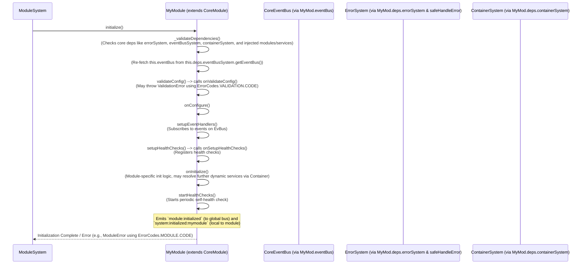

# TSMIS ModuleSystem & CoreModule Documentation
Version: 2.1.0 (Refactored Core)

## Table of Contents

1.  [Introduction to the Module Architecture](#1-introduction-to-the-module-architecture)
    * [1.1. Purpose & Philosophy](#11-purpose--philosophy)
    * [1.2. Key Components: `ModuleSystem` and `CoreModule`](#12-key-components-modulesystem-and-coremodule)
2.  [Component: `CoreModule.js` - The Business Module Foundation](#2-component-coremodulejs---the-business-module-foundation)
    * [2.1. Overview & Primary Responsibility](#21-overview--primary-responsibility)
    * [2.2. Key Features Provided to Subclasses](#22-key-features-provided-to-subclasses)
    * [2.3. API Reference (`CoreModule` - for Subclass Implementation)](#23-api-reference-coremodule---for-subclass-implementation)
        * [2.3.1. Constructor & Dependencies](#231-constructor--dependencies)
        * [2.3.2. Configuration (`this.config` & `validateConfig`)](#232-configuration-thisconfig--validateconfig)
        * [2.3.3. Lifecycle Hooks (to be Overridden)](#233-lifecycle-hooks-to-be-overridden)
        * [2.3.4. Error Handling (`handleError`)](#234-error-handling-handleerror)
        * [2.3.5. Event Emission (`emit`)](#235-event-emission-emit)
        * [2.3.6. Health Monitoring (`registerHealthCheck`, `checkHealth`, `startHealthChecks`)](#236-health-monitoring-registerhealthcheck-checkhealth-starthealthchecks)
        * [2.3.7. Metrics Tracking (`recordMetric`, `getMetrics`)](#237-metrics-tracking-recordmetric-getmetrics)
        * [2.3.8. Status Reporting (`getSystemStatus`)](#238-status-reporting-getsystemstatus)
    * [2.4. State Management (`CoreModule` Specifics)](#24-state-management-coremodule-specifics)
    * [2.5. Lifecycle Management (`CoreModule` Process)](#25-lifecycle-management-coremodule-process)
    * [2.6. Static Factory (`createModule`)](#26-static-factory-createmodule)
3.  [Component: `ModuleSystem.js` - The Module Orchestrator](#3-component-modulesystemjs---the-module-orchestrator)
    * [3.1. Overview & Primary Responsibility](#31-overview--primary-responsibility)
    * [3.2. Key Functionalities & API (`ModuleSystem`)](#32-key-functionalities--api-modulesystem)
        * [3.2.1. `initialize()` & `shutdown()`](#321-initialize--shutdown)
        * [3.2.2. Module Registration & Management (`register`, `unregister`, `resolve`)](#322-module-registration--management-register-unregister-resolve)
        * [3.2.3. Dependency Resolution (`resolveDependencyOrder`)](#323-dependency-resolution-resolvedependencyorder)
        * [3.2.4. Module Error Handling (`handleModuleError`)](#324-module-error-handling-handlemoduleerror)
        * [3.2.5. Module Health Monitoring (`startModuleHealthMonitoring`, `getSystemModulesHealth`)](#325-module-health-monitoring-startmodulehealthmonitoring-getsystemmoduleshealth)
    * [3.3. Adherence to Standardization Pillars (Recap for `ModuleSystem`)](#33-adherence-to-standardization-pillars-recap-for-modulesystem)
    * [3.4. State Management (`ModuleSystem` Specifics)](#34-state-management-modulesystem-specifics)
    * [3.5. Lifecycle Management (`ModuleSystem` Process)](#35-lifecycle-management-modulesystem-process)
    * [3.6. Error Handling within `ModuleSystem`](#36-error-handling-within-modulesystem)
    * [3.7. Event Integration (`ModuleSystem` Specifics)](#37-event-integration-modulesystem-specifics)
    * [3.8. Health Monitoring (`ModuleSystem` Specifics)](#38-health-monitoring-modulesystem-specifics)
    * [3.9. Metrics Tracking (`ModuleSystem` Specifics)](#39-metrics-tracking-modulesystem-specifics)
    * [3.10. Static Factory (`createModuleSystem`)](#310-static-factory-createmodulesystem)
4.  [Integrations (Module Architecture Level)](#4-integrations-module-architecture-level)
5.  [Module Lifecycle & Management Flow Diagrams](#5-module-lifecycle--management-flow-diagrams)
6.  [Developing a New Business Module (Best Practices & Example Reference)](#6-developing-a-new-business-module-best-practices--example-reference)
7.  [Testing Strategies for Modules and ModuleSystem](#7-testing-strategies-for-modules-and-modulesystem)
8.  [Future Considerations & Potential Enhancements](#8-future-considerations--potential-enhancements)

---

## 1. Introduction to the Module Architecture

### 1.1. Purpose & Philosophy
The TSMIS Module Architecture, centered around `CoreModule` and orchestrated by `ModuleSystem`, is designed to provide a structured, consistent, and manageable way to build and integrate distinct units of business functionality. The philosophy is to promote modular design, where each module encapsulates a specific domain, can be developed somewhat independently, and integrates smoothly through standardized interfaces and lifecycle management. This aims to:
* Encapsulate Business Logic.
* Promote Reusability.
* Simplify Maintenance.
* Standardize Development by providing `CoreModule` which handles cross-cutting concerns.

### 1.2. Key Components: `ModuleSystem` and `CoreModule`
* **`CoreModule.js`**: An abstract base class that all business modules *must* extend (or its derivative `RoutableModule`). It provides standardized structure, lifecycle hooks, and utilities for errors, events, health, metrics, and configuration.
* **`ModuleSystem.js`**: The orchestrator of all `CoreModule` instances. It handles registration, instantiation with dependency injection (including core systems like `ErrorSystem`, `EventBusSystem`, `config`, `containerSystem`, and other services/modules resolved from `ContainerSystem`), ordered lifecycle management, and health monitoring aggregation.

---
## 2. Component: `CoreModule.js` - The Business Module Foundation

### 2.1. Overview & Primary Responsibility
`CoreModule` is an abstract base class for all TSMIS business logic modules. It provides a standardized framework, ensuring modules adhere to common patterns for lifecycle, configuration, error handling, communication, and observability.

### 2.2. Key Features Provided to Subclasses
Modules extending `CoreModule` gain:
* **Standardized Lifecycle Hooks**: `onValidateConfig`, `onConfigure`, `setupEventHandlers`, `onSetupHealthChecks`, `onInitialize`, `onShutdown`.
* **Dependency Injection**: Constructor `constructor(deps = {})` where `deps` are injected by `ModuleSystem`. These `deps` include core systems (`errorSystem`, `eventBusSystem`, `containerSystem`), module-specific `config`, and other services or modules listed in `static dependencies`.
* **Configuration Handling**: Access to module-specific configuration via `this.config`; `onValidateConfig` hook for validation.
* **Integrated Error Handling**: `this.handleError(error, context)` for consistent error processing (logs locally, reports to global `ErrorSystem`, emits `module:error`). Errors are instantiated using unprefixed codes from `ErrorCodes.js` with `CoreError` subclasses handling prefixing.
* **Event Communication**: Access to global `CoreEventBus` via `this.eventBus`; `async this.emit(eventName, ...args)` for local and global event emission.
* **Health Monitoring**: `registerHealthCheck()`, `checkHealth()`, `startHealthChecks()`, default state check.
* **Metrics Tracking**: `recordMetric()`, `getMetrics()`.
* **Standardized State**: `this.state` object (`status`, `startTime`, `errors`, etc.) plus `lastHealthCheck`.

### 2.3. API Reference (`CoreModule` - for Subclass Implementation)

#### 2.3.1. Constructor & Dependencies
* **`constructor(deps = {})`**: Subclasses call `super(deps)`. The `deps` object is passed by `ModuleSystem` and now directly contains resolved instances of all declared dependencies (core systems, other modules, non-module services from `ContainerSystem`), plus the module-specific `config` and `containerSystem` itself. Missing optional dependencies are injected as `null` or `undefined`.
* **`static dependencies: Array<string|object>`**: Subclasses MUST define this array. Entries list names of other components.
    * Core systems (`errorSystem`, `eventBusSystem`, `config`, `containerSystem`) are inherited from `CoreModule.dependencies`.
    * Other modules or non-module services should be listed.
    * To declare an optional dependency: `{ name: 'dependencyName', optional: true }`.
    `ModuleSystem` uses this to resolve and inject all listed dependencies.

#### 2.3.2. Configuration (`this.config` & `validateConfig`)
* **`this.config`**: Module-specific configuration object.
* **`async validateConfig(): Promise<boolean>`**: Called by `CoreModule.initialize()`. Calls `onValidateConfig`. Throws `ValidationError` (e.g., using `ErrorCodes.VALIDATION.INVALID_INPUT`) or `ModuleError` (e.g., using `ErrorCodes.MODULE.CONFIG_VALIDATION_FAILED`) on failure.

#### 2.3.3. Lifecycle Hooks (to be Overridden)
Async methods for subclasses to implement specific logic:
* `async onValidateConfig()`: Validate `this.config`.
* `async onConfigure()`: Apply validated config.
* `async setupEventHandlers()`: Subscribe to `CoreEventBus`.
* `async onSetupHealthChecks()`: Register custom health checks.
* `async onInitialize()`: Final initialization tasks.
* `async onShutdown()`: Clean up resources.

#### 2.3.4. Error Handling (`handleError`)
* **`async handleError(error: Error, context = {}): Promise<CoreModule>`**: For operational errors. Uses `safeHandleError` to report to `ErrorSystem`. When wrapping non-`CoreError`s, it uses `new ModuleError(ErrorCodes.MODULE.OPERATION_FAILED, ...)` with an unprefixed code.

#### 2.3.5. Event Emission (`emit`)
* **`async emit(eventName: string, ...args: any[]): Promise<boolean>`**: Emits locally and broadcasts via global `CoreEventBus`.

#### 2.3.6. Health Monitoring (`registerHealthCheck`, `checkHealth`, `startHealthChecks`)
* `registerHealthCheck()`: Adds custom health checks. Throws `ModuleError` with unprefixed code `ErrorCodes.MODULE.INVALID_HEALTH_CHECK` on failure.
* `checkHealth()`: Aggregates checks.
* `startHealthChecks()`: Initiates periodic self-monitoring. Reports unhealthy status using `ModuleError` with unprefixed code `ErrorCodes.MODULE.UNHEALTHY` via `this.handleError()`.

#### 2.3.7. Metrics Tracking (`recordMetric`, `getMetrics`)
Standard methods for custom and standardized metric collection.

#### 2.3.8. Status Reporting (`getSystemStatus`)
Returns a summary object of the module's current status.

### 2.4. State Management (`CoreModule` Specifics)
Implements standard `this.state`, plus `lastHealthCheck: object | null`.

### 2.5. Lifecycle Management (`CoreModule` Process)
`CoreModule.initialize()` orchestrates: `_validateDependencies`, ensuring `this.eventBus` is available, `validateConfig()` (calls `onValidateConfig`), `onConfigure()`, `setupEventHandlers()`, `setupHealthChecks()` (calls `onSetupHealthChecks`), `onInitialize()`, `startHealthChecks()`, and emits lifecycle events.
`CoreModule.shutdown()` orchestrates: clearing health interval, calling `onShutdown()`, and emitting lifecycle events.

### 2.6. Static Factory (`createModule`)
**`createModule(deps = {}): CoreModule`**: Factory for base `CoreModule`. Provides default no-op/simple mock dependencies (including a simple `EventEmitter` for `eventBusSystem.getEventBus()` and a mock `containerSystem`) primarily for testing.

---
## 3. Component: `ModuleSystem.js` - The Module Orchestrator

### 3.1. Overview & Primary Responsibility
`ModuleSystem.js` defines the `ModuleSystem` class, the central component for managing the lifecycle of all `CoreModule` instances. It handles registration, resolves inter-module dependencies, injects all declared dependencies (core systems, other modules, and non-module services from `ContainerSystem`), ensures correct initialization/shutdown order, and provides aggregated health monitoring.

### 3.2. Key Functionalities & API (`ModuleSystem`)

#### 3.2.1. `initialize()` & `shutdown()`
* **`async initialize(): Promise<void>`**: Initializes registered modules in dependency order, calling `module.initialize()` and `this.startModuleHealthMonitoring()`.
* **`async shutdown(): Promise<void>`**: Shuts down modules in reverse dependency order.

#### 3.2.2. Module Registration & Management (`register`, `unregister`, `resolve`)
* **`async register(name: string, ModuleClass: typeof CoreModule, config = {}): Promise<CoreModule>`**:
    * Instantiates `ModuleClass`.
    * **Dependency Injection**: Injects a `deps` object containing:
        * Core systems (`errorSystem`, `eventBusSystem`, `containerSystem`) inherited from `ModuleSystem`'s dependencies.
        * The module-specific `config`.
        * Other modules registered with `ModuleSystem`, based on `ModuleClass.static dependencies` (handles optional inter-module dependencies by injecting `null` if an optional module is not found).
        * Non-module services listed in `ModuleClass.static dependencies`, resolved from the injected `containerSystem` (handles optional non-module services by injecting `null` if resolution fails for an optional unknown component).
    * Throws `ModuleError` (using unprefixed codes like `INVALID_MODULE`, `DUPLICATE_MODULE`, `REGISTRATION_FAILED`, or `DEPENDENCY_RESOLUTION_FAILED`) on issues.
* **`async unregister(name: string): Promise<boolean>`**: Shuts down and removes a module. Throws `ModuleError` with unprefixed code `UNREGISTER_FAILED` on issues.
* **`async resolve(name: string): Promise<CoreModule>`**: Retrieves a registered module. Throws `ModuleError` with unprefixed code `NOT_FOUND` if not found.

#### 3.2.3. Dependency Resolution (`resolveDependencyOrder`)
* **`resolveDependencyOrder(): string[]`**: Calculates module initialization/shutdown order using topological sort based on `static dependencies` (which can declare optional inter-module dependencies). Detects and throws `ModuleError` for circular dependencies using unprefixed code `CIRCULAR_DEPENDENCY`. For missing *required* inter-module dependencies, it throws `ModuleError` with unprefixed code `MISSING_DEPENDENCY`.

#### 3.2.4. Module Error Handling (`handleModuleError`)
* **`async handleModuleError(moduleName: string, error: Error, moduleContext = {}): Promise<void>`**: Central method for processing errors reported by modules (e.g., via `module:error` event). Reports to global `ErrorSystem`.

#### 3.2.5. Module Health Monitoring (`startModuleHealthMonitoring`, `getSystemModulesHealth`)
* **`async startModuleHealthMonitoring(moduleName: string)`**: Initiates periodic health checks for a module by calling its `checkHealth()` method. Skips if module has no health checks registered.
* **`async getSystemModulesHealth(): Promise<object>`**: Aggregates health status from all managed modules by calling their `checkHealth()` on demand. (This is one of the checks for `ModuleSystem.checkHealth()`).

### 3.3. Adherence to Standardization Pillars (Recap for `ModuleSystem`)
* **State Management**: Standard `this.state`; adds `modules`, `moduleHealth`, `healthCheckIntervals` maps.
* **Lifecycle Management**: Standard `initialize`/`shutdown` orchestrating modules. Emits `LIFECYCLE_EVENTS`.
* **Error Handling**: `_handleInternalError` for own errors (throws `ModuleError` with unprefixed code `SYSTEM_ERROR`); `handleModuleError` for module issues. Reports via `safeHandleError`.
* **Health Monitoring**: `checkHealth()` for own status; aggregates module health. Default checks: `modulesystem.state`, `modulesystem.module_overview`, `modulesystem.all_modules_health`.
* **Metrics Tracking**: For lifecycle, module management, errors, health.
* **Factory Function**: `createModuleSystem(deps = {})`.

### 3.4. State Management (`ModuleSystem` Specifics)
Manages `this.modules: Map<string, CoreModule>`, `this.state.moduleHealth: Map<string, object>`, and `this.state.healthCheckIntervals: Map<string, NodeJS.Timeout>`.

### 3.5. Lifecycle Management (`ModuleSystem` Process)
* **`initialize()`**: Validates dependencies (including `containerSystem`), fetches `this.eventBus`, calls `resolveDependencyOrder()`. Initializes modules in order and starts their health monitoring.
* **`shutdown()`**: Stops health monitoring, calls `resolveDependencyOrder().reverse()`. Shuts down modules in reverse order. Clears registries.

### 3.6. Error Handling within `ModuleSystem`
* **Internal Errors**: `_handleInternalError` for orchestration issues. Throws `ModuleError` with unprefixed `SYSTEM_ERROR`.
* **Module-Related Errors**: `handleModuleError` for errors from modules.

### 3.7. Event Integration (`ModuleSystem` Specifics)
* **Emits Events**: Standard lifecycle events, plus `module:registered`, `module:unregistered`, `module:error`, `module:unhealthy` (via `this.emit`, also broadcasts to `CoreEventBus`).
* **Listens for Events**: Subscribes to each registered module instance's `module:error` event.

### 3.8. Health Monitoring (`ModuleSystem` Specifics)
`checkHealth()` for its own status. Key checks:
* **`modulesystem.state`**: Own lifecycle status, uptime, errors.
* **`modulesystem.module_overview`**: Summary of managed modules based on cached health.
* **`modulesystem.all_modules_health`**: On-demand `checkHealth()` for every module, returns detailed report.

### 3.9. Metrics Tracking (`ModuleSystem` Specifics)
Records metrics for its lifecycle, internal errors, module registrations/unregistrations, reported module errors, module health statuses.

### 3.10. Static Factory (`createModuleSystem`)
**`createModuleSystem(deps = {}): ModuleSystem`** for instantiation.

---
## 4. Integrations (Module Architecture Level)

The Module Architecture integrates with:
* **`ContainerSystem`**:
    * Manages `ModuleSystem` instance.
    * Injects core dependencies (including `ContainerSystem` itself) into `ModuleSystem`.
    * `ModuleSystem` now uses its injected `ContainerSystem` to resolve declared non-module service dependencies for `CoreModule` instances during their registration.
* **`EventBusSystem` / `CoreEventBus`**:
    * `ModuleSystem` provides `CoreEventBus` to modules for inter-communication.
    * `ModuleSystem` emits its own operational events.
* **`ErrorSystem`**:
    * Both `ModuleSystem` and `CoreModule`s report errors to `ErrorSystem`.
* **`RouterSystem` (Indirectly via `RoutableModule`)**:
    * `ModuleSystem` manages `RoutableModule`s, which emit route events consumed by `CoreRouter`.

---
## 5. Module Lifecycle & Management Flow Diagrams

**`ModuleSystem`: Module Management & High-Level Interaction**
```mermaid
graph TD
    Container["ContainerSystem"] -- "Injects self & core deps (ErrorSys, EventBusSys, Config)" --> ModSys["ModuleSystem"];
    
    ModSys -- "1. register('ModA', ModuleAClass, modAConfig)" --> ModSys;
    ModSys -- "2. register('ModB', ModuleBClass, modBConfig)" --> ModSys;

    subgraph During_Register_ModA ["ModuleSystem.register(ModuleA)"]
        direction LR
        ModSys -- "Resolves 'nonModSvcA' via ContainerSystem" --> Container;
        ModSys -- "Resolves 'ModB' (if dependency)" --> ModSysRegModules["Registered Modules (ModB)"];
        ModSys -- "Injects {errorSys, eventBusSys, config, containerSystem, nonModSvcA, ModB}" --> NewModAInst["new ModuleAClass(deps)"];
    end
    
    NewModAInst --> ModAInstance["ModuleA Instance"];
    ModSys -- "Stores instance" --> ModCache["Module Cache (this.modules)"];
    ModAInstance -- Added to --> ModCache;

    ModSys -- "Calls initialize() in order" --> ModAInstance;
    ModSys -- "Calls initialize() in order" --> ModBInstance["ModuleB Instance"];
    
    ModSys -- "Periodically calls module.checkHealth()" --> ModAInstance;
    ModSys -- "Periodically calls module.checkHealth()" --> ModBInstance;
    ModAInstance -- "Health status" --> ModHealthAgg["Aggregated Module Health (in ModSys.state)"];
    ModBInstance -- "Health status" --> ModHealthAgg;

    ModAInstance -- "Emits 'module:error' (e.g., new ModuleError(ErrorCodes.MODULE.CODE, ...))" --> ModSys;
    ModSys -- "handleModuleError()" --> ErrorSys["ErrorSystem"];
    
    ModAInstance -- "Uses this.eventBus" --> EventBus["CoreEventBus (via EventBusSystem)"];
    ModBInstance -- "Uses this.eventBus" --> EventBus;
    EventBus -- "Enables communication" --> ModAInstance;
    EventBus -- "Enables communication" --> ModBInstance;

    classDef system fill:#D6EAF8,stroke:#5DADE2,stroke-width:2px;
    classDef module fill:#E8F8F5,stroke:#76D7C4,stroke-width:2px;
    classDef process fill:#FEF9E7,stroke:#F7DC6F,stroke-width:1px;
    class ModSys, Container, ErrorSys, EventBus system;
    class ModAInstance, ModBInstance module;
    class During_Register_ModA, NewModAInst, ModCache, ModHealthAgg process;
```
**`CoreModule`: Internal Initialization Sequence (Called by ModuleSystem)**


---
## 6. Developing a New Business Module (Best Practices & Example Reference)

This section provides guidance for creating new business logic modules. Modules extend `CoreModule` or `RoutableModule`.

* **Guiding Principles**: Single Responsibility, Loose Coupling, Clear Interfaces, Configuration Driven, Leverage `CoreModule` Features, Service Layer Separation, Testability.
* **Extending `CoreModule` or `RoutableModule`**: Choose based on whether HTTP endpoints are needed.
* **Example Module (`InventoryModule`)**: Detailed in the main "TSMIS Core Architecture Guide". Key aspects include:
    * **Dependency Declaration**: In `InventoryModule.js`, `static dependencies` should list `'inventoryService'` (a non-module service) and any other module or service dependencies. `ModuleSystem` will inject `inventoryService` after resolving it from `ContainerSystem`.
    * **Error Handling**: Use `new InventoryError(ErrorCodes.INVENTORY.ITEM_NOT_FOUND, ...)` where `ErrorCodes.INVENTORY.ITEM_NOT_FOUND` provides an unprefixed code like `'ITEM_NOT_FOUND'`.
    * **Service Access**: Access injected services like `this.inventoryService` directly.

---
## 7. Testing Strategies for Modules and ModuleSystem

* **`CoreModule` Subclasses**:
    * Mock all dependencies (core systems, other modules, non-module services) that `ModuleSystem` would inject.
    * Test lifecycle hooks, business methods, event emissions, error reporting (ensure `this.handleError` is called with errors using correct codes).
* **`ModuleSystem`**:
    * Test `register`/`unregister` with valid/invalid inputs.
    * Test `resolveDependencyOrder` (including optional and circular inter-module dependencies).
    * Test DI logic: ensure correct injection of core deps, inter-module deps (including `null` for missing optional), and non-module services resolved from a mock `ContainerSystem`.
    * Test `initialize`/`shutdown` by spying on module lifecycle methods.
    * Test health monitoring and error handling.

---
## 8. Future Considerations & Potential Enhancements
(Adapted from original Module System docs)
* **Dynamic Module Loading/Unloading/Hot-Reloading**.
* **Module Versioning**.
* **Module Composition Patterns**.
* **Inter-Module Contracts/Interfaces**.
* **Module Federation**.
* **Advanced Health Monitoring Aggregation**.