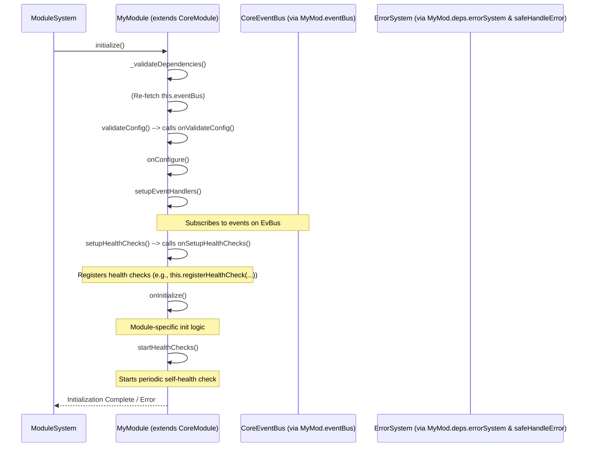

# TSMIS ModuleSystem & CoreModule Documentation
Version: 2.0.0 (Refactored Core)

## Table of Contents

1.  [Introduction to the Module Architecture](#1-introduction-to-the-module-architecture)
    * [1.1. Purpose & Philosophy](#11-purpose--philosophy)
    * [1.2. Key Components: `ModuleSystem` and `CoreModule`](#12-key-components-modulesystem-and-coremodule)
2.  [Component: `CoreModule.js` - The Business Module Foundation](#2-component-coremodulejs---the-business-module-foundation)
    * [2.1. Overview & Primary Responsibility](#21-overview--primary-responsibility)
    * [2.2. Key Features Provided to Subclasses](#22-key-features-provided-to-subclasses)
    * [2.3. API Reference (`CoreModule` - for Subclass Implementation)](#23-api-reference-coremodule---for-subclass-implementation)
        * [2.3.1. Constructor & Dependencies](#231-constructor--dependencies)
        * [2.3.2. Configuration (`this.config` & `validateConfig`)](#232-configuration-thisconfig--validateconfig)
        * [2.3.3. Lifecycle Hooks (to be Overridden)](#233-lifecycle-hooks-to-be-overridden)
        * [2.3.4. Error Handling (`handleError`)](#234-error-handling-handleerror)
        * [2.3.5. Event Emission (`emit`)](#235-event-emission-emit)
        * [2.3.6. Health Monitoring (`registerHealthCheck`, `checkHealth`, `startHealthChecks`)](#236-health-monitoring-registerhealthcheck-checkhealth-starthealthchecks)
        * [2.3.7. Metrics Tracking (`recordMetric`, `getMetrics`)](#237-metrics-tracking-recordmetric-getmetrics)
        * [2.3.8. Status Reporting (`getSystemStatus`)](#238-status-reporting-getsystemstatus)
    * [2.4. State Management (`CoreModule` Specifics)](#24-state-management-coremodule-specifics)
    * [2.5. Lifecycle Management (`CoreModule` Process)](#25-lifecycle-management-coremodule-process)
    * [2.6. Static Factory (`createModule`)](#26-static-factory-createmodule)
3.  [Component: `ModuleSystem.js` - The Module Orchestrator](#3-component-modulesystemjs---the-module-orchestrator)
    * [3.1. Overview & Primary Responsibility](#31-overview--primary-responsibility)
    * [3.2. Key Functionalities & API (`ModuleSystem`)](#32-key-functionalities--api-modulesystem)
        * [3.2.1. `initialize()` & `shutdown()`](#321-initialize--shutdown)
        * [3.2.2. Module Registration & Management (`register`, `unregister`, `resolve`)](#322-module-registration--management-register-unregister-resolve)
        * [3.2.3. Dependency Resolution (`resolveDependencyOrder`)](#323-dependency-resolution-resolvedependencyorder)
        * [3.2.4. Module Error Handling (`handleModuleError`)](#324-module-error-handling-handlemoduleerror)
        * [3.2.5. Module Health Monitoring (`startModuleHealthMonitoring`, `getSystemModulesHealth`)](#325-module-health-monitoring-startmodulehealthmonitoring-getsystemmoduleshealth)
    * [3.3. Adherence to Standardization Pillars (Recap for `ModuleSystem`)](#33-adherence-to-standardization-pillars-recap-for-modulesystem)
    * [3.4. State Management (`ModuleSystem` Specifics)](#34-state-management-modulesystem-specifics)
    * [3.5. Lifecycle Management (`ModuleSystem` Process)](#35-lifecycle-management-modulesystem-process)
    * [3.6. Error Handling within `ModuleSystem`](#36-error-handling-within-modulesystem)
    * [3.7. Event Integration (`ModuleSystem` Specifics)](#37-event-integration-modulesystem-specifics)
    * [3.8. Health Monitoring (`ModuleSystem` Specifics)](#38-health-monitoring-modulesystem-specifics)
    * [3.9. Metrics Tracking (`ModuleSystem` Specifics)](#39-metrics-tracking-modulesystem-specifics)
    * [3.10. Static Factory (`createModuleSystem`)](#310-static-factory-createmodulesystem)
4.  [Integrations (Module Architecture Level)](#4-integrations-module-architecture-level)
5.  [Module Lifecycle & Management Flow Diagrams](#5-module-lifecycle--management-flow-diagrams)
6.  [Developing a New Business Module (Best Practices & Example Reference)](#6-developing-a-new-business-module-best-practices--example-reference)
7.  [Testing Strategies for Modules and ModuleSystem](#7-testing-strategies-for-modules-and-modulesystem)
8.  [Future Considerations & Potential Enhancements](#8-future-considerations--potential-enhancements)

---

## 1. Introduction to the Module Architecture

### 1.1. Purpose & Philosophy
The TSMIS Module Architecture, centered around `CoreModule` and orchestrated by `ModuleSystem`, is designed to provide a structured, consistent, and manageable way to build and integrate distinct units of business functionality. The philosophy is to promote modular design, where each module encapsulates a specific domain or capability, can be developed and tested somewhat independently, and integrates smoothly into the overall application through standardized interfaces and lifecycle management.

This approach aims to:
* **Encapsulate Business Logic**: Keep domain-specific logic contained within well-defined module boundaries.
* **Promote Reusability**: While full reusability across different applications might be limited by domain specifics, services within modules can be designed for reuse.
* **Simplify Maintenance**: Changes within one module are less likely to impact others if interactions are well-defined (e.g., via events or stable service interfaces).
* **Standardize Development**: Provide developers with a common framework and base class (`CoreModule`) that handles many cross-cutting concerns (lifecycle, errors, events, health, metrics).

### 1.2. Key Components: `ModuleSystem` and `CoreModule`
* **`CoreModule.js`**: This is an abstract base class. All business modules *must* extend `CoreModule` (or its derivative, `RoutableModule`, if they expose HTTP routes). It provides the standardized structure, lifecycle hooks, and built-in utilities for error handling, eventing, health monitoring, metrics, and configuration handling that all modules will share.
* **`ModuleSystem.js`**: This system is the orchestrator of all `CoreModule` instances. It is responsible for:
    * Registering module classes and their configurations.
    * Instantiating modules and injecting their dependencies (which include core systems like `ErrorSystem`, `EventBusSystem`, `config`, and any other services resolved from the `ContainerSystem`).
    * Managing the ordered initialization and shutdown of all registered modules based on their declared dependencies.
    * Periodically monitoring the health of each initialized module and providing an aggregated health view of all modules.

## 2. Component: `CoreModule.js` - The Business Module Foundation

**(This section details the `CoreModule` base class. For developers creating modules, this is their primary starting point.)**

### 2.1. Overview & Primary Responsibility
`CoreModule` is an abstract base class designed to be the parent of all business logic modules within TSMIS. It does not perform business logic itself but provides a rich, standardized framework and a set of inheritable functionalities to its subclasses. Its primary responsibility is to ensure that all business modules adhere to common patterns for lifecycle, configuration, error handling, communication, and observability.

### 2.2. Key Features Provided to Subclasses
Modules extending `CoreModule` automatically gain:
* **Standardized Lifecycle Hooks**: A predefined set of asynchronous methods (`onValidateConfig`, `onConfigure`, `setupEventHandlers`, `onSetupHealthChecks`, `onInitialize`, `onShutdown`) that are called at specific points in the module's lifecycle by `ModuleSystem`.
* **Dependency Injection**: A constructor pattern `constructor(deps = {})` where `deps` (containing core systems like `errorSystem`, `eventBusSystem`, `config`, and other resolved dependencies) is injected by `ModuleSystem`.
* **Configuration Handling**: Access to module-specific configuration via `this.config` and a dedicated hook (`onValidateConfig`) for validation.
* **Integrated Error Handling**: A `this.handleError(error, context)` method for consistent error processing, which logs the error to the module's state, records a metric, reports it to the global `ErrorSystem` via `safeHandleError`, and emits a local `module:error` event.
* **Event Communication**:
    * Access to the global `CoreEventBus` via `this.eventBus` (obtained from `this.deps.eventBusSystem.getEventBus()` during `initialize`).
    * An `async this.emit(eventName, ...args)` method that emits an event both locally on the module instance and broadcasts it via the global `CoreEventBus`.
* **Health Monitoring**:
    * `registerHealthCheck(name, checkFn)` to add custom health checks specific to the module's responsibilities or dependencies.
    * `async checkHealth()` to execute all its registered checks and return a standardized health report.
    * `startHealthChecks()` method to initiate periodic self-monitoring (called by `ModuleSystem` after module initialization).
    * A default `modulename.state` health check.
* **Metrics Tracking**: `recordMetric(name, value, tags)` and `getMetrics()` methods for custom and standardized metric collection.
* **Standardized State**: An internal `this.state` object adhering to the core system standard (`status`, `startTime`, `errors`, `metrics`, `healthChecks`), plus `lastHealthCheck`.

### 2.3. API Reference (`CoreModule` - for Subclass Implementation)

#### 2.3.1. Constructor & Dependencies
* **`constructor(deps = {})`**: Subclasses should call `super(deps)`. The `deps` object is passed by `ModuleSystem` and includes:
    * `errorSystem`: Instance of `ErrorSystem`.
    * `eventBusSystem`: Instance of `EventBusSystem`.
    * `config`: Module-specific configuration object passed during `ModuleSystem.register()`.
    * Any other dependencies listed in the subclass's `static dependencies` array, resolved by `ContainerSystem`.
* **`static dependencies: string[]`**: Subclasses MUST define this array to list names of other components/services (registered in `ContainerSystem`) or other modules (registered in `ModuleSystem`) they depend on. `CoreModule` itself declares `['errorSystem', 'eventBusSystem', 'config']`. Subclasses should extend this: `static dependencies = [...CoreModule.dependencies, 'myCustomService', 'anotherModule'];`.

#### 2.3.2. Configuration (`this.config` & `validateConfig`)
* **`this.config`**: The module-specific configuration object is available as `this.config`.
* **`async validateConfig(): Promise<boolean>`**: This method is called by `CoreModule.initialize()`. It, in turn, calls the `async onValidateConfig()` hook that subclasses should override for their specific configuration validation logic. Throws `ValidationError` or `ModuleError` on failure.

#### 2.3.3. Lifecycle Hooks (to be Overridden)
These `async` methods are placeholders in `CoreModule` and are intended for subclasses to implement their specific logic. They are called in sequence during `CoreModule.initialize()` and `CoreModule.shutdown()`.
* **`async onValidateConfig(): Promise<boolean>`**: Validate `this.config`. Throw error on invalid config.
* **`async onConfigure(): Promise<void>`**: Apply validated `this.config` to instance properties, perform initial setup based on config.
* **`async setupEventHandlers(): Promise<void>`**: Subscribe to `CoreEventBus` events. Store subscription IDs for cleanup.
* **`async onSetupHealthChecks(): Promise<void>`**: Register module-specific health checks using `this.registerHealthCheck()`.
* **`async onInitialize(): Promise<void>`**: Perform final initialization tasks (e.g., connect to resources, start timers, load initial data). For `RoutableModule`, this is where routes are typically defined via `this.registerRoute()`.
* **`async onShutdown(): Promise<void>`**: Clean up all resources, unsubscribe from events, clear intervals/timeouts.

#### 2.3.4. Error Handling (`handleError`)
* **`async handleError(error: Error, context = {}): Promise<CoreModule>`**: Used by subclasses to report operational errors. Logs to module's `this.state.errors`, records a metric, reports to global `ErrorSystem` via `safeHandleError`, and emits a local `module:error` event.

#### 2.3.5. Event Emission (`emit`)
* **`async emit(eventName: string, ...args: any[]): Promise<boolean>`**: Emits an event locally on the module instance and broadcasts it to the global `CoreEventBus` (if available and module is running). `CoreEventBus` expects `(eventName, data, options)`.

#### 2.3.6. Health Monitoring (`registerHealthCheck`, `checkHealth`, `startHealthChecks`)
* **`registerHealthCheck(name: string, checkFn: Function): void`**: Adds a health check function.
* **`async checkHealth(): Promise<object>`**: Executes all registered checks and returns a standard health report object.
* **`startHealthChecks(): void`**: Initiates periodic calls to `this.checkHealth()`, storing results in `this.state.lastHealthCheck` and reporting unhealthy states via `this.handleError()`. The interval is `this.healthCheckIntervalMs` (from config or default).

#### 2.3.7. Metrics Tracking (`recordMetric`, `getMetrics`)
* **`recordMetric(name: string, value: any, tags = {}): void`**: Records a metric to `this.state.metrics`.
* **`getMetrics(): object`**: Returns all metrics for the module.

#### 2.3.8. Status Reporting (`getSystemStatus`)
* **`getSystemStatus(): object`**: Returns a summary object of the module's current status, including lifecycle status, uptime, error count, and last health check status.

### 2.4. State Management (`CoreModule` Specifics)
`CoreModule` implements the standard `this.state` object, and adds one specific property:
* **`lastHealthCheck: object | null`**: Stores the full result object from the most recent periodic execution of `this.checkHealth()`.

### 2.5. Lifecycle Management (`CoreModule` Process)
The `CoreModule.initialize()` method orchestrates the following sequence:
1.  Validates its own dependencies (`_validateDependencies`).
2.  Ensures `this.eventBus` is available from `this.deps.eventBusSystem`.
3.  Calls `this.validateConfig()` (which calls `onValidateConfig`).
4.  Calls `this.onConfigure()`.
5.  Calls `this.setupEventHandlers()`.
6.  Calls `this.setupHealthChecks()` (which calls `onSetupHealthChecks`).
7.  Calls `this.onInitialize()`.
8.  Calls `this.startHealthChecks()`.
9.  Emits `module:initialized` and standard scoped lifecycle events.

The `CoreModule.shutdown()` method orchestrates:
1.  Clearing the health check interval.
2.  Calls `this.onShutdown()`.
3.  Emits `module:shutdown` and standard scoped lifecycle events.

### 2.6. Static Factory (`createModule`)
**`createModule(deps = {}): CoreModule`**: A factory that can create a base `CoreModule` instance. It provides default no-op dependencies for `errorSystem` and `eventBusSystem`, mainly for testing or very simple standalone module scenarios. Subclasses typically have their own named factory functions (e.g., `createInventoryModule`).

---
## 3. Component: `ModuleSystem.js` - The Module Orchestrator

**(This section details the `ModuleSystem` class. Full individual documentation would be in `module-system-docs.md`.)**

### 3.1. Overview & Primary Responsibility
`ModuleSystem.js` defines the `ModuleSystem` class, the central component responsible for managing the entire lifecycle of all business logic modules (`CoreModule` instances) within TSMIS. It handles their registration, resolves inter-module dependencies to ensure correct initialization and shutdown order, and provides an aggregated view of their overall health and status.

### 3.2. Key Functionalities & API (`ModuleSystem`)

#### 3.2.1. `initialize()` & `shutdown()`
* **`async initialize(): Promise<void>`**: Initializes all registered modules in their correct dependency order. For each module, it calls `module.initialize()` and then `this.startModuleHealthMonitoring(moduleName)`.
* **`async shutdown(): Promise<void>`**: Shuts down all registered modules in reverse dependency order, calling `module.shutdown()` on each and clearing health monitoring intervals.

#### 3.2.2. Module Registration & Management (`register`, `unregister`, `resolve`)
* **`async register(name: string, ModuleClass: typeof CoreModule, config = {}): Promise<CoreModule>`**: Instantiates the `ModuleClass` with injected dependencies (including core systems and other services/modules resolved from `ContainerSystem`) and the provided `config`. Stores the instance and sets up error listeners for it.
* **`async unregister(name: string): Promise<boolean>`**: Shuts down (if running) and removes a module from management.
* **`async resolve(name: string): Promise<CoreModule>`**: Retrieves a registered module instance.

#### 3.2.3. Dependency Resolution (`resolveDependencyOrder`)
* **`resolveDependencyOrder(): string[]`**: Internally calculates the correct order for initializing and shutting down modules based on their `static dependencies` arrays, using a topological sort. Detects and throws `ModuleError` for circular dependencies.

#### 3.2.4. Module Error Handling (`handleModuleError`)
* **`async handleModuleError(moduleName: string, error: Error, moduleContext = {}): Promise<void>`**: Centralized method for processing errors reported by or related to managed modules. Logs the error, reports it to `ErrorSystem` via `safeHandleError`, and emits a `module:error` event.

#### 3.2.5. Module Health Monitoring (`startModuleHealthMonitoring`, `getSystemModulesHealth`)
* **`async startModuleHealthMonitoring(moduleName: string)`**: Initiates periodic health checks for the specified module by calling its `checkHealth()` method at a configurable interval. Stores the latest health status in `this.state.moduleHealth`.
* **`async getSystemModulesHealth(): Promise<object>`**: Aggregates and returns the health status from all managed modules.

### 3.3. Adherence to Standardization Pillars (Recap for `ModuleSystem`)
* **State Management**: Implements standard `this.state`. Adds `modules` (Map), `moduleHealth` (Map), `healthCheckIntervals` (Map).
* **Lifecycle Management**: Standard `initialize`/`shutdown` orchestrating module lifecycles. Emits `LIFECYCLE_EVENTS`.
* **Error Handling**: Uses `_handleInternalError` for its own errors. Uses `handleModuleError` for issues related to managed modules. Reports via `safeHandleError`. Throws `ModuleError`.
* **Health Monitoring**: `checkHealth()` for its own status. `getSystemModulesHealth()` for aggregated module health. Default checks: `modulesystem.state`, `modulesystem.module_overview`, `modulesystem.all_modules_health`.
* **Metrics Tracking**: Records metrics for its lifecycle, module registrations/unregistrations, reported module errors, and module health statuses.
* **Factory Function**: `createModuleSystem(deps = {})` provided.

### 3.4. State Management (`ModuleSystem` Specifics)
Beyond the standard `this.state`, `ModuleSystem` manages:
* **`this.modules: Map<string, CoreModule>`**: Stores instances of all registered modules.
* **`this.state.moduleHealth: Map<string, object>`**: Caches the last reported health object for each monitored module.
* **`this.state.healthCheckIntervals: Map<string, NodeJS.Timeout>`**: Keeps track of the `setInterval` IDs for each module's periodic health check.

### 3.5. Lifecycle Management (`ModuleSystem` Process)
* **`initialize()`**: Validates dependencies, (re-)fetches `this.eventBus`, calls `resolveDependencyOrder()`. Then, for each module in order, calls `module.initialize()` and `this.startModuleHealthMonitoring(moduleName)`.
* **`shutdown()`**: Stops all module health monitoring intervals. Calls `resolveDependencyOrder().reverse()`. Then, for each module in reverse order, calls `module.shutdown()`. Clears internal module registries.

### 3.6. Error Handling within `ModuleSystem`
* **Internal Errors**: Uses `_handleInternalError` for errors in its own orchestration logic (e.g., failure in `resolveDependencyOrder`, issues starting/stopping health monitors if not module-specific).
* **Module-Related Errors**: Uses `handleModuleError` when a module emits a `module:error` event (to which `ModuleSystem` subscribes upon module registration), or when a module's health check (polled by `ModuleSystem`) indicates a failure or throws an error.

### 3.7. Event Integration (`ModuleSystem` Specifics)
* **Emits Events**:
    * Standard lifecycle events for itself (e.g., `system:initialized`).
    * Module management events (via `this.emit`, which also broadcasts to `CoreEventBus`): `module:registered`, `module:unregistered`, `module:error` (when relaying/processing a module's error), `module:unhealthy` (when periodic health check finds an issue).
* **Listens for Events**:
    * After registering a module instance, `ModuleSystem` internally subscribes to that instance's `module:error` event to trigger `this.handleModuleError`.

### 3.8. Health Monitoring (`ModuleSystem` Specifics)
Provides `checkHealth()` for its own operational status. Key checks include:
* **`modulesystem.state`**: Its own lifecycle status, uptime, internal error count.
* **`modulesystem.module_overview`**: Summary of managed modules (counts, how many are healthy/degraded/unhealthy based on `this.state.moduleHealth`).
* **`modulesystem.all_modules_health`**: This check calls `this.getSystemModulesHealth()` which performs an on-demand `checkHealth()` for every currently managed module and returns a detailed, nested report.

### 3.9. Metrics Tracking (`ModuleSystem` Specifics)
Records metrics for:
* Its own lifecycle: `modulesystem.initialized.success/failure`, `modulesystem.shutdown.success/failure/time`.
* Its internal errors: `modulesystem.errors.internal`.
* Module management: `modulesystem.modules.registered`, `modulesystem.modules.unregistered`.
* Errors related to modules: `modulesystem.errors.module_reported` (tags: `moduleName`, `errorName`, `errorCode`).
* Module health: `modulesystem.module.{name}.health.status` (tags: `status`).

### 3.10. Static Factory (`createModuleSystem`)
**`createModuleSystem(deps = {}): ModuleSystem`** for standardized instantiation.

## 4. Integrations (Module Architecture Level)

The Module Architecture (`ModuleSystem` and `CoreModule`) is deeply integrated with other core TSMIS systems:

* **`ContainerSystem`**:
    * `ModuleSystem` itself is typically a component registered with and managed by `ContainerSystem`.
    * `ContainerSystem` injects `ErrorSystem`, `EventBusSystem`, and `config` into `ModuleSystem`.
    * When `ModuleSystem` registers a new `CoreModule`, it passes these core dependencies along. Crucially, if a `CoreModule` declares additional dependencies in its `static dependencies` array (e.g., `'myCustomService'`), `ModuleSystem` relies on the `ContainerSystem` (implicitly, via the `deps` it received) to resolve these additional dependencies and inject them into the `CoreModule` instance.
* **`EventBusSystem` / `CoreEventBus`**:
    * `ModuleSystem` uses the `CoreEventBus` (via `eventBusSystem.getEventBus()`) to emit its own operational events (e.g., `module:registered`).
    * It ensures all `CoreModule` instances it creates receive the `eventBusSystem` dependency, so they can obtain the `CoreEventBus` for inter-module communication (`this.emit` in `CoreModule` uses it, and `setupEventHandlers` in modules uses it for subscriptions).
* **`ErrorSystem`**:
    * Both `ModuleSystem` (for its own errors and when handling module errors via `handleModuleError`) and individual `CoreModule` instances (via their `handleError` method) use the `ErrorSystem` (typically through the `safeHandleError` utility) for centralized error reporting.
* **`RouterSystem` (Indirectly via `RoutableModule`)**:
    * While `ModuleSystem` itself doesn't directly interact with `RouterSystem`, it manages `RoutableModule` instances. `RoutableModule`s, during their lifecycle (managed by `ModuleSystem`), emit route registration events to `CoreEventBus`, which are then consumed by `CoreRouter` (managed by `RouterSystem`).

## 5. Module Lifecycle & Management Flow Diagrams

**ModuleSystem**: Module Management & High-Level Interaction

```mermaid
graph TD
    Container["ContainerSystem"] -- Resolves & Provides Deps --> ModSys["ModuleSystem"];
    ModSys -- Instantiates with Deps --> ModA["ModuleA (extends CoreModule)"];
    ModSys -- Instantiates with Deps --> ModB["ModuleB (extends CoreModule)"];
    
    ModSys -- Calls initialize() in order --> ModA;
    ModSys -- Calls initialize() in order --> ModB;
    
    ModSys -- Periodically calls checkHealth() --> ModA;
    ModSys -- Periodically calls checkHealth() --> ModB;
    ModSys -- Aggregates Health --> OverallModuleHealth["Aggregated Module Health"];

    ModA -- Emits 'module:error' --> ModSys;
    ModB -- Emits 'module:error' --> ModSys;
    ModSys -- handleModuleError() --> ErrorSys["ErrorSystem"];
    
    ModA -- Uses --> EventBus["CoreEventBus (via EventBusSystem)"];
    ModB -- Uses --> EventBus;
    EventBus -- Enables communication --> ModA;
    EventBus -- Enables communication --> ModB;

    classDef system fill:#D6EAF8,stroke:#5DADE2,stroke-width:2px;
    classDef module fill:#E8F8F5,stroke:#76D7C4,stroke-width:2px;
    class ModSys, Container, ErrorSys, EventBus system;
    class ModA, ModB module;
```

**CoreModule**: Internal Initialization Sequence (Called by ModuleSystem



## 6. Developing a New Business Module (Best Practices & Example Reference)

This topic is covered extensively in **Section 7: Developing Business Modules** of the main "TSMIS Core Architecture - Source of Truth" document. It includes:
* Guiding principles for module design.
* How to extend `CoreModule` or `RoutableModule`.
* A detailed example (`InventoryModule`) covering directory structure, specific error/event files, service separation, schema definition, and implementation of the main module class with lifecycle hooks, route handling, etc.
* How to register modules and their services.
* Module-specific configuration.
* Unit testing strategies for modules.

## 7. Testing Strategies for Modules and ModuleSystem

* **`CoreModule` Subclasses**:
    * Mock all dependencies (`errorSystem`, `eventBusSystem`, `config`, custom services).
    * Test each lifecycle hook's specific logic (e.g., did `onConfigure` set properties correctly? Did `setupEventHandlers` call `eventBus.subscribe`?).
    * Test business methods for correct outputs, side effects (event emissions, metric recording), and error handling (verify `this.handleError` is called).
    * For `RoutableModule`, test route handlers by mocking request/reply objects and asserting interactions with services and response generation (or error throwing for global handler).
* **`ModuleSystem`**:
    * Test `register`/`unregister` with valid and invalid `ModuleClass` inputs, duplicate names.
    * Test `resolveDependencyOrder` with various dependency graphs (including valid order and circular dependencies resulting in errors).
    * Test `initialize`/`shutdown`: Mock `CoreModule` instances and spy on their `initialize`/`shutdown` methods to ensure they are called in the correct order. Test error propagation if a module fails to initialize/shutdown.
    * Test `startModuleHealthMonitoring`: Mock `module.checkHealth()` and timers to verify health state updates and `module:unhealthy` / `handleModuleError` calls.
    * Test `getSystemModulesHealth` aggregates results correctly.
    * Test its own state, health, metrics, and error handling (`_handleInternalError`, `handleModuleError`).

## 8. Future Considerations & Potential Enhancements
(Adapted from original Module System docs)
* **Dynamic Module Loading/Unloading/Hot-Reloading**: For greater flexibility, especially in development or for plugin-based architectures.
* **Module Versioning**: Introduce more explicit support for managing different versions of modules and their dependencies.
* **Module Composition Patterns**: Explore advanced patterns like mixins, traits, or decorators for sharing common functionalities or cross-cutting concerns among modules beyond simple inheritance from `CoreModule`.
* **Inter-Module Contracts/Interfaces**: Formalize contracts for direct inter-module service calls (if used) to improve robustness as the system evolves.
* **Module Federation**: For very large systems, investigate patterns for distributing modules across different services or processes while maintaining a cohesive operational model.
* **Advanced Health Monitoring Aggregation**: More sophisticated health aggregation in `ModuleSystem`, potentially including dependency-aware degradation status or anomaly detection based on module health trends.